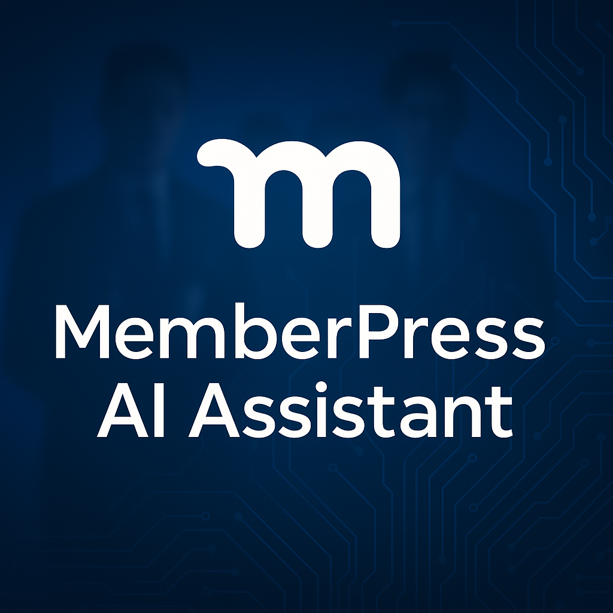

# MemberPress AI Assistant

## Description

MemberPress AI Assistant integrates powerful AI capabilities with your MemberPress WordPress plugin, providing intelligent insights, content analysis, and membership management assistance. This plugin helps site administrators better understand their membership data and streamline site management tasks with features like membership analysis, user management, and comprehensive diagnostic capabilities.

## Features

- **AI-Powered Chat Interface**: Ask questions about your MemberPress data and receive intelligent answers
- **Membership Management**: Create, update, and manage memberships through natural language
- **User Integration**: Manage user-membership relationships and permissions
- **Data Analysis**: Get insights about memberships, transactions, subscriptions, and more
- **Content Generation**: Create membership-related content with AI assistance
- **Agent System**: Specialized AI agents that perform specific tasks through natural language commands
- **Tool-Based Architecture**: Modular, extensible system for implementing functionality
- **Dependency Injection**: Clean, maintainable code with proper separation of concerns
- **Comprehensive Documentation**: Detailed documentation for users and developers

## Requirements

- WordPress 5.8 or higher
- PHP 7.4 or higher (8.0+ recommended)
- MemberPress 1.9.0+ plugin installed and activated

## Installation

1. Upload the `memberpress-ai-assistant` folder to the `/wp-content/plugins/` directory
2. Activate the plugin through the WordPress admin interface
3. Start using the AI assistant from the AI Assistant menu in WordPress admin

For detailed installation instructions, see the [Installation and Configuration Guide](docs/installation-configuration.md).

## Quick Start

### For Site Administrators

1. **Start Using the AI Assistant**
   - Navigate to AI Assistant > Chat in your WordPress admin
   - Type a question or command in the chat interface
   - Receive AI-generated insights and assistance
   - No API key configuration required - the system works out of the box!

3. **Try These Examples**
   - "What are my top-selling memberships this month?"
   - "Create a new monthly membership called 'Premium Plan' for $29.99"
   - "Show me users who joined in the last 30 days"
   - "Draft a welcome email for new members"

For more examples and tips, see the [Getting Started Guide](docs/getting-started.md).

### For Developers

1. **Understand the Architecture**
   - Review the [System Architecture](docs/system-architecture.md) documentation
   - Explore the [Agent Architecture](docs/agent-architecture.md) and [Tool System](docs/available-tools.md)
   - Learn about the [Dependency Injection](docs/dependency-injection.md) system

2. **Extend the Plugin**
   - Create custom agents for specialized functionality
   - Implement custom tools for specific operations
   - Use the dependency injection container for clean integration

For development guidelines and examples, see the [Getting Started Guide for Developers](docs/getting-started.md#for-developers).

## Documentation

### User Documentation

- [Getting Started Guide](docs/getting-started.md)
- [Installation and Configuration](docs/installation-configuration.md)
- [Chat Interface Guide](docs/chat-interface.md)
- [Admin Interface Guide](docs/admin-interface.md)

### Technical Documentation

- [System Architecture](docs/system-architecture.md)
- [Agent Architecture](docs/agent-architecture.md)
- [Available Tools](docs/available-tools.md)
- [Dependency Injection](docs/dependency-injection.md)
- [Membership Operations](docs/membership-operations.md)
- [User Integration](docs/user-integration.md)

## System Architecture

The MemberPress AI Assistant is built on a modular, extensible architecture that combines several architectural patterns:

1. **Layered Architecture**: The system is organized into layers with clear responsibilities
2. **Dependency Injection**: Components receive their dependencies rather than creating them
3. **Service-Oriented Architecture**: Functionality is provided through discrete services
4. **Agent-Based Architecture**: Specialized agents handle different types of requests
5. **Tool-Based Architecture**: Operations are implemented as tools with standardized interfaces

For a comprehensive overview of the system architecture, see the [System Architecture](docs/system-architecture.md) documentation.

## Agent System

The MemberPress AI Assistant includes an advanced agent system with specialized AI assistants:

1. **Agent Interface**: Defines the contract for all agents
2. **Abstract Agent**: Base implementation with common functionality
3. **Agent Orchestrator**: Selects the appropriate agent for each request
4. **Agent Factory**: Creates agent instances with dependencies
5. **Agent Registry**: Maintains a registry of available agents

For more information on the agent system, see the [Agent Architecture](docs/agent-architecture.md) documentation.

## Tool System

The MemberPress AI Assistant implements a tool-based architecture for operations:

1. **Tool Interface**: Defines the contract for all tools
2. **Abstract Tool**: Base implementation with common functionality
3. **Tool Registry**: Maintains a registry of available tools
4. **Cached Tool Wrapper**: Provides caching for tool operations

For more information on the tool system, see the [Available Tools](docs/available-tools.md) documentation.

## Membership Operations

The MemberPress AI Assistant provides comprehensive functionality for managing MemberPress memberships:

1. **Create Memberships**: Create new memberships with pricing and terms
2. **Update Memberships**: Modify existing memberships
3. **Delete Memberships**: Remove memberships
4. **List Memberships**: View all memberships
5. **Manage Access Rules**: Control content access for memberships
6. **Manage Pricing**: Update pricing settings for memberships

For more information on membership operations, see the [Membership Operations](docs/membership-operations.md) documentation.

## User Integration

The MemberPress AI Assistant provides functionality for managing the relationship between WordPress users and MemberPress memberships:

1. **Associate Users**: Associate users with memberships
2. **Disassociate Users**: Remove users from memberships
3. **Get User Memberships**: View a user's memberships
4. **Update User Roles**: Manage user roles and permissions
5. **Get User Permissions**: View a user's roles and capabilities

For more information on user integration, see the [User Integration](docs/user-integration.md) documentation.

## Security

This plugin takes security seriously:

- Only administrators can access the plugin features
- Built-in AI integration with no API key configuration required
- All user inputs are properly sanitized and validated
- Comprehensive error handling and logging

## Development History

### Phase 6A - Dev-Tools Archival (December 2024)

As part of the ongoing consent system removal project, Phase 6A involved the archival of development tools that contained outdated consent system references. This phase was completed to prevent fatal errors and maintain code cleanliness.

**What was archived:**
- 34 development tool files containing 75+ MPAIConsentManager references
- Tools moved from `dev-tools/` to `dev-tools-archived/dev-tools/`
- 22 files identified with potential fatal error risks

**Reason for archival:**
The development tools contained extensive references to the removed MPAIConsentManager class, which could cause fatal errors if executed. Rather than attempting to fix each tool individually, the decision was made to archive them and create a clean replacement structure.

**Current status:**
- Production code remains clean and functional
- Phase 6 consent system removal continues to progress
- Archived tools remain available at `dev-tools-archived/dev-tools/` for reference
- New clean dev-tools structure established

For detailed information about the archival process, see [`phase-6a-archival-summary.md`](phase-6a-archival-summary.md).

## Support

For support, please use the GitHub issue tracker or contact us at [support@memberpress.com](mailto:support@memberpress.com).

## License

This plugin is licensed under the GPL v2 or later.

## Credits

- Developed by MemberPress
- Advanced AI capabilities for intelligent assistance
- Built to enhance the MemberPress plugin experience

---

MemberPress AI Assistant is an official MemberPress plugin.