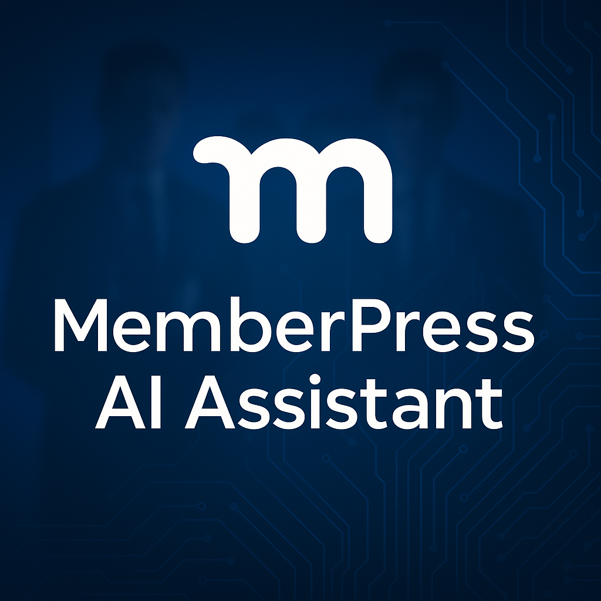

# MemberPress AI Assistant



## Description

MemberPress AI Assistant integrates powerful AI language models (OpenAI and Anthropic) with your MemberPress WordPress plugin, providing intelligent insights, content analysis, and WP-CLI command assistance. This plugin helps site administrators better understand their membership data and streamline site management tasks with features like best-selling membership analysis, tiered support routing, and comprehensive diagnostic capabilities.

## Features

- **AI-Powered Chat Interface**: Ask questions about your MemberPress data and receive intelligent answers
- **Agent System**: Specialized AI agents that perform specific tasks through natural language commands
- **Multi-Agent Data Processing**: Two-stage data processing to optimize the display and formatting of results
- **MemberPress Data Analysis**: Get insights about memberships, transactions, subscriptions, and more
- **Best-Selling Membership Analysis**: Identify your top-performing membership products with sales data
- **Multi-Tier Support Routing**: Integrated support system using Docsbot for documentation before human escalation
- **WP-CLI Integration**: Run WordPress CLI commands with AI assistance
- **Command Recommendations**: Get AI-suggested commands based on your goals
- **Secure Command Execution**: Only pre-approved commands from a whitelist can be executed
- **Conversation History**: Save and retrieve previous conversations
- **Enhanced Command Output**: Automatic formatting of command results as beautiful HTML tables
- **Intelligent Table Formatting**: Automatic detection and formatting of tabular data with appropriate headers
- **Command-Specific Styling**: Specialized formatting for different types of commands (users, posts, plugins, etc.)
- **Direct Command Execution**: Click commands to run them directly from the chat interface
- **Content Marker System**: Automatic tagging and identification of blog posts and pages for reliable publishing
- **Smart Content Extraction**: Multi-tiered content retrieval system with fallbacks for blog post publishing
- **Improved User Experience**: Streamlined interface with real-time feedback during command execution
- **Site Health Integration**: Comprehensive system diagnostics with WordPress Site Health integration

## Requirements

- WordPress 5.8 or higher
- PHP 7.4 or higher (8.0+ recommended)
- MemberPress 1.9.0+ plugin installed and activated
- OpenAI API key (primary integration)
- Anthropic API key (optional)
- WP-CLI (optional, for command-line features)

## Installation

1. Upload the `memberpress-ai-assistant` folder to the `/wp-content/plugins/` directory
2. Activate the plugin through the WordPress admin interface
3. Navigate to AI Assistant > Settings to configure your OpenAI API key and other settings
4. Start using the AI assistant from the AI Assistant menu in WordPress admin

## Configuration

### API Settings

1. Obtain an API key from OpenAI (https://platform.openai.com/api-keys)
2. Optionally obtain an API key from Anthropic (https://console.anthropic.com/)
3. Enter your API keys in the plugin settings
4. Select your preferred models for each API
5. Configure temperature and token settings as needed
6. Choose your primary API provider (OpenAI or Anthropic)

### CLI Command Settings

If you want to use the WP-CLI integration:

1. Enable CLI commands in the settings
2. Add allowed commands to the whitelist
3. Only commands in the whitelist can be executed

## Usage

### Admin Chat Interface

1. Navigate to AI Assistant in the WordPress admin menu
2. Type your question in the chat interface
3. Receive AI-generated insights about your MemberPress site

### WP-CLI Commands

This plugin adds several WP-CLI commands:

```bash
# Generate insights from MemberPress data
wp mpai insights [--prompt=<prompt>] [--format=<format>]

# Get command recommendations
wp mpai recommend <prompt>

# Chat with the AI assistant
wp mpai chat <message>

# Run a command with AI analysis
wp mpai run <command> [--context=<context>]
```

## Documentation

For detailed information, please check these documentation files:

- [Primary Entry Point](_0_START_HERE_.md) - Comprehensive entry point with development pathways
- [Project Specification](docs/current/core/project-specification.md) - Complete project overview and technical specifications
- [User Guide](docs/current/core/user-guide.md) - Complete guide for users
- [Developer Guide](docs/current/core/developer-guide.md) - Information for developers who want to extend the plugin
- [Unified Agent System](docs/current/agent-system/unified-agent-system.md) - Comprehensive agent system documentation
- [Agent System Reference](docs/current/agent-system/agent-system-reference.md) - Quick reference for the agent system
- [Content Marker System](docs/current/content-system/CONTENT_MARKER_SYSTEM.md) - Comprehensive documentation of the content marker system
- [Tool Implementation Map](docs/current/tool-system/tool-implementation-map.md) - Guide for implementing tools
- [Testing Procedures](test/test-procedures.md) - Procedures for testing the plugin

## Agent System

The MemberPress AI Assistant includes an advanced agent system with specialized AI assistants:

1. **Content Agent**: Create and manage website content
2. **System Agent**: Manage WordPress updates, plugins, and settings
3. **Security Agent**: Monitor and enhance site security 
4. **Analytics Agent**: Generate insights about your membership site
5. **MemberPress Agent**: Handle MemberPress-specific tasks and configurations

The plugin also implements a multi-agent data processing approach:

1. **Backend Agent (PHP)**: Detects, formats, and structures tabular data from commands
2. **Frontend Agent (JavaScript)**: Processes and displays the structured data with appropriate formatting

This two-stage processing ensures optimal display of information with context-aware formatting based on the command type.

For more information, see the [Unified Agent System](docs/current/agent-system/unified-agent-system.md) documentation.

## Security

This plugin takes security seriously:

- Only administrators can access the plugin features
- OpenAI API keys are stored securely
- WP-CLI commands can only be executed if they're on a pre-approved whitelist
- All user inputs are properly sanitized and validated

## Project Organization

The plugin is organized into the following structure:

- `/assets/` - CSS and JavaScript files
- `/docs/` - Documentation files
  - `/docs/current/` - Current feature documentation organized by system:
    - `/docs/current/core/` - Core system documentation
    - `/docs/current/agent-system/` - Agent system documentation
    - `/docs/current/tool-system/` - Tool system documentation
    - `/docs/current/content-system/` - Content system documentation
    - `/docs/current/js-system/` - JavaScript system documentation
    - `/docs/current/feature-plans/` - Feature planning documentation
  - `/docs/archive/_snacks/` - Archived investigation results and solutions ("Scooby Snacks")
  - `/docs/roadmap/` - Planned feature documentation
  - `/docs/archive/` - Archived and deprecated files
- `/includes/` - PHP class files
  - `/includes/agents/` - Agent system files
  - `/includes/cli/` - WP-CLI command files
  - `/includes/tools/` - Tool implementation files
- `/test/` - Testing procedures and test files

For a detailed description of all files and their purpose, see the [System Map](docs/current/core/system-map.md).

For an overview of the documentation structure, see the [Documentation Map](docs/current/core/documentation-map.md).

## Development Resources

Refer to the [CLAUDE.md](./CLAUDE.md) file for development guidelines and coding standards.

## Support

For support, please use the GitHub issue tracker or contact us at [support@memberpress.com](mailto:support@memberpress.com).

## License

This plugin is licensed under the GPL v2 or later.

## Credits

- Developed by MemberPress
- OpenAI and Anthropic integrations for language model capabilities
- Built to enhance the MemberPress plugin experience

---

MemberPress AI Assistant is an official MemberPress plugin.