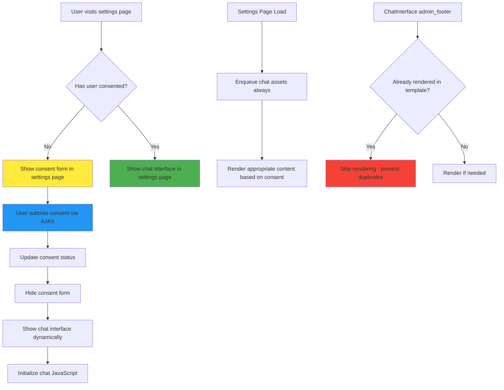

# Chat Interface Fix - Comprehensive Implementation Plan

## Problem Analysis

Based on the logs and code analysis, the chat interface is missing due to several critical issues:

1. **User Consent Status**: Logs show `User consent status: false` - user hasn't given consent
2. **Conflicting Logic**: ChatInterface class redirects users away from settings page when they haven't consented
3. **Dual Rendering Attempts**: Both settings template AND ChatInterface admin_footer hook try to render chat interface
4. **Header Modification Errors**: "Cannot modify header information" warnings from redirect attempts after output
5. **Asset Enqueuing Issues**: Chat assets may not be properly loaded when template renders chat interface

## Solution Architecture



## Implementation Plan

### Phase 1: Fix ChatInterface Conflicting Logic

**File**: `src/ChatInterface.php`

**Changes**:
1. **Remove Redirect Logic**: Modify `renderAdminChatInterface()` to not redirect when on settings page
2. **Add Rendering Flag**: Prevent duplicate rendering attempts
3. **Improve Consent Handling**: Better integration with settings page flow

**Key Modifications**:
```php
// In renderAdminChatInterface()
// Remove this problematic redirect logic:
if (!$has_consented) {
    if (!isset($_GET['page']) || $_GET['page'] !== 'mpai-welcome') {
        wp_redirect(admin_url('admin.php?page=mpai-welcome'));
        exit;
    }
    return;
}

// Replace with:
if (!$has_consented && !$this->isSettingsPageWithConsentForm()) {
    return; // Let settings page handle consent form
}
```

### Phase 2: Enhance Settings Page Template

**File**: `templates/settings-page.php`

**Changes**:
1. **Dynamic Content Switching**: Show consent form OR chat interface based on consent status
2. **AJAX Integration**: Handle consent submission without page reload
3. **Asset Management**: Ensure chat assets are always available

**Implementation**:
```php
// After settings form, add:
<div id="mpai-consent-chat-container">
    <?php
    $consent_manager = \MemberpressAiAssistant\Admin\MPAIConsentManager::getInstance();
    if (!$consent_manager->hasUserConsented()) {
        // Show consent form
        include MPAI_PLUGIN_DIR . 'templates/consent-form-inline.php';
    } else {
        // Show chat interface
        include MPAI_PLUGIN_DIR . 'templates/chat-interface.php';
    }
    ?>
</div>
```

### Phase 3: Create Inline Consent Form

**File**: `templates/consent-form-inline.php` (new file)

**Purpose**: Streamlined consent form for settings page integration

**Features**:
1. **AJAX Submission**: Submit consent without page reload
2. **Compact Design**: Fits well within settings page
3. **Dynamic Replacement**: Replaced by chat interface after consent

### Phase 4: Update Admin Menu Asset Handling

**File**: `src/Admin/MPAIAdminMenu.php`

**Changes**:
1. **Always Enqueue Assets**: Enqueue chat assets regardless of consent status
2. **Improved Timing**: Ensure assets are available before template rendering
3. **Better Error Handling**: Graceful fallbacks if asset loading fails

**Key Modification**:
```php
protected function ensure_chat_assets_enqueued(): void {
    // Always enqueue assets for settings page - needed for both consent form and chat
    $this->logWithLevel('Ensuring chat assets are enqueued for settings page', 'info');
    
    $chat_interface = \MemberpressAiAssistant\ChatInterface::getInstance();
    $current_screen = get_current_screen();
    $hook_suffix = $current_screen ? $current_screen->id : 'unknown';
    
    $chat_interface->registerAdminAssets($hook_suffix);
    $this->logWithLevel('Chat assets enqueued successfully', 'info');
}
```

### Phase 5: Implement AJAX Consent Handler

**File**: `src/Admin/MPAIConsentManager.php`

**Changes**:
1. **Enhanced AJAX Handler**: Better response handling for inline consent
2. **Dynamic Content Return**: Return chat interface HTML after consent
3. **Improved Logging**: Better tracking of consent flow

**New Method**:
```php
public function saveConsentInline() {
    // Verify nonce and user permissions
    // Save consent
    // Return success response with chat interface HTML
    wp_send_json_success([
        'message' => 'Consent saved successfully',
        'chat_html' => $this->getChatInterfaceHTML()
    ]);
}
```

### Phase 6: Add JavaScript Integration

**File**: `assets/js/consent-chat-integration.js` (new file)

**Purpose**: Handle dynamic switching from consent form to chat interface

**Features**:
1. **AJAX Consent Submission**: Submit consent form via AJAX
2. **Dynamic Content Replacement**: Replace consent form with chat interface
3. **Chat Initialization**: Initialize chat system after dynamic loading

### Phase 7: Prevent Duplicate Rendering

**Implementation Strategy**:
1. **Global Flag**: Set flag when chat interface is rendered in template
2. **Hook Modification**: Check flag in admin_footer hook
3. **Cleanup**: Reset flag after page load

**Code Example**:
```php
// In settings template
global $mpai_chat_rendered;
$mpai_chat_rendered = true;

// In ChatInterface::renderAdminChatInterface()
global $mpai_chat_rendered;
if ($mpai_chat_rendered) {
    error_log('[MPAI Debug] Chat interface already rendered in template, skipping');
    return;
}
```

## Testing Strategy

### Phase 1 Testing: Basic Flow
1. **No Consent**: Visit settings page → Should show consent form
2. **Give Consent**: Submit consent → Should show chat interface immediately
3. **With Consent**: Refresh page → Should show chat interface directly

### Phase 2 Testing: Edge Cases
1. **Multiple Submissions**: Prevent duplicate consent submissions
2. **JavaScript Disabled**: Graceful fallback to page reload
3. **Asset Loading Failures**: Proper error handling

### Phase 3 Testing: Integration
1. **Chat Functionality**: Ensure chat works after dynamic loading
2. **Asset Dependencies**: Verify all required assets are loaded
3. **Browser Compatibility**: Test across different browsers

## File Structure

```
templates/
├── settings-page.php (modified)
├── consent-form-inline.php (new)
└── chat-interface.php (existing)

src/
├── ChatInterface.php (modified)
└── Admin/
    ├── MPAIAdminMenu.php (modified)
    └── MPAIConsentManager.php (modified)

assets/js/
└── consent-chat-integration.js (new)
```

## Success Criteria

1. ✅ **No Redirects**: User stays on settings page throughout consent flow
2. ✅ **Immediate Display**: Chat interface appears immediately after consent
3. ✅ **No Duplicates**: Only one chat interface rendered per page
4. ✅ **Proper Assets**: All JavaScript and CSS loaded correctly
5. ✅ **Error-Free**: No header modification or JavaScript errors
6. ✅ **Functional Chat**: Chat interface works properly after dynamic loading

## Risk Mitigation

1. **Fallback Mechanism**: If AJAX fails, fall back to page reload
2. **Asset Verification**: Check that required assets are loaded before initialization
3. **Error Logging**: Comprehensive logging for debugging
4. **Graceful Degradation**: Basic functionality even if JavaScript fails

## Implementation Order

1. **Phase 1**: Fix ChatInterface conflicting logic (highest priority)
2. **Phase 2**: Create inline consent form template
3. **Phase 3**: Update settings page template
4. **Phase 4**: Implement AJAX consent handler
5. **Phase 5**: Add JavaScript integration
6. **Phase 6**: Update admin menu asset handling
7. **Phase 7**: Add duplicate rendering prevention

This plan addresses all identified issues while providing a smooth, redirect-free user experience that shows the consent form and chat interface on the same settings page.