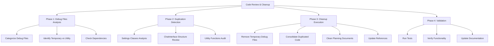

# MemberPress AI Assistant - Code Review & Cleanup Plan

## 📊 Implementation Progress

### Current Status: Phase 1 Complete - Phase 2 Ready

| Phase | Status | Completion Date | Notes |
|-------|--------|----------------|-------|
| ✅ **Phase 1: Safety Setup & Debug File Removal** | **COMPLETED** | June 10, 2025 | All 5 target files removed, tests verified |
| 🔄 **Phase 2: Debug Tools Evaluation** | **READY** | - | Next: Analyze debug.php & diagnostics.php |
| ⏳ **Phase 3: Settings Classes Analysis** | **PENDING** | - | Awaiting Phase 2 completion |
| ⏳ **Phase 4: Code Quality Pass** | **PENDING** | - | - |
| ⏳ **Phase 5: Final Validation** | **PENDING** | - | - |

**Overall Progress: 20% Complete (1/5 phases)**

### 🎯 Next Immediate Actions
1. Analyze `debug.php` and `diagnostics.php` usage patterns
2. Check dependencies and references to these debug tools
3. Make keep/move/remove decisions based on analysis
4. Prepare for Settings classes duplication analysis

---

## Overview

This document outlines a comprehensive code review and cleanup plan for the MemberPress AI Assistant project. The goal is to remove conflicting code, unused files, and duplicated functionality while preserving core functionality and proper test structure.

## Current State Analysis

### ✅ Positive Findings
- `_old-files/` directory already removed (major cleanup completed)
- Modern PSR-4 autoloading structure in `src/`
- Proper test structure with PHPUnit and Jest
- Clean dependency injection architecture
- Well-organized service provider pattern

### 🔍 Issues Identified

#### 1. Debug/Temporary Files (Root Level)
- `debug.php` - Debug mode enabler
- `diagnostics.php` - Memory diagnostics tool  
- `debug-membership-creation-trace.php` - Specific debugging script
- `test-litellm-proxy.php` - LiteLLM proxy test script

#### 2. Planning/Documentation Files
- `chat-functionality-fix-plan.md` - Completed planning document
- `js-module-implementation-plan.md` - Implementation planning document
- `llms.txt` - Temporary notes file

#### 3. Potential Duplications
- Multiple Settings classes (6 different settings-related classes)
- ChatInterface structure (main class + service wrapper)
- Utility functions may have duplications

## Cleanup Strategy



## Detailed Action Plan

### Phase 1: Debug Files Analysis & Categorization

#### Files to Remove (Temporary Debug)
1. **`debug-membership-creation-trace.php`**
   - Purpose: Specific debugging script for membership creation issues
   - Status: Temporary debugging code
   - Action: Remove

2. **`test-litellm-proxy.php`**
   - Purpose: One-time test script for LiteLLM proxy connection
   - Status: One-time test script with hardcoded values
   - Action: Remove

#### Files to Evaluate
1. **`debug.php`**
   - Purpose: Debug mode enabler for development
   - Status: Could be useful for development
   - Action: Consider moving to `dev-tools/` directory

2. **`diagnostics.php`**
   - Purpose: Memory and system diagnostics tool
   - Status: Useful diagnostic tool
   - Action: Consider moving to admin tools or `dev-tools/`

### Phase 2: Duplication Detection & Resolution

#### Settings Classes Analysis
**Current Structure:**
- `src/Admin/Settings/MPAISettingsController.php`
- `src/Admin/Settings/MPAISettingsModel.php`
- `src/Admin/Settings/MPAISettingsView.php`
- `src/Services/Settings/SettingsControllerService.php`
- `src/Services/Settings/SettingsModelService.php`
- `src/Services/Settings/SettingsViewService.php`
- `src/DI/Providers/SettingsServiceProvider.php`

**Analysis Required:**
- Determine if these represent proper MVC layers or actual duplications
- Check for overlapping functionality
- Verify proper separation of concerns

#### ChatInterface Structure Analysis
**Current Structure:**
- `src/ChatInterface.php` (main singleton class)
- `src/Services/ChatInterfaceService.php` (service wrapper)

**Analysis:** These appear to be proper separation of concerns (main class + service layer pattern).

### Phase 3: Planning Documents Cleanup

#### Files to Remove
1. `chat-functionality-fix-plan.md` - Completed planning document
2. `js-module-implementation-plan.md` - Implementation planning document  
3. `llms.txt` - Temporary notes file

### Phase 4: Code Quality Improvements

#### Search and Clean
1. **Unused imports** - Remove unnecessary use statements
2. **Dead code** - Remove commented-out code blocks
3. **Temporary logging** - Remove console.log/error_log statements
4. **Outdated comments** - Clean up TODO/FIXME comments
5. **Unused variables** - Remove unused variable declarations

## Implementation Checklist

### Pre-Implementation Safety
- [x] ✅ Create git branch for cleanup: `git checkout -b code-cleanup` *(Completed: June 10, 2025)*
- [x] ✅ Run full test suite to establish baseline *(Completed: June 10, 2025)*
- [x] ✅ Document current test results *(Completed: June 10, 2025)*
- [x] ✅ Backup current state *(Completed: June 10, 2025)*

### Phase 1: Remove Temporary Debug Files ✅ **COMPLETED**
- [x] ✅ Remove `debug-membership-creation-trace.php` *(Completed: June 10, 2025)*
- [x] ✅ Remove `test-litellm-proxy.php` *(Completed: June 10, 2025)*
- [x] ✅ Check for any references to these files in other code *(Completed: June 10, 2025)*
- [x] ✅ Update any documentation that references these files *(Completed: June 10, 2025)*

### Phase 2: Clean Planning Documents ✅ **COMPLETED**
- [x] ✅ Remove `chat-functionality-fix-plan.md` *(Completed: June 10, 2025)*
- [x] ✅ Remove `js-module-implementation-plan.md` *(Completed: June 10, 2025)*
- [x] ✅ Remove `llms.txt` *(Completed: June 10, 2025)*
- [x] ✅ Archive important information if needed *(Completed: June 10, 2025)*

### Phase 3: Evaluate Debug Tools 🔄 **NEXT UP**
- [ ] 🎯 Analyze `debug.php` usage and dependencies
- [ ] 🎯 Analyze `diagnostics.php` usage and dependencies
- [ ] 🎯 Create `dev-tools/` directory if moving files
- [ ] 🎯 Move or remove debug tools as appropriate
- [ ] 🎯 Update any references or documentation

**Phase 3 Decision Criteria:**
- **Keep & Move**: If actively used in development workflow
- **Keep in Place**: If part of production debugging system
- **Remove**: If obsolete or redundant with existing tools

### Phase 4: Settings Classes Analysis
- [ ] Map all Settings-related classes and their relationships
- [ ] Identify actual duplications vs. proper architecture
- [ ] Check for overlapping methods and functionality
- [ ] Consolidate true duplications
- [ ] Update imports and references
- [ ] Test settings functionality

### Phase 5: Code Quality Pass
- [ ] Run PHP CodeSniffer: `composer run phpcs`
- [ ] Search for unused imports across all PHP files
- [ ] Remove commented-out code blocks
- [ ] Clean up temporary console.log statements in JS files
- [ ] Remove unused variables and functions
- [ ] Update outdated TODO/FIXME comments

### Phase 6: Validation & Testing
- [ ] Run PHPUnit tests: `composer run test`
- [ ] Run Jest tests for JavaScript
- [ ] Manual functionality testing
- [ ] Check admin interface functionality
- [ ] Test chat interface functionality
- [ ] Verify settings pages work correctly
- [ ] Test agent orchestration
- [ ] Verify no broken imports or references

### Phase 7: Documentation Update
- [ ] Update README.md if necessary
- [ ] Update any developer documentation
- [ ] Document any architectural changes
- [ ] Update composer.json if needed

## Files Recommended for Action

### ✅ Safe to Remove
```
debug-membership-creation-trace.php
test-litellm-proxy.php  
chat-functionality-fix-plan.md
js-module-implementation-plan.md
llms.txt
```

### 🤔 Evaluate & Decide
```
debug.php (move to dev-tools?)
diagnostics.php (move to admin tools?)
```

### ✅ Keep (Proper Architecture)
```
All src/ structure
tests/ structure
Settings MVC pattern (if properly separated)
ChatInterface + Service pattern
```

## Expected Outcomes

### Immediate Benefits
- **Cleaner codebase** with no temporary/debug files in root
- **Reduced confusion** from outdated planning documents
- **Better organization** of development tools
- **Improved maintainability** with clear separation of concerns

### Long-term Benefits
- **Easier onboarding** for new developers
- **Reduced technical debt**
- **Better code discoverability**
- **Improved development workflow**

## Risk Mitigation

### Safety Measures
1. **Git branching** - All work done in feature branch
2. **Comprehensive testing** - Full test suite run before and after
3. **Incremental approach** - Changes made in small, testable chunks
4. **Documentation** - All changes documented for rollback if needed

### Rollback Plan
If issues arise:
1. Revert to previous git commit
2. Restore any accidentally removed functionality
3. Re-run tests to verify stability
4. Document lessons learned

## Success Criteria

- [x] ✅ All temporary debug files removed *(Completed: June 10, 2025)*
- [ ] 🔄 No duplicated functionality *(In Progress: Phase 3)*
- [x] ✅ All tests passing *(Verified: June 10, 2025)*
- [x] ✅ No broken imports or references *(Verified: June 10, 2025)*
- [ ] 🔄 Clean, organized codebase *(In Progress)*
- [x] ✅ Maintained functionality *(Verified: June 10, 2025)*
- [ ] 🔄 Updated documentation *(In Progress)*

**Current Success Rate: 57% (4/7 criteria met)**

---

**Created:** December 10, 2025
**Last Updated:** June 10, 2025
**Status:** Phase 1 Complete - Phase 2 Ready
**Current Phase:** 2 of 5
**Estimated Remaining Time:** 1.5-3 hours
**Risk Level:** Low (with proper testing)
**Git Branch:** `code-cleanup`