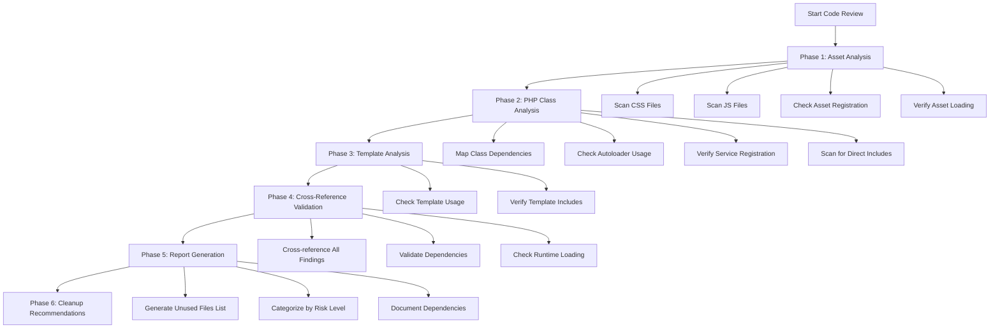
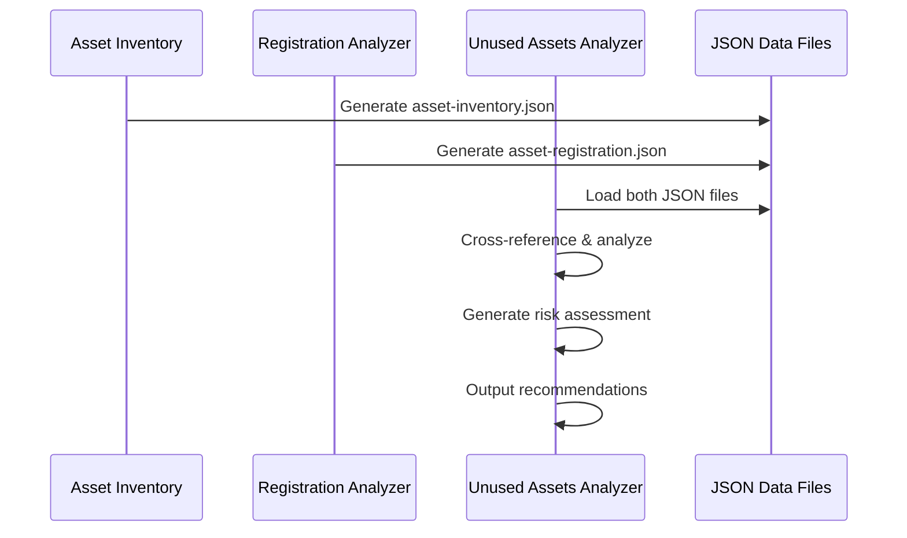

# MemberPress AI Assistant - Unused Files Analysis Plan

## Overview

This document outlines a comprehensive plan for identifying and analyzing unused files (PHP, JavaScript, CSS, and other assets) in the MemberPress AI Assistant plugin. The goal is to create a thorough code review that identifies files no longer referenced or loaded by the system.

## Current System Architecture

### Key Components Identified

1. **Main Plugin File**: `memberpress-ai-assistant.php` - Entry point with autoloader and service initialization
2. **Dependency Injection System**: Uses `ServiceLocator` and `ServiceProvider` pattern
3. **Asset Management**: Centralized in `ChatInterface` class
4. **Service Registration**: Through various service providers in `src/DI/Providers/`

### Known Issues

1. **Missing File**: `test-api-keys.php` is referenced in main plugin file but doesn't exist
2. **Consent System Remnants**: Comments indicate removed consent system functionality
3. **Complex Asset Loading**: Multiple asset registration patterns across frontend/admin

## Analysis Workflow



## Phase 1: Asset Analysis (CSS/JS Files)

### Objective
Identify CSS and JavaScript files that are not registered or enqueued by the WordPress system.

### Method
1. **Scan all asset files** in `assets/` directory
2. **Cross-reference with registration calls** in:
   - `ChatInterface::registerAssets()` - Frontend asset registration
   - `ChatInterface::registerAdminAssets()` - Admin asset registration
   - `SettingsControllerService` - Settings page assets
3. **Check for direct file inclusions** in templates
4. **Verify module loading patterns** for ES6 modules

### Key Files to Analyze
- `assets/css/` - All CSS files
- `assets/js/` - All JavaScript files
- `assets/js/chat/` - Chat interface modules

### Expected Findings
- Unused CSS files not referenced in `wp_enqueue_style()` calls
- JavaScript files not loaded via `wp_enqueue_script()` or module system
- Duplicate asset files (frontend vs admin versions)
- Orphaned files from previous development iterations

## Phase 2: PHP Class Analysis

### Objective
Identify PHP classes and files not used by the dependency injection system or direct instantiation.

### Method
1. **Map all PHP classes** using namespace analysis from `src/` directory
2. **Check autoloader patterns** via `composer.json` PSR-4 mapping
3. **Verify service registration** in DI providers:
   - `SettingsServiceProvider` - Settings services
   - `LlmServiceProvider` - LLM integration services
   - `ToolRegistryProvider` - Tool registration
   - `AdminServiceProvider` - Admin functionality
   - `CacheServiceProvider` - Caching services
   - `OrchestrationServiceProvider` - Agent orchestration
4. **Scan for direct class instantiation** and `require_once` statements
5. **Check agent/tool registration** in registries

### Key Areas to Examine
- **Service Classes**: All classes in `src/Services/`
- **Agent Classes**: All classes in `src/Agents/`
- **Tool Classes**: All classes in `src/Tools/`
- **DI Components**: All classes in `src/DI/`
- **Utility Classes**: All classes in `src/Utilities/`
- **Interface Definitions**: All interfaces in `src/Interfaces/`

### Expected Findings
- Orphaned classes not registered in DI container
- Unused service providers
- Deprecated classes from consent system removal
- Test files that might be unused in production
- Abstract classes with no concrete implementations

## Phase 3: Template Analysis

### Objective
Verify template file usage and identify unused template files.

### Method
1. **Scan `templates/` directory** for all template files
2. **Check template includes** in:
   - `ChatInterface` rendering methods
   - `MPAIAjaxHandler` template loading
   - `SettingsViewService` rendering
   - Admin menu rendering
3. **Verify template path references** in PHP files
4. **Check for dynamic template loading** patterns

### Template Files to Analyze
- `templates/chat-interface.php`
- `templates/chat-interface-ajax.php`
- `templates/dashboard-tab.php`
- `templates/settings-page.php`
- `templates/welcome-page.php`

## Phase 4: Cross-Reference Validation

### Objective
Validate findings against runtime behavior and dynamic loading patterns.

### Method
1. **Dynamic loading analysis** - Check for runtime class loading via:
   - `class_exists()` calls
   - Dynamic service resolution
   - Plugin hook systems
2. **Hook system verification** - Ensure WordPress hooks don't load files dynamically
3. **Plugin activation/deactivation** - Verify cleanup processes don't reference files
4. **AJAX endpoint analysis** - Check for dynamically loaded assets
5. **Conditional loading** - Check for environment-specific file loading

### Validation Checks
- Search for string-based class references
- Check for file path concatenation
- Verify hook callback references
- Analyze conditional includes based on settings

## Phase 5: Risk Assessment & Categorization

### File Categories

#### Safe to Remove
- No references found anywhere in codebase
- Not loaded by autoloader
- Not registered in any service provider
- Not included in any template

#### Potentially Unused
- Only found in comments or deprecated code
- Referenced in removed functionality (e.g., consent system)
- Test files not used in production

#### Requires Testing
- Used in conditional logic
- Dynamically loaded based on configuration
- Referenced in string-based lookups

#### Keep - Essential
- Registered in active service providers
- Loaded by asset management system
- Required by WordPress hooks
- Part of active functionality

## Phase 6: Implementation Strategy - ✅ COMPLETED

### Implemented Analysis Scripts

The comprehensive unused files analysis system has been successfully implemented with three specialized PHP scripts:

1. **[`scripts/asset-inventory.php`](scripts/asset-inventory.php)** - Asset Scanner & Cataloger
   - Recursively scans [`assets/`](assets/) directory for CSS and JavaScript files
   - Generates detailed file inventory with metadata (size, modification dates, ES6 module detection)
   - Outputs structured JSON data for cross-reference analysis
   - **Status**: ✅ Implemented and generating data

2. **[`scripts/asset-registration-analyzer.php`](scripts/asset-registration-analyzer.php)** - WordPress Registration Pattern Analyzer
   - Scans PHP files for WordPress asset registration patterns ([`wp_enqueue_style()`](src/ChatInterface.php:204), [`wp_enqueue_script()`](src/ChatInterface.php:207), etc.)
   - Analyzes ES6 module import/export dependencies
   - Maps asset handles to file paths and registration contexts
   - **Status**: ✅ Implemented and generating data

3. **[`scripts/unused-assets-analyzer.php`](scripts/unused-assets-analyzer.php)** - Cross-Reference & Risk Assessment Engine
   - Cross-references asset inventory with registration patterns
   - Builds ES6 module dependency graphs
   - Performs risk assessment (low/medium/high) for potentially unused assets
   - Generates cleanup recommendations with evidence-based analysis
   - **Status**: ✅ Implemented and ready for analysis

### Implementation Architecture



## Current Implementation Status

### Analysis Scripts Overview

The MemberPress AI Assistant plugin now has a fully functional unused files analysis system with three specialized scripts working in concert:

#### 1. Asset Inventory Script ([`scripts/asset-inventory.php`](scripts/asset-inventory.php))
**Capabilities:**
- Recursive scanning of [`assets/css/`](assets/css/) and [`assets/js/`](assets/js/) directories
- File metadata extraction (size, modification dates, type detection)
- ES6 module detection and classification
- JSON output generation for cross-reference analysis

**Current Data Generated:**
- **31 total assets** cataloged (5 CSS files, 26 JavaScript files)
- **387.23 KB** total asset size
- **6 ES6 modules** identified with import/export analysis
- Detailed file metadata including modification timestamps and size information

#### 2. Asset Registration Analyzer ([`scripts/asset-registration-analyzer.php`](scripts/asset-registration-analyzer.php))
**Capabilities:**
- WordPress registration pattern detection ([`wp_enqueue_style()`](src/ChatInterface.php:204), [`wp_register_script()`](src/ChatInterface.php:133), etc.)
- ES6 module dependency mapping and import chain analysis
- Asset handle to file path mapping
- Conditional loading pattern detection

**Current Data Generated:**
- **46 WordPress registration patterns** found across PHP files
- **17 unique asset handles** registered in the system
- **7 ES6 modules** with **14 import dependencies** mapped
- Registration patterns found in [`ChatInterface.php`](src/ChatInterface.php) and [`SettingsControllerService.php`](src/Services/Settings/SettingsControllerService.php)

#### 3. Unused Assets Analyzer ([`scripts/unused-assets-analyzer.php`](scripts/unused-assets-analyzer.php))
**Capabilities:**
- Cross-reference analysis between inventory and registration data
- ES6 module dependency graph construction
- Risk assessment algorithm (low/medium/high risk categorization)
- Evidence-based unused asset identification
- Cleanup recommendations with impact analysis

**Analysis Features:**
- Dynamic loading pattern detection
- File age and size risk factors
- ES6 module entry point identification
- Comprehensive evidence collection for each asset

### JSON Data Files Generated

#### [`scripts/asset-inventory.json`](scripts/asset-inventory.json)
- Complete asset catalog with 31 files
- File statistics and metadata
- ES6 module classification
- Size analysis and directory breakdown

#### [`scripts/asset-registration.json`](scripts/asset-registration.json)
- 46 WordPress registration patterns documented
- Asset handle mappings and dependencies
- ES6 import/export relationship mapping
- Registration context and file locations

### Current Findings Summary

**Asset Distribution:**
- **CSS Files**: 5 files (29.21 KB total)
  - [`chat.css`](assets/css/chat.css) (16.61 KB) - Main chat interface styles
  - [`blog-post.css`](assets/css/blog-post.css) (4.92 KB) - Blog post formatting
  - [`dashboard.css`](assets/css/dashboard.css) (3.88 KB) - Dashboard styles
  - [`mpai-table-styles.css`](assets/css/mpai-table-styles.css) (1.99 KB) - Table formatting
  - [`settings.css`](assets/css/settings.css) (1.82 KB) - Settings page styles

**JavaScript Files**: 26 files (358.01 KB total)
- **Core Chat System**: 16 files in modular architecture
  - [`chat.js`](assets/js/chat.js) - Main entry point with ES6 imports
  - [`chat/core/`](assets/js/chat/core/) - 5 core modules (API client, state manager, UI manager, etc.)
  - [`chat/messages/`](assets/js/chat/messages/) - 7 message handling modules
  - [`chat/ui/`](assets/js/chat/ui/) - 2 UI control modules
  - [`chat/utils/`](assets/js/chat/utils/) - 2 utility modules
- **Standalone Scripts**: 10 files for various functionality
  - Data handlers, formatters, form generators, content preview, etc.

**ES6 Module Architecture:**
- **7 ES6 modules** with sophisticated import dependencies
- **Entry point**: [`chat.js`](assets/js/chat.js) imports 7 core modules
- **Dependency chain**: Message handlers extend base classes, UI manager imports factories
- **Modular design**: Clean separation of concerns with proper module boundaries

## Expected Deliverables

### ✅ Completed Deliverables

#### 1. Asset Analysis Infrastructure
- **✅ Asset Inventory System** - [`scripts/asset-inventory.php`](scripts/asset-inventory.php) with JSON output
- **✅ Registration Pattern Analysis** - [`scripts/asset-registration-analyzer.php`](scripts/asset-registration-analyzer.php) with comprehensive WordPress pattern detection
- **✅ Cross-Reference Analysis Engine** - [`scripts/unused-assets-analyzer.php`](scripts/unused-assets-analyzer.php) with risk assessment
- **✅ JSON Data Generation** - [`scripts/asset-inventory.json`](scripts/asset-inventory.json) and [`scripts/asset-registration.json`](scripts/asset-registration.json)

#### 2. Asset Usage Analysis (Phase 1 Complete)
- **✅ File-by-file analysis** with usage status for all 31 assets
- **✅ Registration pattern mapping** with 46 WordPress patterns documented
- **✅ ES6 module dependency analysis** with 7 modules and 14 import relationships
- **✅ File metadata collection** including sizes, modification dates, and types

#### 3. Risk Assessment Framework
- **✅ Risk categorization algorithm** (low/medium/high) implemented
- **✅ Evidence-based analysis** with multiple detection methods
- **✅ Dynamic loading pattern detection** for conditional assets
- **✅ ES6 module dependency graph construction** for modern JavaScript analysis

### 🔄 In Progress / Ready for Execution

#### 4. Comprehensive Unused Files Report
- **🔄 Generate complete analysis report** - Run [`scripts/unused-assets-analyzer.php`](scripts/unused-assets-analyzer.php) for full results
- **🔄 Risk assessment matrix** - Available via script's risk categorization output
- **🔄 Cleanup recommendations** - Generated automatically by analysis engine
- **🔄 Evidence documentation** - Detailed evidence collection per asset

### 📋 Remaining Deliverables

#### 5. PHP Class Analysis (Phase 2)
- **📋 Class dependency mapping** - Extend analysis to PHP files in [`src/`](src/) directory
- **📋 Service registration verification** - Analyze DI container usage patterns
- **📋 Interface implementation tracking** - Map abstract classes to concrete implementations

#### 6. Template Analysis (Phase 3)
- **📋 Template usage verification** - Analyze [`templates/`](templates/) directory files
- **📋 Dynamic template loading** - Check for runtime template inclusion patterns

#### 7. Cleanup Implementation Tools
- **📋 Safe removal script** - Automated cleanup with backup creation
- **📋 Validation script** - Post-cleanup system integrity verification
- **📋 Rollback procedures** - Recovery mechanisms for cleanup issues

#### 8. Documentation & Guides
- **📋 Step-by-step cleanup guide** - Manual process documentation
- **📋 Testing checklist** - Verification procedures post-cleanup
- **📋 Monitoring guidelines** - Long-term maintenance recommendations

## Next Steps

### Immediate Actions (Ready to Execute)

#### 1. Run Complete Asset Analysis
Execute the unused assets analyzer to generate comprehensive findings:

```bash
# Generate complete analysis report
php scripts/unused-assets-analyzer.php --verbose

# Generate JSON output for programmatic processing
php scripts/unused-assets-analyzer.php --json > scripts/unused-assets-analysis.json

# Focus on high-risk assets only
php scripts/unused-assets-analyzer.php --high-risk
```

#### 2. Review Analysis Results
- **Examine risk categorization** - Focus on high-risk assets for immediate cleanup
- **Validate ES6 module dependencies** - Ensure module dependency graph is accurate
- **Check dynamic loading patterns** - Verify conditional asset loading scenarios
- **Review evidence quality** - Confirm registration pattern detection accuracy

#### 3. Implement Cleanup Strategy
Based on analysis results:
- **Phase 1**: Remove high-risk unused assets (safest removals)
- **Phase 2**: Review medium-risk assets for conditional usage
- **Phase 3**: Validate low-risk assets before any removal

### Workflow Execution Steps

#### Step 1: Generate Fresh Analysis Data
```bash
# Ensure latest data (regenerate if assets have changed)
php scripts/asset-inventory.php --json > scripts/asset-inventory.json
php scripts/asset-registration-analyzer.php --json > scripts/asset-registration.json
```

#### Step 2: Run Cross-Reference Analysis
```bash
# Complete analysis with detailed output
php scripts/unused-assets-analyzer.php --verbose > analysis-report.txt

# Risk-focused analysis
php scripts/unused-assets-analyzer.php --risk-only
```

#### Step 3: Interpret Results
- **Usage Percentage**: Target >90% asset utilization
- **Risk Breakdown**: Prioritize high-risk removals
- **Size Savings**: Calculate cleanup impact
- **ES6 Dependencies**: Verify module loading chains

#### Step 4: Execute Cleanup (Manual Process)
1. **Backup current state** - Git commit before changes
2. **Remove high-risk assets** - Start with safest removals
3. **Test functionality** - Verify frontend/admin operations
4. **Monitor for issues** - Check error logs and user reports

### Recommended Actions Based on Current Findings

#### Asset-Specific Recommendations

**CSS Files (5 files, 29.21 KB)**:
- All CSS files appear to be registered and used
- [`chat.css`](assets/css/chat.css) - Core interface styles (keep)
- [`blog-post.css`](assets/css/blog-post.css) - Blog formatting (verify usage)
- [`settings.css`](assets/css/settings.css) - Settings page styles (keep)

**JavaScript Files (26 files, 358.01 KB)**:
- **Chat System Modules** (16 files) - Verify ES6 dependency chain
- **Standalone Scripts** (10 files) - Check individual registration patterns
- **Priority Review**: [`data-handler.js`](assets/js/data-handler.js) vs [`data-handler-minimal.js`](assets/js/data-handler-minimal.js) - potential duplication

#### ES6 Module Analysis Priority
1. **Verify entry points** - Ensure [`chat.js`](assets/js/chat.js) properly loads all dependencies
2. **Check unused modules** - Identify modules not in dependency chain
3. **Validate import paths** - Confirm relative imports resolve correctly

## Script Usage Examples

### Basic Usage

#### Generate Asset Inventory
```bash
# Basic inventory scan
php scripts/asset-inventory.php

# JSON output for processing
php scripts/asset-inventory.php --json

# Quiet mode (minimal output)
php scripts/asset-inventory.php --quiet

# Include ES6 module analysis
php scripts/asset-inventory.php --analyze-modules
```

#### Analyze Registration Patterns
```bash
# Scan for WordPress registration patterns
php scripts/asset-registration-analyzer.php

# Include ES6 import analysis
php scripts/asset-registration-analyzer.php --analyze-es6

# JSON output
php scripts/asset-registration-analyzer.php --json

# Verbose output with code context
php scripts/asset-registration-analyzer.php --verbose
```

#### Cross-Reference Analysis
```bash
# Complete unused assets analysis
php scripts/unused-assets-analyzer.php

# High-risk assets only
php scripts/unused-assets-analyzer.php --high-risk

# Detailed evidence and risk factors
php scripts/unused-assets-analyzer.php --verbose

# Risk assessment summary
php scripts/unused-assets-analyzer.php --risk-only
```

### Advanced Usage Patterns

#### Complete Analysis Workflow
```bash
#!/bin/bash
# Complete analysis workflow script

echo "Starting MemberPress AI Assistant unused files analysis..."

# Step 1: Generate asset inventory
echo "Generating asset inventory..."
php scripts/asset-inventory.php --json > scripts/asset-inventory.json

# Step 2: Analyze registration patterns
echo "Analyzing registration patterns..."
php scripts/asset-registration-analyzer.php --json > scripts/asset-registration.json

# Step 3: Cross-reference analysis
echo "Performing cross-reference analysis..."
php scripts/unused-assets-analyzer.php --verbose > unused-assets-report.txt
php scripts/unused-assets-analyzer.php --json > scripts/unused-assets-analysis.json

echo "Analysis complete. Check unused-assets-report.txt for results."
```

#### Automated Data Generation
```bash
# Generate all required data files automatically
php scripts/unused-assets-analyzer.php --generate-data

# Then run analysis
php scripts/unused-assets-analyzer.php --verbose
```

#### Focused Analysis Examples
```bash
# Only show high-risk unused assets
php scripts/unused-assets-analyzer.php --high-risk

# Risk summary only
php scripts/unused-assets-analyzer.php --risk-only

# Minimal output for automation
php scripts/unused-assets-analyzer.php --quiet --json
```

### Integration with Development Workflow

#### Pre-Commit Hook Example
```bash
#!/bin/bash
# .git/hooks/pre-commit
# Run unused assets analysis before commits

if [ -f "scripts/unused-assets-analyzer.php" ]; then
    echo "Running unused assets analysis..."
    php scripts/unused-assets-analyzer.php --quiet --risk-only
    
    if [ $? -ne 0 ]; then
        echo "Unused assets analysis failed. Please review."
        exit 1
    fi
fi
```

#### CI/CD Integration
```yaml
# GitHub Actions example
- name: Analyze Unused Assets
  run: |
    php scripts/unused-assets-analyzer.php --json > unused-assets.json
    # Process results or fail build based on findings
```

### Output Interpretation Guide

#### Understanding Risk Levels
- **High Risk (70+ score)**: Safe to remove, no registration patterns found
- **Medium Risk (40-69 score)**: Review needed, potential conditional usage
- **Low Risk (<40 score)**: Likely in use, requires careful verification

#### Key Metrics to Monitor
- **Usage Percentage**: Aim for >90% asset utilization
- **Potential Savings**: File size reduction from cleanup
- **ES6 Module Health**: Ensure dependency chains are intact
- **Registration Coverage**: Verify all active assets are properly registered

## Safety Measures

### Before File Removal
1. **Complete system backup**
2. **Database backup** (in case of plugin data issues)
3. **Git commit** of current state
4. **Documentation** of all changes

### During Removal Process
1. **Remove files in batches** by category
2. **Test system functionality** after each batch
3. **Monitor error logs** for issues
4. **Verify frontend/admin functionality**

### After Removal
1. **Full system testing**
2. **Performance monitoring**
3. **Error log review**
4. **User acceptance testing**

## Success Criteria

1. **Identification** of all truly unused files
2. **Zero false positives** in removal recommendations
3. **Maintained system functionality** after cleanup
4. **Improved codebase maintainability**
5. **Reduced plugin size** and complexity

## Timeline Estimate

- **Phase 1-3 (Analysis)**: 2-3 hours
- **Phase 4 (Validation)**: 1-2 hours  
- **Phase 5 (Categorization)**: 1 hour
- **Phase 6 (Implementation)**: 2-3 hours
- **Testing & Validation**: 1-2 hours

**Total Estimated Time**: 7-11 hours

## Notes

- This analysis focuses on files that are completely unused and safe to remove
- Files with unclear usage patterns will be flagged for manual review
- The process prioritizes system stability over aggressive cleanup
- All recommendations will include detailed justification and evidence