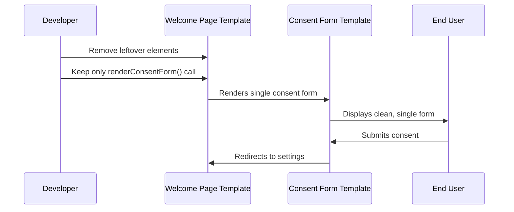

# Consent Form Duplication Elimination Plan

## Problem Analysis

The welcome page (`templates/welcome-page.php`) currently has TWO sources of consent-related content:

1. **Leftover consent elements** from previous implementation
2. **Actual consent form** rendered by `$consent_manager->renderConsentForm()`

This creates visual duplication where users see what appears to be two consent forms.

## Root Cause Diagram

```mermaid
graph TD
    A[templates/welcome-page.php] --> B[Leftover CSS Styling]
    A --> C[Separate Terms Button]
    A --> D[Terms Modal HTML]
    A --> E[Terms Modal JavaScript]
    A --> F[renderConsentForm() Call]
    
    B --> G[Visual Duplication]
    C --> G
    D --> G
    E --> G
    F --> H[Actual Consent Form]
    
    G --> I[User Sees Two Forms]
    H --> I
    
    style I fill:#ffcccc
    style G fill:#ffeecc
    style H fill:#ccffcc
```

## Complete Cleanup Strategy

### Phase 1: Remove Leftover Elements

**Target File:** `templates/welcome-page.php`

**Elements to Remove:**

1. **Lines 45-49:** Separate "Review Full Terms" button
   ```php
   <div class="mpai-welcome-buttons" style="margin-top: 20px;">
       <a href="#" id="mpai-terms-link" class="button">
           <?php _e('Review Full Terms', 'memberpress-ai-assistant'); ?>
       </a>
   </div>
   ```

2. **Lines 53-72:** Terms modal HTML
   ```php
   <!-- Modal for full terms -->
   <div id="mpai-terms-modal" class="mpai-terms-modal" style="display: none;">
       <!-- entire modal content -->
   </div>
   ```

3. **Lines 113-169:** All consent-related CSS
   ```css
   .mpai-consent-checkbox { /* ... */ }
   .mpai-welcome-buttons { /* ... */ }
   .mpai-terms-modal { /* ... */ }
   /* etc. */
   ```

4. **Lines 183-200:** Terms modal JavaScript
   ```javascript
   // Terms link handling
   termsLink.addEventListener('click', function(event) {
       // modal functionality
   });
   ```

### Phase 2: Preserve Essential Elements

**Keep in `templates/welcome-page.php`:**

1. **Basic container structure**
2. **Admin notices display** (`settings_errors('mpai_messages')`)
3. **Consent manager call** (`$consent_manager->renderConsentForm()`)
4. **Basic container CSS** (non-consent related)
5. **Debug logging** for troubleshooting

### Phase 3: Verification

**Expected Result:**
- Only ONE consent form visible on welcome page
- Form comes entirely from `templates/consent-form.php`
- No visual duplication or interference
- All functionality preserved in the actual consent form

## Implementation Steps



## Files to Modify

1. **Primary:** `templates/welcome-page.php`
   - Remove all leftover consent elements
   - Keep minimal structure + renderConsentForm() call

2. **Verify:** `templates/consent-form.php`
   - Ensure it's complete and self-contained
   - Confirm it has terms review functionality

## Testing Checklist

- [ ] Navigate to `admin.php?page=mpai-welcome`
- [ ] Verify only ONE consent form appears
- [ ] Test checkbox enables/disables submit button
- [ ] Test form submission redirects correctly
- [ ] Verify no JavaScript errors in console
- [ ] Confirm terms review functionality works
- [ ] Test on both MemberPress active/inactive scenarios

## Success Criteria

✅ **Single consent form** visible on welcome page  
✅ **No visual duplication** or interference  
✅ **Full functionality preserved** (checkbox, submit, terms)  
✅ **Clean user experience** with no confusion  
✅ **Proper form submission** and redirect behavior  

## Risk Mitigation

- **Backup current template** before changes
- **Test thoroughly** after each modification
- **Verify consent form template** is complete
- **Check both admin scenarios** (MP active/inactive)

## Post-Implementation

After cleanup, the welcome page will be minimal and clean:
- Container with admin notices
- Single consent form rendered by consent manager
- No duplicate elements or visual confusion
- Streamlined user experience

This approach ensures the welcome page serves as a simple container for the consent manager's form, eliminating all sources of duplication.