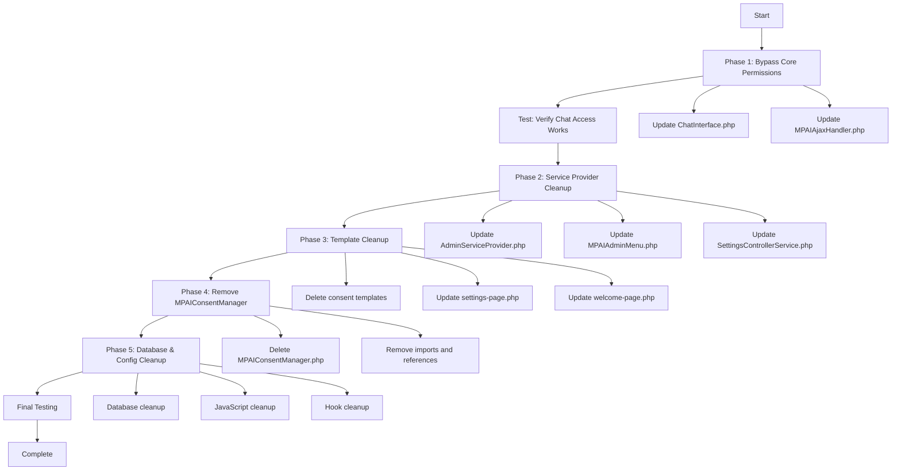

---
**ARCHIVED DOCUMENT**

**Archive Date:** December 15, 2024  
**Archive Reason:** Phase 6B Documentation Cleanup - Historical planning document  
**Original Purpose:** Comprehensive plan for removing consent system from MemberPress AI Assistant  
**Current Status:** Historical reference only - implementation completed, consent system removed  
**Cross-References:** 7 references in project documentation (now archived)  

This document is preserved for historical context. The consent system removal described in this plan has been successfully completed. All consent-related functionality has been removed from the MemberPress AI Assistant plugin.
---

# Complete Consent System Removal Plan

## Overview
This plan outlines the complete removal of the consent system from the MemberPress AI Assistant plugin. The consent system is currently deeply integrated across multiple layers and requires systematic removal to ensure clean functionality.

## Current Consent System Components

### Backend PHP Components
- `src/Admin/MPAIConsentManager.php` - Primary consent management class
- `src/ChatInterface.php` - REST API permission checks
- `src/Admin/MPAIAjaxHandler.php` - AJAX consent handlers
- `src/Admin/MPAIAdminMenu.php` - Admin menu consent integration
- `src/Services/Settings/SettingsControllerService.php` - Settings page consent checks
- `src/DI/Providers/AdminServiceProvider.php` - Consent manager service registration

### Frontend Templates
- `templates/consent-form.php` - Standalone consent page
- `templates/consent-form-inline.php` - Inline consent form
- `templates/welcome-page.php` - Welcome page with consent
- `templates/settings-page.php` - Conditional consent/chat rendering

### Database Storage
- User meta key: `mpai_has_consented`

## Implementation Plan

### Phase 1: Core Permission System Bypass
**Priority: CRITICAL - This enables immediate functionality**

1. **Update ChatInterface.php**
   - Remove consent checks in `checkChatPermissions()` method (lines 1125-1196)
   - Remove consent status from `getChatConfig()` method (lines 1375-1386)
   - Remove consent-related logging throughout the file
   - Always allow authenticated users to access chat

2. **Update MPAIAjaxHandler.php**
   - Remove `handle_save_consent()` method (lines 79-137)
   - Remove consent checks in `handle_chat_interface_request()` (lines 192-205)
   - Remove consent checks in `handle_render_chat_interface()` (lines 356-368)
   - Remove consent-related AJAX action registration

### Phase 2: Service Provider and Dependency Cleanup

1. **Update AdminServiceProvider.php**
   - Remove consent manager registration (lines 39-42)
   - Remove 'consent_manager' from service dependencies (line 65)

2. **Update MPAIAdminMenu.php**
   - Remove consent checks in `ensure_chat_assets_enqueued()` (lines 275-280)
   - Remove consent-related logging
   - Always render chat interface for authenticated users

3. **Update SettingsControllerService.php**
   - Remove consent manager usage (lines 155-157)
   - Remove consent status checks

### Phase 3: Template System Cleanup

1. **Remove Consent Templates**
   - Delete `templates/consent-form.php`
   - Delete `templates/consent-form-inline.php`

2. **Update settings-page.php**
   - Remove consent status checks (lines 136-137, 149-151)
   - Remove conditional consent form rendering (lines 165-213)
   - Always render chat interface
   - Remove consent-related JavaScript

3. **Update welcome-page.php**
   - Remove consent form rendering (lines 34-40)
   - Redirect directly to settings page or show simple welcome message

### Phase 4: Complete MPAIConsentManager Removal

1. **Delete MPAIConsentManager Class**
   - Delete entire `src/Admin/MPAIConsentManager.php` file
   - Remove all 532 lines of consent management code

2. **Remove Consent Manager Imports**
   - Remove imports from all files that reference MPAIConsentManager
   - Update any type hints or dependencies

### Phase 5: Database and Configuration Cleanup

1. **Database Cleanup**
   - Create migration function to remove all `mpai_has_consented` user meta
   - Add cleanup to plugin deactivation hook

2. **JavaScript Configuration Cleanup**
   - Remove `hasConsented` from chat configuration
   - Remove consent-related JavaScript variables
   - Update chat initialization to not check consent status

3. **Hook and Filter Cleanup**
   - Remove all consent-related WordPress hooks
   - Remove consent-related filters and actions
   - Clean up any remaining consent references

## Implementation Order

## Risk Mitigation

### Backup Strategy
- Create full database backup before starting
- Keep original files in backup directory
- Test each phase independently

### Testing Checkpoints
1. After Phase 1: Verify chat interface loads and functions
2. After Phase 2: Verify admin interface works correctly
3. After Phase 3: Verify settings page renders properly
4. After Phase 4: Verify no PHP errors or missing class references
5. After Phase 5: Verify clean installation and no orphaned data

### Rollback Plan
- Keep consent templates temporarily until final testing
- Maintain service provider registration until Phase 4
- Test with consent manager disabled before deletion

## Expected Outcome

After complete implementation:
- ✅ Users have immediate access to AI Assistant upon login
- ✅ No consent forms or permission barriers
- ✅ Simplified codebase with ~600+ lines of code removed
- ✅ Direct access to chat functionality
- ✅ Cleaner admin interface
- ✅ Reduced complexity and maintenance overhead

## Files to Modify

### Files to Update
- `src/ChatInterface.php`
- `src/Admin/MPAIAjaxHandler.php`
- `src/Admin/MPAIAdminMenu.php`
- `src/Services/Settings/SettingsControllerService.php`
- `src/DI/Providers/AdminServiceProvider.php`
- `templates/settings-page.php`
- `templates/welcome-page.php`

### Files to Delete
- `src/Admin/MPAIConsentManager.php`
- `templates/consent-form.php`
- `templates/consent-form-inline.php`

### Database Changes
- Remove all `mpai_has_consented` user meta entries
- No schema changes required

## Success Criteria

1. **Functional**: Chat interface loads immediately for authenticated users
2. **Clean**: No consent-related code remains in codebase
3. **Stable**: No PHP errors or JavaScript console errors
4. **Complete**: All consent templates and classes removed
5. **Tested**: Full functionality verified across all admin pages

This plan ensures complete removal of the consent system while maintaining all core AI Assistant functionality.