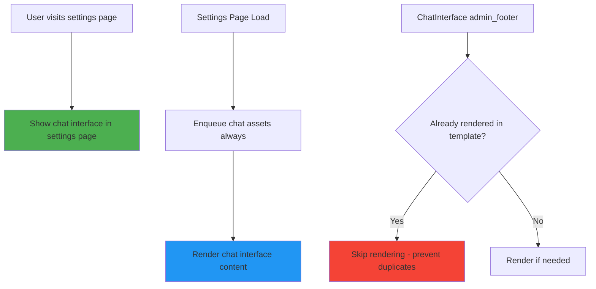

# Chat Interface Fix - Comprehensive Implementation Plan

## Problem Analysis

Based on the logs and code analysis, the chat interface is missing due to several critical issues:

1. **Rendering Logic Issues**: Chat interface rendering logic conflicts between different components
2. **Dual Rendering Attempts**: Both settings template AND ChatInterface admin_footer hook try to render chat interface
3. **Header Modification Errors**: "Cannot modify header information" warnings from redirect attempts after output
4. **Asset Enqueuing Issues**: Chat assets may not be properly loaded when template renders chat interface

## Solution Architecture



## Implementation Plan

### Phase 1: Fix ChatInterface Conflicting Logic

**File**: `src/ChatInterface.php`

**Changes**:
1. **Remove Redirect Logic**: Modify `renderAdminChatInterface()` to not redirect when on settings page
2. **Add Rendering Flag**: Prevent duplicate rendering attempts
3. **Improve Rendering Logic**: Better integration with settings page flow

**Key Modifications**:
```php
// In renderAdminChatInterface()
// Remove problematic redirect logic and simplify:
if (!$this->isSettingsPageWithChatInterface()) {
    return; // Let settings page handle chat interface rendering
}
```

### Phase 2: Enhance Settings Page Template

**File**: `templates/settings-page.php`

**Changes**:
1. **Direct Chat Interface**: Show chat interface directly in settings page
2. **Asset Management**: Ensure chat assets are always available

**Implementation**:
```php
// After settings form, add:
<div id="mpai-chat-container">
    <?php
    // Show chat interface directly
    include MPAI_PLUGIN_DIR . 'templates/chat-interface.php';
    ?>
</div>
```

### Phase 3: Update Admin Menu Asset Handling

**File**: `src/Admin/MPAIAdminMenu.php`

**Changes**:
1. **Always Enqueue Assets**: Enqueue chat assets for settings page
2. **Improved Timing**: Ensure assets are available before template rendering
3. **Better Error Handling**: Graceful fallbacks if asset loading fails

**Key Modification**:
```php
protected function ensure_chat_assets_enqueued(): void {
    // Always enqueue assets for settings page - needed for chat interface
    $this->logWithLevel('Ensuring chat assets are enqueued for settings page', 'info');
    
    $chat_interface = \MemberpressAiAssistant\ChatInterface::getInstance();
    $current_screen = get_current_screen();
    $hook_suffix = $current_screen ? $current_screen->id : 'unknown';
    
    $chat_interface->registerAdminAssets($hook_suffix);
    $this->logWithLevel('Chat assets enqueued successfully', 'info');
}
```

### Phase 4: Prevent Duplicate Rendering

**Implementation Strategy**:
1. **Global Flag**: Set flag when chat interface is rendered in template
2. **Hook Modification**: Check flag in admin_footer hook
3. **Cleanup**: Reset flag after page load

**Code Example**:
```php
// In settings template
global $mpai_chat_rendered;
$mpai_chat_rendered = true;

// In ChatInterface::renderAdminChatInterface()
global $mpai_chat_rendered;
if ($mpai_chat_rendered) {
    error_log('[MPAI Debug] Chat interface already rendered in template, skipping');
    return;
}
```

## Testing Strategy

### Phase 1 Testing: Basic Flow
1. **Settings Page**: Visit settings page → Should show chat interface
2. **Chat Functionality**: Test chat interface functionality
3. **Page Refresh**: Refresh page → Should show chat interface consistently

### Phase 2 Testing: Edge Cases
1. **Multiple Renders**: Prevent duplicate chat interface rendering
2. **JavaScript Disabled**: Graceful fallback behavior
3. **Asset Loading Failures**: Proper error handling

### Phase 3 Testing: Integration
1. **Chat Functionality**: Ensure chat works properly
2. **Asset Dependencies**: Verify all required assets are loaded
3. **Browser Compatibility**: Test across different browsers

## File Structure

```
templates/
├── settings-page.php (modified)
└── chat-interface.php (existing)

src/
├── ChatInterface.php (modified)
└── Admin/
    └── MPAIAdminMenu.php (modified)
```

## Success Criteria

1. ✅ **No Redirects**: User stays on settings page
2. ✅ **Direct Display**: Chat interface appears directly in settings
3. ✅ **No Duplicates**: Only one chat interface rendered per page
4. ✅ **Proper Assets**: All JavaScript and CSS loaded correctly
5. ✅ **Error-Free**: No header modification or JavaScript errors
6. ✅ **Functional Chat**: Chat interface works properly

## Risk Mitigation

1. **Asset Verification**: Check that required assets are loaded before initialization
2. **Error Logging**: Comprehensive logging for debugging
3. **Graceful Degradation**: Basic functionality even if JavaScript fails

## Implementation Order

1. **Phase 1**: Fix ChatInterface conflicting logic (highest priority)
2. **Phase 2**: Update settings page template
3. **Phase 3**: Update admin menu asset handling
4. **Phase 4**: Add duplicate rendering prevention

This plan addresses all identified issues while providing a smooth, redirect-free user experience that shows the chat interface directly on the settings page.