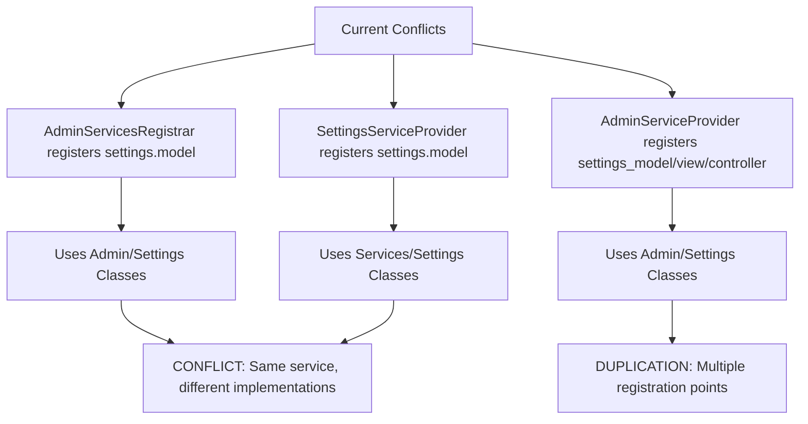
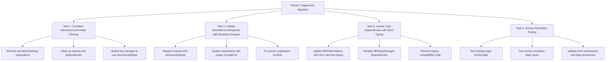
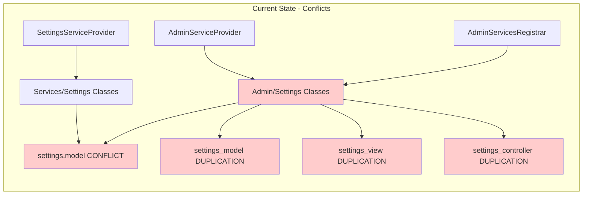
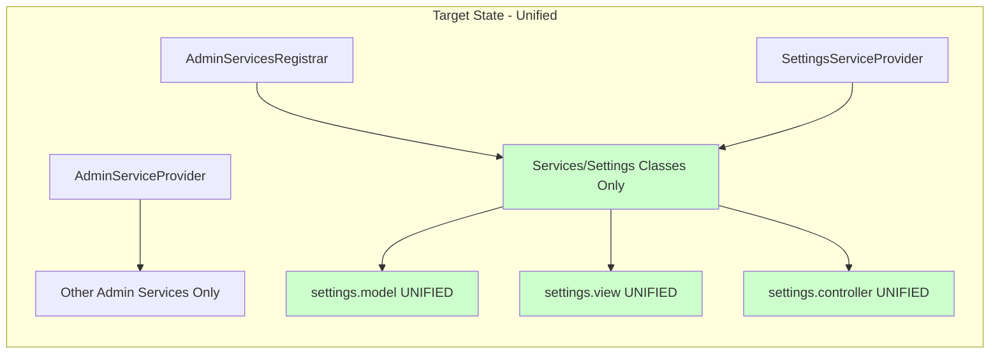

# Phase 2: Migration Implementation Plan
## Settings Classes Duplication Consolidation

### Executive Summary

This document outlines the detailed implementation plan for Phase 2 of the Settings Classes Duplication Consolidation. Phase 1 (Feature Reconciliation) has been completed successfully with the `log_level` functionality now available in Services/Settings classes. Phase 2 focuses on aggressive migration from Admin/Settings to Services/Settings with immediate breaking changes and complete cleanup.

**Objective**: Eliminate all Admin/Settings dependencies and establish Services/Settings as the single source of truth through aggressive migration with breaking changes.

**Key Changes from Original Plan**: 
- API key management is no longer critical (proxy server implementation)
- Immediate breaking changes to type hints for cleaner code
- Complete removal of AdminServiceProvider settings registrations
- Simplified testing focused on service resolution and settings functionality

---

## Current State Analysis

### Service Registration Conflicts Identified



### Dependencies to Update

1. **AdminServicesRegistrar** - Currently uses Admin/Settings classes
2. **AdminServiceProvider** - Duplicates settings registrations
3. **MPAIAdminMenu** - Hard-coded type hints for Admin/Settings
4. **MPAIKeyManager** - Settings dependency (to be simplified)

---

## Implementation Strategy

### Aggressive Migration Approach



---

## Detailed Task Breakdown

### Task 1: Complete AdminServiceProvider Cleanup

**File**: `src/DI/Providers/AdminServiceProvider.php`

**Priority**: HIGH (Removes conflicts immediately)

#### Changes Required:

1. **Remove All Settings Registrations** (lines 32-50):
   ```php
   // DELETE ENTIRELY
   $this->registerSingleton($locator, 'settings_model', function() use ($locator) {
       $logger = $locator->has('logger') ? $locator->get('logger') : null;
       return new MPAISettingsModel($logger);
   });

   $this->registerSingleton($locator, 'settings_view', function() {
       return new MPAISettingsView();
   });

   $this->registerSingleton($locator, 'settings_controller', function() use ($locator) {
       $model = $locator->get('settings_model');
       $view = $locator->get('settings_view');
       $logger = $locator->has('logger') ? $locator->get('logger') : null;
       
       $controller = new MPAISettingsController($model, $view, $logger);
       $controller->init();
       
       return $controller;
   });
   ```

2. **Clean Up Imports** (lines 16-18):
   ```php
   // REMOVE COMPLETELY
   use MemberpressAiAssistant\Admin\Settings\MPAISettingsController;
   use MemberpressAiAssistant\Admin\Settings\MPAISettingsModel;
   use MemberpressAiAssistant\Admin\Settings\MPAISettingsView;
   ```

3. **Update provides() Array** (lines 94-96):
   ```php
   // REMOVE from provides() array
   'settings_model',
   'settings_view', 
   'settings_controller',
   ```

4. **Update Key Manager Registration** (lines 80-84):
   ```php
   // CHANGE
   $this->registerSingleton($locator, 'key_manager', function() use ($locator) {
       $logger = $locator->has('logger') ? $locator->get('logger') : null;
       $settings = $locator->get('settings_model');
       return new MPAIKeyManager('key_manager', $logger, $settings);
   });
   
   // TO (simplified since API keys no longer used)
   $this->registerSingleton($locator, 'key_manager', function() use ($locator) {
       $logger = $locator->has('logger') ? $locator->get('logger') : null;
       return new MPAIKeyManager('key_manager', $logger);
   });
   ```

### Task 2: Update AdminServicesRegistrar with Breaking Changes

**File**: `src/Services/AdminServicesRegistrar.php`

**Priority**: HIGH (Establishes Services/Settings as primary)

#### Changes Required:

1. **Replace Imports** (lines 12-14):
   ```php
   // REPLACE
   use MemberpressAiAssistant\Admin\Settings\MPAISettingsController;
   use MemberpressAiAssistant\Admin\Settings\MPAISettingsModel;
   use MemberpressAiAssistant\Admin\Settings\MPAISettingsView;
   
   // WITH
   use MemberpressAiAssistant\Services\Settings\SettingsControllerService;
   use MemberpressAiAssistant\Services\Settings\SettingsModelService;
   use MemberpressAiAssistant\Services\Settings\SettingsViewService;
   ```

2. **Update Service Instantiation** (lines 73-75):
   ```php
   // REPLACE
   $settings_model = new MPAISettingsModel($logger);
   $settings_view = new MPAISettingsView();
   $settings_controller = new MPAISettingsController($settings_model, $settings_view, $logger);
   
   // WITH
   $settings_model = new SettingsModelService('settings.model', $logger);
   $settings_view = new SettingsViewService('settings.view', $logger);
   $settings_controller = new SettingsControllerService('settings.controller', $logger);
   ```

3. **Fix Service Registration** (lines 78-93):
   ```php
   // REPLACE ENTIRE BLOCK
   // Register settings model with the service locator
   $serviceLocator->register('settings.model', function() use ($settings_model) {
       return $settings_model;
   });
   
   // Register settings model with the service locator (DUPLICATE)
   $serviceLocator->register('settings.model', function() use ($settings_model) {
       return $settings_model;
   });
   
   // Register settings controller with the service locator
   $serviceLocator->register('settings_controller', function() use ($settings_controller) {
       return $settings_controller;
   });
   
   // Initialize settings controller
   $settings_controller->init();
   
   // WITH
   // Register with service locator
   $settings_model->register($serviceLocator);
   $settings_view->register($serviceLocator);
   $settings_controller->register($serviceLocator);
   
   // Boot services in correct order
   $settings_model->boot();
   $settings_view->boot();
   $settings_controller->boot();
   
   // Initialize settings controller
   $settings_controller->init();
   ```

4. **Update Logging** (lines 106-112):
   ```php
   // UPDATE services list
   'services' => [
       'admin_menu',
       'settings.model',
       'settings.view',
       'settings.controller'
   ]
   ```

### Task 3: Update Type Dependencies with Strict Typing

#### File: `src/Admin/MPAIAdminMenu.php`

**Priority**: MEDIUM (Improves code quality)

1. **Add Import** (after line 10):
   ```php
   use MemberpressAiAssistant\Services\Settings\SettingsControllerService;
   ```

2. **Update Property Type** (line 36):
   ```php
   // CHANGE
   /**
    * Settings controller instance (for new MVC architecture)
    *
    * @var \MemberpressAiAssistant\Admin\Settings\MPAISettingsController
    */
   protected $settings_controller;
   
   // TO
   /**
    * Settings controller instance
    *
    * @var \MemberpressAiAssistant\Services\Settings\SettingsControllerService|null
    */
   protected ?SettingsControllerService $settings_controller = null;
   ```

3. **Update Method Signature** (line 56):
   ```php
   // CHANGE
   public function set_settings_controller(\MemberpressAiAssistant\Admin\Settings\MPAISettingsController $settings_controller): void {
   
   // TO
   public function set_settings_controller(SettingsControllerService $settings_controller): void {
   ```

4. **Update Method Documentation** (line 53):
   ```php
   // CHANGE
   /**
    * Set the settings controller (for new MVC architecture)
    *
    * @param \MemberpressAiAssistant\Admin\Settings\MPAISettingsController $settings_controller Settings controller instance
    * @return void
    */
   
   // TO
   /**
    * Set the settings controller
    *
    * @param SettingsControllerService $settings_controller Settings controller instance
    * @return void
    */
   ```

#### File: `src/Admin/MPAIKeyManager.php`

**Priority**: LOW (API keys no longer used)

1. **Simplify Constructor** (line 86):
   ```php
   // CHANGE
   public function __construct(string $name = 'key_manager', $logger = null, $settings = null) {
       parent::__construct($name, $logger);
       
       // Initialize request counts for rate limiting
       $this->request_counts = [
           self::SERVICE_OPENAI => [],
           self::SERVICE_ANTHROPIC => []
       ];
       
       // Store settings model
       $this->settings = $settings;
   }
   
   // TO
   public function __construct(string $name = 'key_manager', $logger = null) {
       parent::__construct($name, $logger);
       
       // Initialize request counts for rate limiting
       $this->request_counts = [
           self::SERVICE_OPENAI => [],
           self::SERVICE_ANTHROPIC => []
       ];
   }
   ```

2. **Remove Settings Methods** (lines 102-116):
   ```php
   // DELETE ENTIRELY
   public function get_settings() {
       return $this->settings;
   }
   
   public function set_settings($settings) {
       $this->settings = $settings;
   }
   ```

3. **Update Property Documentation** (lines 34-37):
   ```php
   // REMOVE ENTIRELY
   /**
    * Settings model instance
    *
    * @var \MemberpressAiAssistant\Admin\Settings\MPAISettingsModel
    */
   private $settings;
   ```

### Task 4: Service Resolution Testing

**Priority**: HIGH (Validation)

#### Focus Areas:

1. **Settings Page Functionality**:
   - [ ] Settings page loads without errors
   - [ ] All 5 tabs render correctly (general, api, chat, access, consent)
   - [ ] Form submissions save to database
   - [ ] Validation messages display properly
   - [ ] Default values load correctly

2. **Service Resolution Edge Cases**:
   - [ ] No service registration conflicts
   - [ ] Proper dependency injection flow
   - [ ] Clean service lifecycle management
   - [ ] Services boot in correct order
   - [ ] No circular dependencies

3. **Data Persistence**:
   - [ ] Settings save correctly to `mpai_settings` option
   - [ ] Log level setting works properly
   - [ ] All validation rules function correctly
   - [ ] No data loss during service resolution

#### Testing Commands:
```bash
# Check for any remaining Admin/Settings references
grep -r "MPAISettings" src/ --exclude-dir=Admin/Settings

# Verify service registrations
grep -r "settings\.model\|settings_model" src/

# Test settings page load
# Navigate to WordPress admin -> MemberPress AI Assistant
```

---

## Architecture Transformation

### Before: Conflicted Registration



### After: Clean Unified System



---

## Implementation Order

### Priority Sequence:

1. **CRITICAL**: Task 1 - AdminServiceProvider cleanup
   - Removes immediate conflicts
   - Eliminates duplicate registrations
   - Simplifies service resolution

2. **HIGH**: Task 2 - AdminServicesRegistrar migration
   - Establishes Services/Settings as primary
   - Fixes service registration conflicts
   - Implements proper DI patterns

3. **MEDIUM**: Task 3 - Type hint updates
   - Improves code quality
   - Enforces strict typing
   - Removes legacy compatibility

4. **VALIDATION**: Task 4 - Testing
   - Ensures functionality preserved
   - Validates service resolution
   - Confirms data persistence

### Rollback Strategy:

- Keep Admin/Settings files intact during Phase 2
- Test each task incrementally
- Maintain backup of original service registrations
- Document any breaking changes

---

## Success Criteria

### Functional Requirements:
- [ ] Settings page loads correctly
- [ ] All form submissions work properly
- [ ] All validation rules function correctly
- [ ] No data loss during migration
- [ ] All 5 tabs render and function properly

### Technical Requirements:
- [ ] Single Settings system (Services/Settings only)
- [ ] No service registration conflicts
- [ ] Proper dependency injection patterns
- [ ] Clean service registration
- [ ] No legacy Admin/Settings references in active code

### Quality Requirements:
- [ ] No performance degradation
- [ ] Improved code maintainability
- [ ] Strict type safety
- [ ] Clean service resolution
- [ ] Comprehensive validation

---

## Risk Assessment

### Low Risk Areas:
- **API Key Management**: No longer critical due to proxy server
- **Data Migration**: Settings structure unchanged
- **User Interface**: No UI changes required

### Medium Risk Areas:
- **Service Resolution**: Potential conflicts during transition
- **Type Compatibility**: Breaking changes to method signatures
- **Initialization Order**: Service boot sequence changes

### Mitigation Strategies:
- Incremental testing after each task
- Maintain rollback capability
- Document all breaking changes
- Test service resolution thoroughly

---

## Conclusion

This aggressive migration approach will eliminate the Settings duplication completely while establishing a clean, modern architecture. The breaking changes ensure type safety and maintainability, while the simplified approach (removing API key dependencies) reduces complexity.

Upon completion, the plugin will have:
- **Single Source of Truth**: Services/Settings classes only
- **Clean Architecture**: Proper DI patterns throughout
- **Type Safety**: Strict typing with modern PHP practices
- **Maintainable Code**: No duplication or conflicts
- **Future-Proof Design**: Extensible service-based architecture

The estimated implementation time is 1-2 days with comprehensive testing and validation.