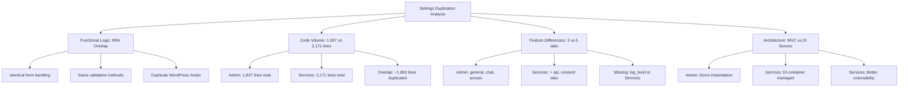
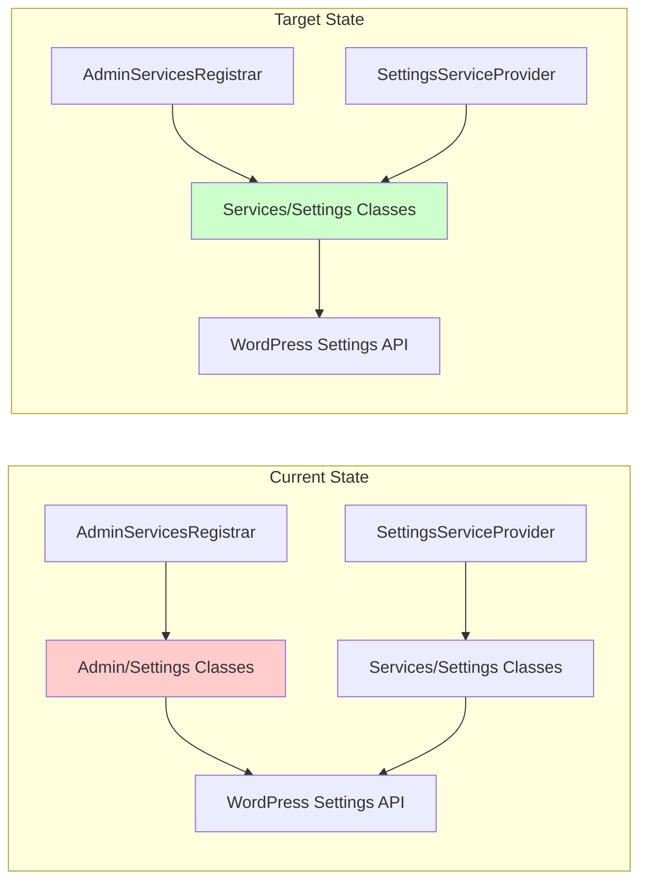
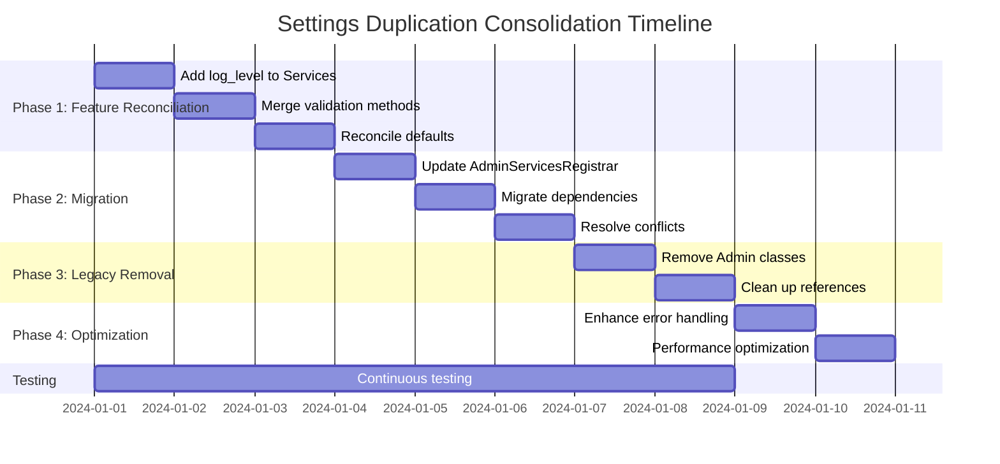

# Phase 4: Settings Classes Duplication Consolidation Plan

## Executive Summary

This document outlines the comprehensive plan to consolidate the duplicated Settings system in the MemberPress AI Assistant plugin. The consolidation will eliminate architectural redundancy by migrating from dual parallel implementations to a single, modern dependency injection-based system.

**Objective**: Consolidate to Services/Settings classes as the single source of truth, eliminating the Admin/Settings duplication while preserving all functionality and establishing a modern, maintainable architecture.

**Timeline**: 6-10 days across 4 phases
**Risk Level**: Medium (mitigated through comprehensive testing and gradual migration)

---

## Current Architecture Analysis

### Identified Duplication

The plugin currently maintains two parallel Settings implementations:

#### 1. Legacy Admin/Settings Classes (Traditional MVC)
- **Location**: `src/Admin/Settings/`
- **Classes**: 
  - [`MPAISettingsController`](src/Admin/Settings/MPAISettingsController.php) - 444 lines
  - [`MPAISettingsModel`](src/Admin/Settings/MPAISettingsModel.php) - 638 lines  
  - [`MPAISettingsView`](src/Admin/Settings/MPAISettingsView.php) - 655 lines
- **Architecture**: Traditional WordPress MVC pattern
- **Features**: 3 tabs (general, chat, access), includes `log_level` setting
- **Usage**: Registered via [`AdminServicesRegistrar`](src/Services/AdminServicesRegistrar.php)

#### 2. Modern Services/Settings Classes (DI-Compatible)
- **Location**: `src/Services/Settings/`
- **Classes**:
  - [`SettingsControllerService`](src/Services/Settings/SettingsControllerService.php) - 775 lines
  - [`SettingsModelService`](src/Services/Settings/SettingsModelService.php) - 664 lines
  - [`SettingsViewService`](src/Services/Settings/SettingsViewService.php) - 732 lines
- **Architecture**: Modern DI pattern with AbstractService inheritance
- **Features**: 5 tabs (general, api, chat, access, consent), includes `consent_required` setting
- **Usage**: Registered via [`SettingsServiceProvider`](src/DI/Providers/SettingsServiceProvider.php)

### Duplication Metrics



### Critical Issues Identified

1. **Service Registration Conflicts**
   - Both systems register `settings.model` service
   - Potential runtime conflicts depending on load order

2. **Feature Inconsistency**
   - Admin version missing API and consent management
   - Services version missing log level configuration
   - Different default values between systems

3. **Maintenance Overhead**
   - Bug fixes must be applied to both systems
   - Feature additions require dual implementation
   - Testing complexity doubled

4. **Architectural Debt**
   - Mixed patterns within same codebase
   - Unclear which system is authoritative
   - Future development uncertainty

---

## Consolidation Strategy

### Decision Matrix

| Criteria | Admin/Settings | Services/Settings | **Winner** |
|----------|----------------|-------------------|------------|
| Architecture Quality | Traditional MVC | Modern DI Pattern | **Services** |
| Feature Completeness | 3 tabs, basic | 5 tabs, full featured | **Services** |
| Extensibility | Limited | High (AbstractService) | **Services** |
| Future-Proof | No | Yes | **Services** |
| Code Quality | Good | Better (DI patterns) | **Services** |
| Maintenance | Higher overhead | Lower overhead | **Services** |

**Recommendation**: Consolidate to Services/Settings as single source of truth.

### Migration Architecture



---

## Implementation Plan

### Phase 1: Feature Reconciliation (2-3 days)

#### Objective
Merge all features from Admin/Settings into Services/Settings to ensure complete feature parity.

#### Tasks

**1.1 Add Missing Settings to SettingsModelService**
```php
// Add to src/Services/Settings/SettingsModelService.php defaults array
private $defaults = [
    // ... existing settings ...
    'log_level' => 'info', // Add from Admin/Settings
];
```

**1.2 Add Log Level Validation**
```php
// Add to validate() method in SettingsModelService
case 'log_level':
    $validated[$key] = $this->validate_log_level($value);
    break;
```

**1.3 Add Log Level Methods**
```php
// Add to SettingsModelService
public function get_log_level() {
    return $this->get('log_level', 'info');
}

private function validate_log_level($value) {
    $valid_levels = ['none', 'error', 'warning', 'info', 'debug', 'trace', 'minimal'];
    
    if (in_array($value, $valid_levels, true)) {
        return $value;
    }
    
    if ($this->logger) {
        $this->logger->warning('Invalid log level', [
            'value' => $value,
            'valid_levels' => $valid_levels
        ]);
    }
    
    return 'info';
}
```

**1.4 Add Log Level Field to SettingsControllerService**
```php
// Add to register_general_section() method
add_settings_field(
    'mpai_log_level',
    __('Log Level', 'memberpress-ai-assistant'),
    [$this, 'render_log_level_field'],
    $this->page_slug,
    'mpai_general_section'
);

// Add render method
public function render_log_level_field() {
    $value = $this->model->get_log_level();
    $this->view->render_log_level_field($value);
}
```

**1.5 Add Log Level Field to SettingsViewService**
```php
// Add to SettingsViewService
public function render_log_level_field($value) {
    $log_levels = [
        'none' => __('None (Disable All Logging)', 'memberpress-ai-assistant'),
        'error' => __('Error (Minimal)', 'memberpress-ai-assistant'),
        'warning' => __('Warning', 'memberpress-ai-assistant'),
        'info' => __('Info (Recommended)', 'memberpress-ai-assistant'),
        'debug' => __('Debug', 'memberpress-ai-assistant'),
        'trace' => __('Trace (Verbose)', 'memberpress-ai-assistant'),
    ];
    ?>
    <select id="mpai_log_level" name="mpai_settings[log_level]">
        <?php foreach ($log_levels as $level => $label) : ?>
            <option value="<?php echo esc_attr($level); ?>" <?php selected($value, $level); ?>>
                <?php echo esc_html($label); ?>
            </option>
        <?php endforeach; ?>
    </select>
    <p class="description">
        <?php esc_html_e('Select the logging level. Higher levels include more detailed logs but may impact performance.', 'memberpress-ai-assistant'); ?>
    </p>
    <?php
}
```

#### Validation Criteria
- [ ] All settings from Admin/Settings present in Services/Settings
- [ ] All validation methods consistent between systems
- [ ] Default values reconciled and documented
- [ ] No functionality regression

### Phase 2: Migration Implementation (2-3 days)

#### Objective
Update all dependent classes to use Services/Settings instead of Admin/Settings.

#### Tasks

**2.1 Update AdminServicesRegistrar**

Replace the settings registration in `src/Services/AdminServicesRegistrar.php`:

```php
// BEFORE (lines 72-93)
$settings_model = new MPAISettingsModel($logger);
$settings_view = new MPAISettingsView();
$settings_controller = new MPAISettingsController($settings_model, $settings_view, $logger);

// AFTER
$settings_model = new SettingsModelService('settings.model', $logger);
$settings_view = new SettingsViewService('settings.view', $logger);
$settings_controller = new SettingsControllerService('settings.controller', $logger);

// Register with service locator
$settings_model->register($serviceLocator);
$settings_view->register($serviceLocator);
$settings_controller->register($serviceLocator);

// Boot services
$settings_model->boot();
$settings_view->boot();
$settings_controller->boot();
```

**2.2 Update Imports**
```php
// Replace in AdminServicesRegistrar.php
use MemberpressAiAssistant\Services\Settings\SettingsControllerService;
use MemberpressAiAssistant\Services\Settings\SettingsModelService;
use MemberpressAiAssistant\Services\Settings\SettingsViewService;
```

**2.3 Update MPAIAdminMenu**

Modify `src/Admin/MPAIAdminMenu.php` to accept Services interface:

```php
// Update type hint in set_settings_controller method
public function set_settings_controller($settings_controller): void {
    $this->settings_controller = $settings_controller;
}
```

**2.4 Update MPAIKeyManager**

Modify `src/Admin/MPAIKeyManager.php` to work with Services classes:

```php
// Update type hints and method calls to be compatible with both systems
// during transition period, then finalize to Services only
```

**2.5 Resolve Service Registration Conflicts**

Update service names to avoid conflicts:
```php
// In AdminServicesRegistrar, use different service names
$serviceLocator->register('admin.settings.model', function() use ($settings_model) {
    return $settings_model;
});

$serviceLocator->register('admin.settings.controller', function() use ($settings_controller) {
    return $settings_controller;
});
```

#### Validation Criteria
- [ ] All dependent classes updated to use Services/Settings
- [ ] No service registration conflicts
- [ ] Settings page loads correctly
- [ ] All form submissions work
- [ ] No PHP errors or warnings

### Phase 3: Legacy Removal (1-2 days)

#### Objective
Remove Admin/Settings classes and clean up all references.

#### Tasks

**3.1 Remove Admin/Settings Files**
```bash
rm src/Admin/Settings/MPAISettingsController.php
rm src/Admin/Settings/MPAISettingsModel.php
rm src/Admin/Settings/MPAISettingsView.php
```

**3.2 Clean Up AdminServicesRegistrar**
```php
// Remove unused imports
// Remove duplicate service registrations
// Simplify registration logic
```

**3.3 Update AdminServiceProvider**

Modify `src/DI/Providers/AdminServiceProvider.php`:
```php
// Remove Admin/Settings class registrations
// Update to use Services/Settings if needed
// Clean up imports
```

**3.4 Search and Replace References**
```bash
# Search for any remaining references
grep -r "MPAISettingsController\|MPAISettingsModel\|MPAISettingsView" src/
```

**3.5 Update Documentation**
- Update class documentation
- Remove references to deprecated classes
- Update architectural documentation

#### Validation Criteria
- [ ] All Admin/Settings files removed
- [ ] No remaining references to Admin/Settings classes
- [ ] All functionality still works
- [ ] No broken imports or dependencies

### Phase 4: Architecture Optimization (1-2 days)

#### Objective
Optimize the consolidated Services/Settings architecture for performance and maintainability.

#### Tasks

**4.1 Enhance Error Handling**
```php
// Add try-catch blocks around critical operations
// Improve error logging and user feedback
// Add graceful degradation for missing dependencies
```

**4.2 Optimize Service Loading**
```php
// Implement lazy loading where appropriate
// Optimize dependency resolution
// Reduce memory footprint
```

**4.3 Add Interface Contracts**
```php
// Create SettingsModelInterface
// Create SettingsViewInterface  
// Create SettingsControllerInterface
// Implement interfaces in Services classes
```

**4.4 Performance Tuning**
```php
// Cache validation results
// Optimize settings queries
// Reduce redundant operations
```

#### Validation Criteria
- [ ] Improved error handling implemented
- [ ] Performance optimizations applied
- [ ] Interface contracts defined and implemented
- [ ] Code quality metrics improved

---

## Risk Assessment and Mitigation

### High Risk Areas

#### 1. Settings Data Loss
**Risk**: Existing settings could be lost during migration
**Probability**: Low
**Impact**: High
**Mitigation**: 
- Create settings backup before migration
- Test data migration thoroughly
- Implement rollback procedure

#### 2. UI Functionality Breakage
**Risk**: Settings pages may not render or function correctly
**Probability**: Medium
**Impact**: High
**Mitigation**:
- Comprehensive UI testing
- Test all form submissions
- Validate all field types and interactions

#### 3. Service Registration Conflicts
**Risk**: Conflicting service names causing runtime errors
**Probability**: Medium
**Impact**: Medium
**Mitigation**:
- Use unique service names during transition
- Test service resolution thoroughly
- Monitor for dependency injection issues

#### 4. External Dependencies
**Risk**: Unknown external code depending on Admin/Settings classes
**Probability**: Low
**Impact**: Medium
**Mitigation**:
- Search codebase for external references
- Implement compatibility layer if needed
- Document breaking changes

### Mitigation Strategies

#### Backup and Recovery
```php
// Create settings backup
function backup_mpai_settings() {
    $settings = get_option('mpai_settings', []);
    update_option('mpai_settings_backup_' . date('Y-m-d-H-i-s'), $settings);
    return $settings;
}

// Restore settings if needed
function restore_mpai_settings($backup_key) {
    $backup = get_option($backup_key);
    if ($backup) {
        update_option('mpai_settings', $backup);
        return true;
    }
    return false;
}
```

#### Feature Flags
```php
// Implement feature flag for gradual migration
function use_services_settings() {
    return get_option('mpai_use_services_settings', false);
}
```

#### Monitoring and Logging
```php
// Add migration tracking
function log_migration_step($step, $status, $details = []) {
    error_log(sprintf(
        'MPAI Settings Migration - Step: %s, Status: %s, Details: %s',
        $step,
        $status,
        json_encode($details)
    ));
}
```

---

## Testing Strategy

### Pre-Migration Testing
1. **Baseline Functionality Test**
   - Test all settings pages load correctly
   - Test all form submissions save properly
   - Test all validation rules work
   - Document current behavior

2. **Data Integrity Test**
   - Export current settings
   - Verify all settings are accessible
   - Test edge cases and invalid data

### Migration Testing

#### Phase 1 Testing
- [ ] All new features work in Services/Settings
- [ ] No regression in existing functionality
- [ ] Validation methods work correctly
- [ ] Default values are appropriate

#### Phase 2 Testing
- [ ] Settings page loads with Services classes
- [ ] All form fields render correctly
- [ ] Form submissions save to database
- [ ] No JavaScript errors
- [ ] All tabs function properly

#### Phase 3 Testing
- [ ] No broken references after file removal
- [ ] All functionality still works
- [ ] No PHP errors or warnings
- [ ] Clean codebase with no dead code

#### Phase 4 Testing
- [ ] Performance improvements verified
- [ ] Error handling works correctly
- [ ] Interface contracts function properly
- [ ] Code quality metrics improved

### Automated Testing

```php
// Unit tests for Services/Settings classes
class SettingsModelServiceTest extends TestCase {
    public function test_log_level_validation() {
        $model = new SettingsModelService();
        $this->assertEquals('info', $model->validate_log_level('info'));
        $this->assertEquals('info', $model->validate_log_level('invalid'));
    }
    
    public function test_settings_migration() {
        // Test that all Admin/Settings functionality works in Services
    }
}

// Integration tests
class SettingsIntegrationTest extends TestCase {
    public function test_settings_page_loads() {
        // Test that settings page loads correctly
    }
    
    public function test_form_submission() {
        // Test that form submissions work
    }
}
```

---

## Success Criteria

### Functional Requirements
- [ ] All original settings functionality preserved
- [ ] All settings pages load correctly
- [ ] All form submissions work properly
- [ ] All validation rules function correctly
- [ ] No data loss during migration

### Technical Requirements
- [ ] Single Settings system (Services/Settings only)
- [ ] No code duplication in Settings classes
- [ ] Proper dependency injection patterns
- [ ] Clean service registration
- [ ] No legacy Admin/Settings references

### Quality Requirements
- [ ] No performance degradation
- [ ] Improved error handling
- [ ] Better code maintainability
- [ ] Comprehensive test coverage
- [ ] Updated documentation

### Acceptance Testing

#### User Acceptance Tests
1. **Settings Management**
   - Admin can access all settings pages
   - Admin can modify and save all settings
   - Settings persist correctly across sessions
   - All validation messages display properly

2. **Feature Completeness**
   - All 5 tabs are accessible (general, api, chat, access, consent)
   - Log level setting works correctly
   - API settings function properly
   - Consent management works as expected

3. **Error Handling**
   - Invalid settings show appropriate errors
   - System gracefully handles missing dependencies
   - User-friendly error messages displayed

#### Technical Acceptance Tests
1. **Architecture Quality**
   - Services follow DI patterns correctly
   - No circular dependencies
   - Proper service lifecycle management
   - Clean separation of concerns

2. **Performance**
   - Settings page load time ≤ baseline
   - Memory usage ≤ baseline
   - No unnecessary database queries
   - Efficient service resolution

---

## Implementation Timeline



### Daily Breakdown

**Day 1-3: Phase 1 - Feature Reconciliation**
- Day 1: Add missing settings and validation
- Day 2: Merge utility methods and reconcile defaults
- Day 3: Testing and validation

**Day 4-6: Phase 2 - Migration Implementation**
- Day 4: Update AdminServicesRegistrar and imports
- Day 5: Migrate dependent classes
- Day 6: Resolve conflicts and comprehensive testing

**Day 7-8: Phase 3 - Legacy Removal**
- Day 7: Remove Admin/Settings files and references
- Day 8: Clean up and final testing

**Day 9-10: Phase 4 - Optimization**
- Day 9: Enhance error handling and add interfaces
- Day 10: Performance optimization and final validation

---

## Conclusion

This consolidation plan will eliminate the significant duplication in the Settings system while establishing a modern, maintainable architecture. The Services/Settings classes provide:

- **Modern DI Architecture**: Proper dependency injection patterns
- **Complete Feature Set**: All 5 tabs with full functionality
- **Better Maintainability**: Single source of truth for settings
- **Future-Proof Design**: Extensible service-based architecture
- **Improved Testing**: Better separation of concerns

The 4-phase approach ensures a safe, methodical migration with comprehensive testing at each step. The estimated 6-10 day timeline provides adequate buffer for thorough testing and validation.

Upon completion, the plugin will have a clean, modern Settings architecture that eliminates maintenance overhead and provides a solid foundation for future enhancements.