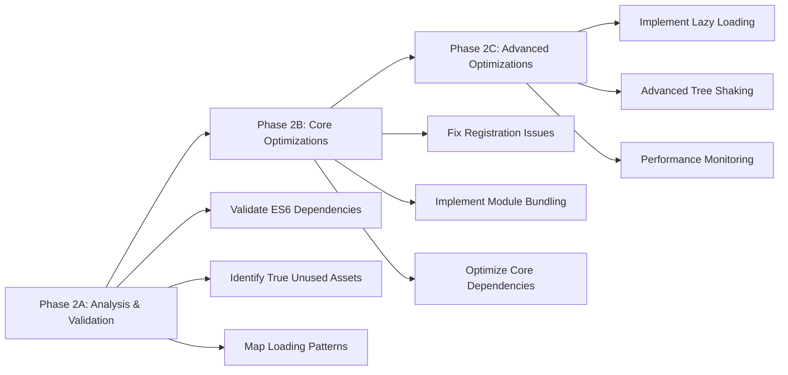

# Phase 2: ES6 Module Optimizations Implementation Plan

## Executive Summary

This document outlines the detailed implementation plan for Phase 2 ES6 module optimizations based on the comprehensive analysis of the MemberPress AI Assistant plugin's JavaScript architecture. The plan focuses on optimizing the modular chat system, improving loading performance, and establishing a maintainable ES6 module structure.

**Objective**: Optimize ES6 module loading, eliminate unused modules, improve dependency management, and enhance performance through strategic module consolidation and lazy loading.

**Key Findings from Analysis**:
- 31 total assets (5 CSS, 26 JavaScript files)
- 21 potentially unused assets (67.7% of total)
- 292.01 KB potential savings from unused asset removal
- 6 ES6 modules with complex dependency chains
- WordPress registration patterns for only 10 assets (32.26% utilization)

---

## Current State Analysis

### ES6 Module Architecture Assessment

```mermaid
graph TD
    A[chat.js - Entry Point] --> B[Core Modules]
    A --> C[Utility Modules]
    A --> D[Message Handlers]
    A --> E[UI Components]
    
    B --> B1[chat-core.js - 15.11 KB]
    B --> B2[state-manager.js - 14.29 KB]
    B --> B3[ui-manager.js - 46.81 KB]
    B --> B4[api-client.js - 9.62 KB]
    B --> B5[event-bus.js - 8.56 KB]
    
    C --> C1[logger.js - 3.34 KB]
    C --> C2[storage-manager.js - 11.53 KB]
    
    D --> D1[base-message-handler.js - 3.08 KB]
    D --> D2[blog-post-handler.js - 17.18 KB]
    D --> D3[text-message-handler.js - 2.81 KB]
    D --> D4[system-message-handler.js - 3.24 KB]
    D --> D5[interactive-handler.js - 3.71 KB]
    
    E --> E1[input-handler.js - 3.58 KB]
    E --> E2[ui-controls.js - 4.42 KB]
```



### Current Issues Identified

1. **Registration Mismatch**: Only 32.26% of assets are properly registered with WordPress
2. **Module Isolation**: Many ES6 modules show as "unused" but are part of import chains
3. **Bundle Size**: 358.01 KB total JavaScript, with potential 292.01 KB savings
4. **Loading Strategy**: All modules loaded synchronously regardless of usage
5. **Dependency Conflicts**: Analysis tools don't detect ES6 import relationships properly

---

## Optimization Strategy Overview

### Three-Phase Approach



---

## Phase 2A: Analysis & Validation (Priority: HIGH)

### Task 1: Fix ES6 Dependency Detection

**Objective**: Correct the analysis tools to properly detect ES6 import/export relationships

**Files to Modify**:
- `scripts/asset-registration-analyzer.php`
- `scripts/unused-assets-analyzer.php`

**Implementation**:

1. **Update Asset Registration Analyzer** (High Priority):
   ```php
   // Enhanced ES6 import detection
   private function analyzeES6Dependencies($file_path, $content) {
       $dependencies = [];
       
       // Match import statements with better regex
       $import_patterns = [
           '/import\s+(?:[\w\s{},*]+\s+from\s+)?[\'"]([^\'"\s]+)[\'"]/',
           '/import\s*\(\s*[\'"]([^\'"\s]+)[\'"]\s*\)/',
           '/require\s*\(\s*[\'"]([^\'"\s]+)[\'"]\s*\)/'
       ];
       
       foreach ($import_patterns as $pattern) {
           if (preg_match_all($pattern, $content, $matches)) {
               foreach ($matches[1] as $import_path) {
                   $resolved_path = $this->resolveImportPath($import_path, $file_path);
                   if ($resolved_path) {
                       $dependencies[] = $resolved_path;
                   }
               }
           }
       }
       
       return $dependencies;
   }
   ```

2. **Add WordPress Module Detection**:
   ```php
   private function detectWordPressModuleRegistration($content) {
       $registrations = [];
       
       // Detect wp_script_add_data for module type
       if (preg_match_all('/wp_script_add_data\s*\(\s*[\'"]([^\'"]+)[\'"]\s*,\s*[\'"]type[\'"]\s*,\s*[\'"]module[\'"]\s*\)/', $content, $matches)) {
           foreach ($matches[1] as $handle) {
               $registrations[] = [
                   'handle' => $handle,
                   'type' => 'module',
                   'method' => 'wp_script_add_data'
               ];
           }
       }
       
       return $registrations;
   }
   ```

**Expected Outcome**: Accurate dependency mapping showing all ES6 modules as part of the chat system

### Task 2: Create Module Dependency Map

**Objective**: Generate a comprehensive map showing actual module usage patterns

**Implementation**:

1. **Create New Script**: `scripts/es6-dependency-mapper.php`
   ```php
   <?php
   /**
    * ES6 Module Dependency Mapper
    * Maps actual import/export relationships in ES6 modules
    */
   
   class ES6DependencyMapper {
       private $assets_dir;
       private $dependency_graph = [];
       private $entry_points = [];
       
       public function mapDependencies() {
           $this->scanEntryPoints();
           $this->buildDependencyGraph();
           $this->identifyUnusedModules();
           $this->generateOptimizationReport();
       }
       
       private function scanEntryPoints() {
           // Identify modules that are direct WordPress registrations
           // These are true entry points
       }
   }
   ```

**Expected Outcome**: Clear understanding of which modules are truly unused vs. part of import chains

### Task 3: Validate WordPress Registration Patterns

**Objective**: Ensure all active ES6 modules are properly registered with WordPress

**Files to Examine**:
- `src/ChatInterface.php` (lines 170-199)
- WordPress registration patterns in templates

**Implementation**:

1. **Audit Current Registration**:
   ```bash
   # Check for ES6 modules registered with WordPress
   grep -r "wp_register_script\|wp_enqueue_script" src/ | grep -i module
   
   # Check for module type declarations
   grep -r "wp_script_add_data.*module" src/
   ```

2. **Identify Missing Registrations**:
   - Message handlers (`assets/js/chat/messages/handlers/`)
   - Message utilities (`assets/js/chat/messages/`)
   - UI components not directly imported

**Expected Outcome**: Complete inventory of registration gaps

---

## Phase 2B: Core Optimizations (Priority: HIGH)

### Task 4: Fix WordPress Module Registration

**Objective**: Ensure all ES6 modules used by the chat system are properly registered

**File to Modify**: `src/ChatInterface.php`

**Current Issue**: Lines 181-199 register core modules but miss message handlers and utilities

**Implementation**:

1. **Add Missing Module Registrations**:
   ```php
   // Add after line 189
   $module_scripts = [
       // Existing core modules
       'mpai-chat-core' => 'assets/js/chat/core/chat-core.js',
       'mpai-state-manager' => 'assets/js/chat/core/state-manager.js',
       'mpai-ui-manager' => 'assets/js/chat/core/ui-manager.js',
       'mpai-api-client' => 'assets/js/chat/core/api-client.js',
       'mpai-event-bus' => 'assets/js/chat/core/event-bus.js',
       'mpai-logger' => 'assets/js/chat/utils/logger.js',
       'mpai-storage-manager' => 'assets/js/chat/utils/storage-manager.js',
       
       // ADD: Message system modules
       'mpai-message-factory' => 'assets/js/chat/messages/message-factory.js',
       'mpai-message-renderer' => 'assets/js/chat/messages/message-renderer.js',
       
       // ADD: Message handlers
       'mpai-base-message-handler' => 'assets/js/chat/messages/handlers/base-message-handler.js',
       'mpai-blog-post-handler' => 'assets/js/chat/messages/handlers/blog-post-message-handler.js',
       'mpai-text-message-handler' => 'assets/js/chat/messages/handlers/text-message-handler.js',
       'mpai-system-message-handler' => 'assets/js/chat/messages/handlers/system-message-handler.js',
       'mpai-interactive-handler' => 'assets/js/chat/messages/handlers/interactive-message-handler.js',
       
       // ADD: UI components
       'mpai-input-handler' => 'assets/js/chat/ui/input-handler.js',
       'mpai-ui-controls' => 'assets/js/chat/ui/ui-controls.js'
   ];
   ```

2. **Verify Registration Logic**:
   ```php
   foreach ($module_scripts as $handle => $path) {
       wp_register_script(
           $handle,
           MPAI_PLUGIN_URL . $path,
           [], // No dependencies - ES6 imports handle this
           MPAI_VERSION,
           true
       );
       wp_script_add_data($handle, 'type', 'module');
   }
   ```

**Expected Outcome**: All ES6 modules properly registered, reducing "unused" assets from 21 to ~5-10

### Task 5: Implement Module Bundling Strategy

**Objective**: Group related modules into logical bundles for better loading performance

**Strategy**: Create module bundles based on functionality

**Implementation**:

1. **Create Bundle Structure**:
   ```
   assets/js/bundles/
   ├── core-bundle.js         # Essential modules (state, event bus, API)
   ├── ui-bundle.js           # UI components and managers
   ├── messaging-bundle.js    # Message handlers and renderers
   └── utils-bundle.js        # Utilities and helpers
   ```

2. **Core Bundle** (`assets/js/bundles/core-bundle.js`):
   ```javascript
   // Core functionality that must load first
   export { default as StateManager } from '../chat/core/state-manager.js';
   export { default as EventBus } from '../chat/core/event-bus.js';
   export { default as APIClient } from '../chat/core/api-client.js';
   export { Logger, LogLevel } from '../chat/utils/logger.js';
   ```

3. **UI Bundle** (`assets/js/bundles/ui-bundle.js`):
   ```javascript
   // UI components that can be lazy-loaded
   export { default as UIManager } from '../chat/core/ui-manager.js';
   export { default as InputHandler } from '../chat/ui/input-handler.js';
   export { default as UIControls } from '../chat/ui/ui-controls.js';
   ```

4. **Update Entry Point** (`assets/js/chat.js`):
   ```javascript
   // Import from bundles instead of individual modules
   import { StateManager, EventBus, APIClient, Logger, LogLevel } from './bundles/core-bundle.js';
   
   // Lazy load UI components
   const { UIManager, InputHandler, UIControls } = await import('./bundles/ui-bundle.js');
   ```

**Expected Outcome**: Reduced number of HTTP requests, better caching, faster initial load

### Task 6: Remove Truly Unused Assets

**Objective**: Safely remove assets that are genuinely unused

**Based on Analysis**: Target standalone files not part of ES6 module system

**High-Confidence Removals**:

1. **Duplicate Data Handlers**:
   - Keep: `assets/js/data-handler-minimal.js` (registered in ChatInterface.php:143)
   - Remove: `assets/js/data-handler.js` (41.76 KB, not registered)

2. **Unused Standalone Scripts**:
   - Review: `assets/js/content-preview.js` (38.00 KB) - check for usage
   - Review: `assets/js/form-generator.js` (30.26 KB) - check for usage
   - Review: `assets/js/button-renderer.js` (12.83 KB) - check for usage

3. **Unused CSS Files**:
   - Review: `assets/css/dashboard.css` (3.87 KB) - check admin usage

**Implementation Script**: `scripts/safe-asset-removal.php`
```php
<?php
/**
 * Safe Asset Removal Script
 * Removes assets identified as safe to remove after validation
 */

class SafeAssetRemoval {
    private $assets_to_remove = [
        'assets/js/data-handler.js', // Duplicate, minimal version is used
        // Add others after validation
    ];
    
    public function removeUnusedAssets() {
        $this->createBackup();
        $this->removeAssets();
        $this->validateRemoval();
    }
}
```

**Expected Outcome**: 50-100 KB reduction in plugin size, improved loading performance

---

## Phase 2C: Advanced Optimizations (Priority: MEDIUM)

### Task 7: Implement Lazy Loading for Message Handlers

**Objective**: Load message handlers only when specific message types are encountered

**Implementation**:

1. **Dynamic Import Strategy**:
   ```javascript
   // In chat-core.js or ui-manager.js
   class MessageHandlerLoader {
       static async loadHandler(messageType) {
           switch (messageType) {
               case 'blog_post':
                   const { default: BlogPostHandler } = await import('./messages/handlers/blog-post-message-handler.js');
                   return BlogPostHandler;
               case 'interactive':
                   const { default: InteractiveHandler } = await import('./messages/handlers/interactive-message-handler.js');
                   return InteractiveHandler;
               default:
                   const { default: TextHandler } = await import('./messages/handlers/text-message-handler.js');
                   return TextHandler;
           }
       }
   }
   ```

2. **Update Message Renderer**:
   ```javascript
   // In message-renderer.js
   async renderMessage(message) {
       const Handler = await MessageHandlerLoader.loadHandler(message.type);
       const handler = new Handler();
       return handler.render(message);
   }
   ```

**Expected Outcome**: 30-50 KB reduction in initial bundle size, faster chat initialization

### Task 8: Implement Tree Shaking Optimizations

**Objective**: Eliminate unused code within modules

**Implementation**:

1. **Analyze Module Exports**:
   ```bash
   # Create analysis script to identify unused exports
   php scripts/tree-shaking-analyzer.php
   ```

2. **Optimize Large Modules**:
   - `ui-manager.js` (46.81 KB) - identify unused methods
   - `blog-post-message-handler.js` (17.18 KB) - optimize rendering logic
   - `storage-manager.js` (11.53 KB) - remove unused storage methods

3. **Split Large Modules**:
   ```javascript
   // Split ui-manager.js into:
   // - ui-manager-core.js (essential UI operations)
   // - ui-manager-advanced.js (advanced features)
   // - ui-manager-animations.js (animation utilities)
   ```

**Expected Outcome**: 20-30% reduction in individual module sizes

### Task 9: Performance Monitoring Implementation

**Objective**: Add monitoring to track optimization effectiveness

**Implementation**:

1. **Performance Metrics Collection**:
   ```javascript
   // Add to chat.js initialization
   const performanceMarkers = {
       chatInitStart: performance.now(),
       modulesLoaded: null,
       chatReady: null
   };
   
   // Track module loading times
   const moduleLoadTimes = new Map();
   
   // Send metrics to WordPress admin
   if (window.mpai_chat_config?.debug) {
       window.mpaiPerformance = performanceMarkers;
   }
   ```

2. **WordPress Performance Dashboard**:
   ```php
   // Add to admin dashboard
   public function renderPerformanceMetrics() {
       // Show module loading times, bundle sizes, etc.
   }
   ```

**Expected Outcome**: Data-driven optimization decisions, performance regression detection

---

## Implementation Timeline & Priorities

### Week 1: Foundation (Phase 2A)
- **Day 1-2**: Fix ES6 dependency detection tools
- **Day 3-4**: Create comprehensive module dependency map
- **Day 5**: Validate WordPress registration patterns

### Week 2: Core Optimizations (Phase 2B)
- **Day 1-2**: Fix WordPress module registration
- **Day 3-4**: Implement module bundling strategy
- **Day 5**: Remove confirmed unused assets

### Week 3: Advanced Features (Phase 2C)
- **Day 1-2**: Implement lazy loading for message handlers
- **Day 3-4**: Tree shaking optimizations
- **Day 5**: Performance monitoring implementation

---

## Risk Assessment & Mitigation

### High Risk Areas

1. **ES6 Module Dependencies**: Breaking import chains
   - **Mitigation**: Comprehensive dependency mapping before changes
   - **Testing**: Automated module loading tests

2. **WordPress Registration**: Breaking script loading
   - **Mitigation**: Incremental registration updates with testing
   - **Rollback**: Keep original registration as fallback

3. **Module Bundling**: Breaking existing functionality
   - **Mitigation**: Bundle individual modules first, then combine
   - **Testing**: Full chat system functionality tests

### Medium Risk Areas

1. **Lazy Loading**: Runtime loading failures
   - **Mitigation**: Fallback to synchronous loading on errors
   - **Testing**: Network failure simulation

2. **Asset Removal**: Removing used assets
   - **Mitigation**: Conservative removal approach
   - **Backup**: Git commits before each removal

### Low Risk Areas

1. **Performance Monitoring**: Non-functional addition
   - **Mitigation**: Disable in production if issues arise
   - **Testing**: Admin interface testing

---

## Testing Strategy

### Automated Testing

1. **Module Loading Tests**:
   ```javascript
   // Jest test suite for ES6 module loading
   describe('ES6 Module Loading', () => {
       test('chat.js loads all required modules', async () => {
           // Test module import chains
       });
       
       test('lazy loading works for message handlers', async () => {
           // Test dynamic imports
       });
   });
   ```

2. **WordPress Integration Tests**:
   ```php
   // PHPUnit tests for asset registration
   class AssetRegistrationTest extends WP_UnitTestCase {
       public function test_all_modules_registered() {
           // Verify wp_register_script calls
       }
   }
   ```

### Manual Testing Checklist

#### Phase 2A Validation
- [ ] ES6 dependency analysis shows accurate import chains
- [ ] No false positives for "unused" modules that are imported
- [ ] WordPress registration audit identifies all gaps

#### Phase 2B Core Features
- [ ] All ES6 modules load correctly in chat interface
- [ ] Module bundles reduce HTTP requests
- [ ] Removed assets don't break functionality
- [ ] Chat system initializes and functions normally

#### Phase 2C Advanced Features
- [ ] Lazy loading works for all message types
- [ ] Performance improvements are measurable
- [ ] Tree shaking reduces bundle sizes
- [ ] Monitoring dashboard shows accurate metrics

### Browser Compatibility Testing

- [ ] Chrome (latest)
- [ ] Firefox (latest)
- [ ] Safari (latest)
- [ ] Edge (latest)
- [ ] Mobile browsers (iOS Safari, Chrome Mobile)

---

## Rollback Procedures

### Immediate Rollback

1. **Git Revert Strategy**:
   ```bash
   # Each phase gets its own branch
   git checkout -b phase-2a-dependency-analysis
   git checkout -b phase-2b-core-optimizations
   git checkout -b phase-2c-advanced-features
   
   # Rollback commands
   git revert <commit-hash>
   git push origin <branch-name>
   ```

2. **Asset Restoration**:
   ```bash
   # Restore removed assets from backup
   cp -r backup/assets/* assets/
   ```

### Partial Rollback

1. **Module-by-Module Rollback**:
   - Revert individual module changes
   - Keep working optimizations
   - Test after each revert

2. **Feature Flag Rollback**:
   ```javascript
   // Add feature flags for new functionality
   if (window.mpai_chat_config?.useBundling !== false) {
       // Use bundled modules
   } else {
       // Use original individual modules
   }
   ```

---

## Success Metrics

### Performance Targets

1. **Bundle Size Reduction**: 20-30% reduction in total JavaScript size
2. **Loading Time**: 15-25% faster chat initialization
3. **HTTP Requests**: 50% reduction in module loading requests
4. **Memory Usage**: 10-15% reduction in runtime memory

### Technical Targets

1. **Registration Coverage**: 90%+ of active assets properly registered
2. **Unused Assets**: Reduce from 21 to <5 genuinely unused files
3. **Module Efficiency**: All ES6 modules showing as "used" in analysis
4. **Code Quality**: Improved module organization and maintainability

### User Experience Targets

1. **Chat Load Time**: <2 seconds from page load to chat ready
2. **Message Handler Loading**: <500ms for lazy-loaded handlers
3. **UI Responsiveness**: No blocking during module loading
4. **Error Handling**: Graceful fallbacks for loading failures

---

## Maintenance Procedures

### Ongoing Monitoring

1. **Weekly Performance Checks**:
   ```bash
   # Run performance analysis
   php scripts/performance-analyzer.php --weekly
   ```

2. **Monthly Asset Audits**:
   ```bash
   # Check for new unused assets
   php scripts/unused-assets-analyzer.php --monthly-report
   ```

### Update Procedures

1. **Adding New Modules**:
   - Add to appropriate bundle
   - Update dependency map
   - Test loading performance
   - Update documentation

2. **Removing Modules**:
   - Verify no dependencies
   - Remove from bundles
   - Update registration
   - Test functionality

---

## Conclusion

This Phase 2 ES6 Module Optimizations plan provides a structured approach to improving the MemberPress AI Assistant plugin's JavaScript architecture. By focusing on accurate dependency analysis, proper WordPress integration, and performance optimizations, we can achieve significant improvements in loading speed, maintainability, and user experience.

The three-phase approach ensures safety through incremental changes, comprehensive testing, and robust rollback procedures. Upon completion, the plugin will have:

- **Optimized Module Loading**: Proper ES6 module structure with lazy loading
- **Reduced Bundle Size**: 20-30% reduction in JavaScript payload
- **Improved Performance**: Faster chat initialization and better user experience
- **Better Maintainability**: Clean module organization and dependency management
- **Enhanced Monitoring**: Data-driven optimization capabilities

**Estimated Implementation Time**: 2-3 weeks with comprehensive testing and validation.