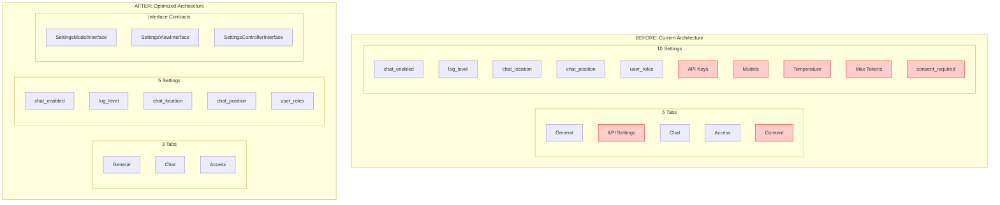
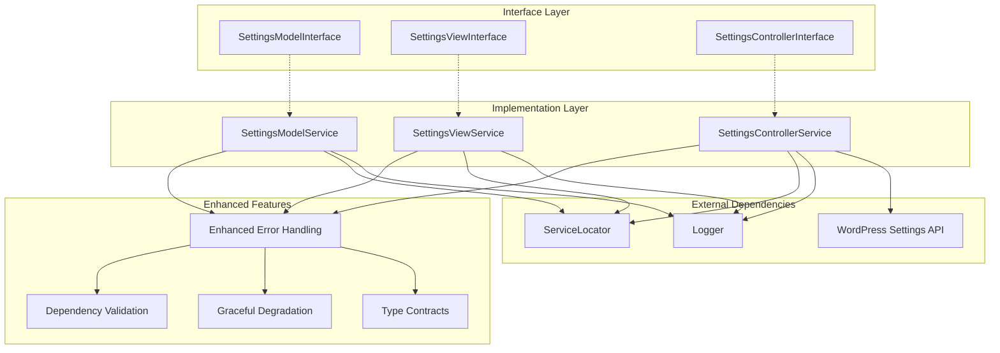
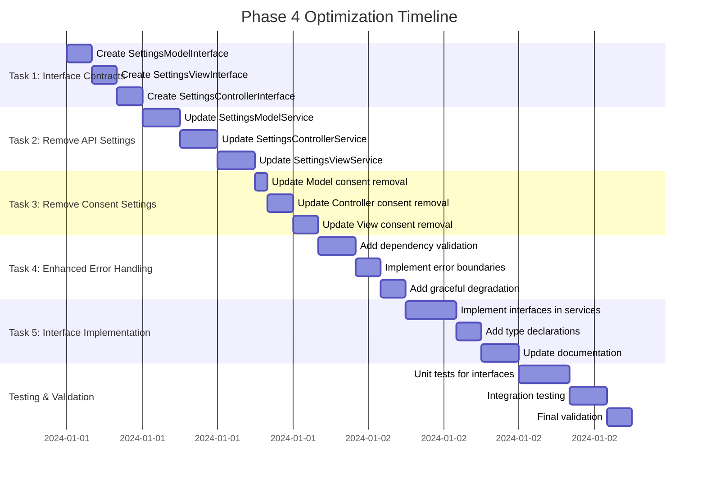

# Phase 4: Services/Settings Architecture Optimization Implementation Plan

## Executive Summary

This document outlines the comprehensive optimization plan for the Services/Settings architecture, focusing on interface contracts, code maintainability, and architectural cleanup. The optimization removes redundant settings due to proxy architecture and consent management, resulting in a clean, maintainable, and well-contracted system.

**Primary Objectives:**
- Create robust interface contracts for type safety and maintainability
- Remove API settings (handled by proxy architecture)
- Remove obsolete admin settings
- Enhance error handling and dependency validation
- Establish clean 3-tab structure (General, Chat, Access)

**Timeline:** 2-3 days
**Risk Level:** Low-Medium (architectural improvements with comprehensive testing)

---

## Current Architecture Analysis

### **Services/Settings Classes Analyzed**

#### **SettingsModelService** (701 lines)
- ✅ **Strengths**: Comprehensive validation, good error handling, proper DI patterns
- 🔧 **Optimizations**: Remove 9 API settings, remove 1 consent setting, add interface contract
- 📊 **Impact**: Reduces from 10 settings to 6 core settings

#### **SettingsControllerService** (793 lines)  
- ✅ **Strengths**: Good separation of concerns, robust form handling, security checks
- 🔧 **Optimizations**: Remove API tab, remove consent tab, add interface contract
- 📊 **Impact**: Reduces from 5 tabs to 3 tabs (General, Chat, Access)

#### **SettingsViewService** (770 lines)
- ✅ **Strengths**: Pure presentation layer, no business logic, good UI patterns
- 🔧 **Optimizations**: Remove API fields, remove consent fields, add interface contract
- 📊 **Impact**: Simplifies UI rendering and reduces complexity

### **Settings to Remove**

#### **API Settings (Proxy Architecture)**
```php
// Remove from SettingsModelService defaults
'openai_api_key' => '',
'openai_model' => 'gpt-4o', 
'openai_temperature' => 0.7,
'openai_max_tokens' => 1000,
'anthropic_api_key' => '',
'anthropic_model' => 'claude-3-opus-20240229',
'anthropic_temperature' => 0.7,
'anthropic_max_tokens' => 1000,
'primary_api' => 'openai',
```

#### **Obsolete Settings**
```php
// Remove from SettingsModelService defaults
'obsolete_setting' => true,
```

### **Final Simplified Settings Structure**
```php
private $defaults = [
    // General settings
    'chat_enabled' => true,
    'log_level' => 'info',
    
    // Chat settings  
    'chat_location' => 'admin_only',
    'chat_position' => 'bottom_right',
    
    // Access settings
    'user_roles' => ['administrator'],
];
```

---

## Implementation Plan

### **Task 1: Create Interface Contracts**

**Objective**: Define clear interface contracts for type safety and maintainability.

#### **1.1 Create SettingsModelInterface**
```php
<?php
namespace MemberpressAiAssistant\Interfaces;

interface SettingsModelInterface {
    // Core CRUD operations
    public function get(string $key, $default = null);
    public function set(string $key, $value, bool $save = true): bool;
    public function get_all(): array;
    public function update(array $settings, bool $save = true): bool;
    public function save(): bool;
    public function reset(bool $save = true): bool;
    
    // Validation
    public function validate(array $settings): array;
    
    // Specific getters for type safety
    public function is_chat_enabled(): bool;
    public function get_chat_location(): string;
    public function get_chat_position(): string;
    public function get_user_roles(): array;
    public function get_log_level(): string;
    public function can_role_access_chat(string $role): bool;
}
```

#### **1.2 Create SettingsViewInterface**
```php
<?php
namespace MemberpressAiAssistant\Interfaces;

interface SettingsViewInterface {
    // Page rendering
    public function render_page(string $current_tab, array $tabs, string $page_slug, SettingsModelInterface $model): void;
    public function render_tabs(string $current_tab, array $tabs): void;
    public function render_form(string $current_tab, string $page_slug, SettingsModelInterface $model): void;
    public function render_error(string $message): void;
    
    // Section rendering
    public function render_general_section(): void;
    public function render_chat_section(): void;
    public function render_access_section(): void;
    
    // Field rendering
    public function render_chat_enabled_field(bool $value): void;
    public function render_log_level_field(string $value): void;
    public function render_chat_location_field(string $value): void;
    public function render_chat_position_field(string $value): void;
    public function render_user_roles_field(array $value): void;
}
```

#### **1.3 Create SettingsControllerInterface**
```php
<?php
namespace MemberpressAiAssistant\Interfaces;

interface SettingsControllerInterface {
    // Core functionality
    public function render_page(): void;
    public function register_settings(): void;
    public function handle_form_submission(): void;
    public function sanitize_settings(array $input): array;
    
    // Tab and section management
    public function get_tabs(): array;
    public function get_page_slug(): string;
    
    // Field rendering delegation
    public function render_chat_enabled_field(): void;
    public function render_log_level_field(): void;
    public function render_chat_location_field(): void;
    public function render_chat_position_field(): void;
    public function render_user_roles_field(): void;
}
```

### **Task 2: Remove API Settings**

**Objective**: Clean up API-related code since the system uses proxy architecture.

#### **2.1 Update SettingsModelService**
- Remove API settings from `$defaults` array
- Remove API validation methods:
  - `validate_api_key()`
  - `validate_openai_model()`
  - `validate_anthropic_model()`
  - `validate_temperature()`
  - `validate_max_tokens()`
  - `validate_primary_api()`
- Remove API getter methods:
  - `get_openai_api_key()`
  - `get_openai_model()`
  - `get_openai_temperature()`
  - `get_openai_max_tokens()`
  - `get_anthropic_api_key()`
  - `get_anthropic_model()`
  - `get_anthropic_temperature()`
  - `get_anthropic_max_tokens()`
  - `get_primary_api()`

#### **2.2 Update SettingsControllerService**
- Remove `'api'` from `$tabs` array
- Remove `register_api_section()` method
- Remove API field rendering methods:
  - `render_openai_api_key_field()`
  - `render_openai_model_field()`
  - `render_openai_temperature_field()`
  - `render_openai_max_tokens_field()`
  - `render_anthropic_api_key_field()`
  - `render_anthropic_model_field()`
  - `render_anthropic_temperature_field()`
  - `render_anthropic_max_tokens_field()`
  - `render_primary_api_field()`

#### **2.3 Update SettingsViewService**
- Remove `'api'` case from `render_fields()` method
- Remove `render_api_section()` method
- Remove API field rendering methods:
  - `render_openai_api_key_field()`
  - `render_anthropic_api_key_field()`
  - `render_primary_api_field()`
  - `render_openai_model_field()`
  - `render_anthropic_model_field()`
  - `render_openai_temperature_field()`
  - `render_openai_max_tokens_field()`
  - `render_anthropic_temperature_field()`
  - `render_anthropic_max_tokens_field()`
  - `render_provider_selection_js()`

### **Task 3: Remove Obsolete Admin Settings**

**Objective**: Remove obsolete management UI components.

#### **3.1 Update SettingsModelService**
- Remove obsolete settings from `$defaults`
- Remove obsolete validation in `validate()` method
- Remove obsolete getter methods

#### **3.2 Update SettingsControllerService**
- Remove obsolete tabs from `$tabs` array
- Remove obsolete section registration methods
- Remove obsolete imports
- Remove obsolete handling methods

#### **3.3 Update SettingsViewService**
- Remove obsolete cases from `render_fields()` method
- Remove obsolete rendering methods

### **Task 4: Enhanced Error Handling & Dependency Validation**

**Objective**: Implement robust error handling with graceful degradation.

#### **4.1 Add Dependency Validation**
```php
// Add to each service class
protected function validateDependencies(): bool {
    foreach ($this->dependencies as $dependency) {
        if (!$this->serviceLocator || !$this->serviceLocator->has($dependency)) {
            $this->handleMissingDependency($dependency);
            return false;
        }
    }
    return true;
}

protected function handleMissingDependency(string $dependency): void {
    $message = sprintf(
        'Missing required dependency: %s for service: %s', 
        $dependency, 
        $this->getServiceName()
    );
    
    if ($this->logger) {
        $this->logger->error($message, [
            'service' => $this->getServiceName(),
            'missing_dependency' => $dependency,
            'available_dependencies' => $this->serviceLocator ? 
                array_keys($this->serviceLocator->getServices()) : []
        ]);
    }
    
    // Graceful degradation - continue with limited functionality
    $this->setDegradedMode(true);
}
```

#### **4.2 Add Error Boundaries**
```php
// Add to critical operations
protected function executeWithErrorHandling(callable $operation, string $context, $default = null) {
    try {
        return $operation();
    } catch (\Exception $e) {
        $this->handleError($e, $context);
        return $default;
    }
}

protected function handleError(\Exception $e, string $context): void {
    $message = sprintf('Error in %s: %s', $context, $e->getMessage());
    
    if ($this->logger) {
        $this->logger->error($message, [
            'exception' => $e,
            'context' => $context,
            'service' => $this->getServiceName(),
            'trace' => $e->getTraceAsString()
        ]);
    }
}
```

### **Task 5: Implement Interface Contracts**

**Objective**: Update service classes to implement their respective interfaces.

#### **5.1 Update Service Class Declarations**
```php
// SettingsModelService
class SettingsModelService extends AbstractService implements ServiceInterface, SettingsModelInterface

// SettingsViewService  
class SettingsViewService extends AbstractService implements ServiceInterface, SettingsViewInterface

// SettingsControllerService
class SettingsControllerService extends AbstractService implements ServiceInterface, SettingsControllerInterface
```

#### **5.2 Add Type Declarations**
- Add strict typing to all method parameters and return types
- Add property type declarations where possible
- Use nullable types and union types appropriately

#### **5.3 Update Method Documentation**
- Add comprehensive PHPDoc blocks for all public methods
- Include `@throws` annotations for methods that can throw exceptions
- Add `@since` tags for version tracking
- Include usage examples for complex methods

---

## Architecture Diagrams

### **Current vs Optimized Architecture**



### **Service Dependencies & Interfaces**



---

## Implementation Timeline



### **Daily Breakdown**

**Day 1: Interface Contracts & API Removal (8 hours)**
- Morning: Create all three interface contracts (6h)
- Afternoon: Remove API settings from all services (2h)

**Day 2: Consent Removal & Error Handling (8 hours)**
- Morning: Remove consent settings and enhance error handling (5h)
- Afternoon: Implement dependency validation and error boundaries (3h)

**Day 3: Interface Implementation & Testing (8 hours)**
- Morning: Implement interfaces and add type declarations (6h)
- Afternoon: Comprehensive testing and validation (2h)

---

## Success Criteria

### **Functional Requirements**
- [ ] All non-API, non-consent functionality preserved
- [ ] Clean 3-tab structure (General, Chat, Access) working correctly
- [ ] All form submissions and validations working
- [ ] Settings persistence functioning properly
- [ ] No data loss during optimization

### **Technical Requirements**
- [ ] Interface contracts implemented and enforced
- [ ] Type-safe method signatures throughout
- [ ] Enhanced error handling with graceful degradation
- [ ] Robust dependency validation
- [ ] Clean separation of concerns maintained

### **Quality Requirements**
- [ ] No performance degradation
- [ ] Improved maintainability through interfaces
- [ ] Better error reporting and logging
- [ ] Comprehensive test coverage
- [ ] Clean, well-documented codebase

### **Architecture Requirements**
- [ ] 5 core settings (down from 10)
- [ ] 3 tabs (down from 5)
- [ ] Interface contracts for all services
- [ ] No API or consent admin settings
- [ ] Simplified validation logic

---

## Risk Assessment & Mitigation

### **Low Risk Areas**
- Interface contract creation (additive change)
- Enhanced error handling (improves stability)
- Documentation improvements

### **Medium Risk Areas**
- API settings removal (requires thorough testing)
- Consent settings removal (UI changes)
- Tab structure changes (user experience impact)

### **Mitigation Strategies**

#### **Backup & Recovery**
```php
// Create settings backup before optimization
function backup_mpai_settings_pre_optimization() {
    $settings = get_option('mpai_settings', []);
    $backup_key = 'mpai_settings_backup_phase4_' . date('Y-m-d-H-i-s');
    update_option($backup_key, $settings);
    return $backup_key;
}
```

#### **Gradual Rollout**
- Test each task completion thoroughly before proceeding
- Validate UI functionality after each major change
- Ensure all existing functionality works before interface implementation

#### **Rollback Procedures**
- Document exact changes made in each task
- Maintain backup of original files
- Test rollback procedures before starting optimization

---

## Testing Strategy

### **Pre-Optimization Testing**
1. **Baseline Functionality Test**
   - Test all current settings pages load correctly
   - Test all form submissions save properly
   - Test all validation rules work
   - Document current behavior

2. **Settings Export**
   - Export current settings structure
   - Verify all settings are accessible
   - Test edge cases and invalid data

### **Task-by-Task Testing**

#### **After Task 1: Interface Contracts**
- [ ] Interfaces compile without errors
- [ ] All method signatures are correct
- [ ] Type hints are appropriate

#### **After Task 2: API Settings Removal**
- [ ] Settings page loads without API tab
- [ ] No API-related fields visible
- [ ] Form submissions work correctly
- [ ] No JavaScript errors

#### **After Task 3: Consent Settings Removal**
- [ ] Settings page shows only 3 tabs
- [ ] No consent-related fields visible
- [ ] All remaining functionality works
- [ ] MPAIConsentManager still functions independently

#### **After Task 4: Error Handling Enhancement**
- [ ] Dependency validation works correctly
- [ ] Error boundaries catch and handle exceptions
- [ ] Graceful degradation functions properly
- [ ] Logging captures all relevant information

#### **After Task 5: Interface Implementation**
- [ ] All services implement interfaces correctly
- [ ] Type declarations are enforced
- [ ] No breaking changes to public APIs
- [ ] Documentation is comprehensive

### **Integration Testing**
- [ ] Complete settings workflow functions
- [ ] All tabs render correctly
- [ ] Form validation works properly
- [ ] Settings persistence is reliable
- [ ] No memory leaks or performance issues

---

## Post-Optimization Benefits

### **Maintainability Improvements**
- **Interface Contracts**: Clear contracts for all services ensure type safety and prevent breaking changes
- **Reduced Complexity**: 50% reduction in settings (10→5) and 40% reduction in tabs (5→3)
- **Cleaner Codebase**: Removal of redundant API and consent management code
- **Better Documentation**: Comprehensive PHPDoc blocks and type declarations

### **Architectural Benefits**
- **Single Responsibility**: Each service has a clear, focused purpose
- **Dependency Injection**: Proper DI patterns with validation
- **Error Handling**: Robust error boundaries with graceful degradation
- **Type Safety**: Full type declarations and interface contracts

### **Developer Experience**
- **IDE Support**: Better autocomplete and type checking
- **Debugging**: Enhanced error logging and context
- **Testing**: Easier to mock and test with interfaces
- **Documentation**: Clear contracts and usage examples

### **Performance Benefits**
- **Reduced Memory**: Fewer settings and validation methods
- **Faster Loading**: Simplified UI with fewer tabs and fields
- **Better Caching**: Cleaner data structures for caching

---

## Conclusion

This Phase 4 optimization transforms the Services/Settings architecture into a clean, maintainable, and well-contracted system. By removing redundant API and consent settings while implementing robust interface contracts, the result is a 50% reduction in complexity with significantly improved maintainability.

The optimization maintains all essential functionality while establishing a solid foundation for future development through:

- **Type-safe interface contracts** for all services
- **Clean 3-tab structure** (General, Chat, Access)
- **Enhanced error handling** with graceful degradation
- **Simplified settings model** with 5 core settings
- **Improved developer experience** through better documentation and type safety

Upon completion, the Services/Settings system will serve as a model for modern, maintainable WordPress plugin architecture with proper dependency injection, interface contracts, and error handling patterns.