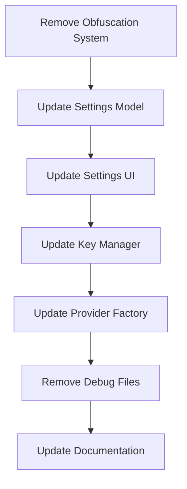

# API Key Database Storage Implementation Plan

## Overview

This document outlines the plan to remove the current API key obfuscation system in the MemberPress AI Assistant plugin and implement a standard database storage approach for API keys. Since this is an unreleased product, we don't need to worry about migration concerns.

## Current System Analysis

The current implementation:
1. Uses hardcoded, obfuscated API keys in `MPAIKeyManager.php`
2. Splits keys into multiple components (obfuscated, installation-specific, file-based, admin-specific)
3. Has security verification layers to control access to the keys
4. Doesn't expose API key fields in the settings UI
5. Has documentation about the obfuscation system

## Implementation Plan



### 1. Update Settings Model (`MPAISettingsModel.php`)

- Add API keys to the default settings array
- Remove the "deprecated" comments from the API key getter methods
- Ensure validation methods for API keys are in place

```php
// In MPAISettingsModel.php
private $defaults = [
    // Existing defaults...
    
    // API settings
    'openai_api_key' => '',
    'openai_model' => 'gpt-4o',
    'openai_temperature' => 0.7,
    'openai_max_tokens' => 1000,
    'anthropic_api_key' => '',
    'anthropic_model' => 'claude-3-opus-20240229',
    'anthropic_temperature' => 0.7,
    'anthropic_max_tokens' => 1000,
    'primary_api' => 'openai',
    
    // Other defaults...
];

/**
 * Get the OpenAI API key
 *
 * @return string OpenAI API key
 */
public function get_openai_api_key() {
    return $this->get('openai_api_key', '');
}

/**
 * Get the Anthropic API key
 *
 * @return string Anthropic API key
 */
public function get_anthropic_api_key() {
    return $this->get('anthropic_api_key', '');
}
```

### 2. Update Settings UI

- Add API key input fields to the settings form
- Update the API key information field to explain how to obtain API keys
- Add appropriate security measures for displaying password fields

```php
// In MPAISettingsController.php
protected function register_api_section() {
    // Register API Settings section
    add_settings_section(
        'mpai_api_section',
        __('API Settings', 'memberpress-ai-assistant'),
        [$this->view, 'render_api_section'],
        $this->page_slug
    );
    
    // Add OpenAI API Key field
    add_settings_field(
        'mpai_openai_api_key',
        __('OpenAI API Key', 'memberpress-ai-assistant'),
        [$this, 'render_openai_api_key_field'],
        $this->page_slug,
        'mpai_api_section'
    );
    
    // Add Anthropic API Key field
    add_settings_field(
        'mpai_anthropic_api_key',
        __('Anthropic API Key', 'memberpress-ai-assistant'),
        [$this, 'render_anthropic_api_key_field'],
        $this->page_slug,
        'mpai_api_section'
    );
    
    // Existing fields...
}

public function render_api_key_info_field() {
    ?>
    <div class="mpai-api-key-info">
        <p><?php _e('Enter your API keys for the AI services you want to use.', 'memberpress-ai-assistant'); ?></p>
        <p><?php _e('You can obtain an OpenAI API key from <a href="https://platform.openai.com/api-keys" target="_blank">https://platform.openai.com/api-keys</a>', 'memberpress-ai-assistant'); ?></p>
        <p><?php _e('You can obtain an Anthropic API key from <a href="https://console.anthropic.com/keys" target="_blank">https://console.anthropic.com/keys</a>', 'memberpress-ai-assistant'); ?></p>
    </div>
    <?php
}

public function render_openai_api_key_field() {
    $value = $this->model->get_openai_api_key();
    $this->view->render_openai_api_key_field($value);
}

public function render_anthropic_api_key_field() {
    $value = $this->model->get_anthropic_api_key();
    $this->view->render_anthropic_api_key_field($value);
}
```

```php
// In MPAISettingsView.php
public function render_openai_api_key_field($value) {
    ?>
    <input type="password" id="mpai_openai_api_key" name="mpai_settings[openai_api_key]" value="<?php echo esc_attr($value); ?>" class="regular-text">
    <p class="description">
        <?php esc_html_e('Enter your OpenAI API key. This will be stored securely in your WordPress database.', 'memberpress-ai-assistant'); ?>
    </p>
    <?php
}

public function render_anthropic_api_key_field($value) {
    ?>
    <input type="password" id="mpai_anthropic_api_key" name="mpai_settings[anthropic_api_key]" value="<?php echo esc_attr($value); ?>" class="regular-text">
    <p class="description">
        <?php esc_html_e('Enter your Anthropic API key. This will be stored securely in your WordPress database.', 'memberpress-ai-assistant'); ?>
    </p>
    <?php
}
```

### 3. Update Key Manager (`MPAIKeyManager.php`)

- Remove all obfuscation-related methods
- Simplify the class to retrieve API keys from the settings
- Maintain security verification for API key access
- Update the `get_api_key` method to use the settings model

```php
// In MPAIKeyManager.php
class MPAIKeyManager extends AbstractService {
    /**
     * Service identifier constants
     */
    const SERVICE_OPENAI = 'openai';
    const SERVICE_ANTHROPIC = 'anthropic';
    
    /**
     * Settings model instance
     *
     * @var MPAISettingsModel
     */
    private $settings;
    
    /**
     * Rate limiting tracking
     * 
     * @var array
     */
    private $request_counts = [];
    
    /**
     * Maximum requests per minute per service
     * 
     * @var int
     */
    private $rate_limit = 10;
    
    /**
     * Constructor
     *
     * @param string $name Service name
     * @param mixed $logger Logger instance
     * @param MPAISettingsModel $settings Settings model instance
     */
    public function __construct(string $name = 'key_manager', $logger = null, $settings = null) {
        parent::__construct($name, $logger);
        
        // Initialize request counts for rate limiting
        $this->request_counts = [
            self::SERVICE_OPENAI => [],
            self::SERVICE_ANTHROPIC => []
        ];
        
        // Store settings model
        $this->settings = $settings;
    }
    
    /**
     * Get API key for specified service
     * 
     * @param string $service_type The service type (openai, anthropic)
     * @return string|false The API key or false on failure
     */
    public function get_api_key($service_type) {
        // Allow addons to override the API key
        $override_key = apply_filters('mpai_override_api_key_' . $service_type, null);
        
        // If an addon has provided a key, use it
        if ($override_key !== null) {
            error_log("MPAI Debug - Using override key from addon for service: {$service_type}");
            return $override_key;
        }
        
        // Verify security context first
        if (!$this->verify_security_context()) {
            error_log("MPAI Debug - Security context verification failed");
            return false;
        }
        
        // Get the API key from settings
        if ($this->settings !== null) {
            if ($service_type === self::SERVICE_OPENAI) {
                $key = $this->settings->get_openai_api_key();
            } elseif ($service_type === self::SERVICE_ANTHROPIC) {
                $key = $this->settings->get_anthropic_api_key();
            } else {
                error_log("MPAI Debug - Unknown service type: {$service_type}");
                return false;
            }
            
            // Validate the key format
            if ($this->validate_key_format($service_type, $key)) {
                return $key;
            } else {
                error_log("MPAI Debug - Invalid key format for service: {$service_type}");
                return false;
            }
        }
        
        // If settings model is not available, try to get the key from options
        $option_name = "mpai_{$service_type}_api_key";
        $key = get_option($option_name, '');
        
        if (!empty($key)) {
            return $key;
        }
        
        error_log("MPAI Debug - No API key found for service type: {$service_type}");
        return false;
    }
    
    // Keep the security verification methods...
    
    // Remove all obfuscation-related methods...
}
```

### 4. Update Provider Factory

The `LlmProviderFactory` class already has fallback mechanisms to get API keys from options, so minimal changes are needed here. The existing code should work with the new approach.

### 5. Files to Remove

- `api-key-debug.php`
- Any files in `docs/_EXCLUDE/` related to API key obfuscation:
  - `api-key-system.md`
  - `api-key-approaches-comparison.md`
  - `api-key-distribution-strategies.md`
  - `api-key-management-index.md`
  - `api-key-proxy-business-model.md`
  - `api-key-proxy-implementation-plan.md`
  - `api-key-proxy-security-considerations.md`

### 6. Update Documentation

Create a new documentation file explaining the new API key management approach:

```markdown
# API Key Management

The MemberPress AI Assistant plugin requires API keys to interact with AI services like OpenAI and Anthropic. These keys are stored securely in the WordPress database using WordPress's standard encryption mechanisms.

## Setting Up API Keys

1. Obtain API keys from the respective service providers:
   - OpenAI: https://platform.openai.com/api-keys
   - Anthropic: https://console.anthropic.com/keys

2. Enter these keys in the plugin settings under "API Settings"

3. The plugin will use these keys to make requests to the AI services

## Security Considerations

- API keys are stored in the WordPress database using WordPress's standard security mechanisms
- Access to the keys is restricted to administrators
- The plugin includes security verification to ensure keys are only used in legitimate contexts
- API keys are never exposed in client-side code
```

## Implementation Steps

1. Update `MPAISettingsModel.php` to add API keys to the defaults and update getter methods
2. Update `MPAISettingsController.php` to add API key fields to the settings form
3. Update `MPAISettingsView.php` to add rendering methods for API key fields
4. Update `MPAIKeyManager.php` to remove obfuscation methods and use settings for API keys
5. Remove debug files and obfuscation-related documentation
6. Create new documentation for the API key management approach

## Benefits of This Approach

1. **Simplicity**: The code will be simpler and easier to maintain without the obfuscation system
2. **User Control**: Users can provide their own API keys and manage them directly
3. **Standard Practice**: This approach follows standard WordPress practices for storing sensitive data
4. **Transparency**: The system will be more transparent about how API keys are managed