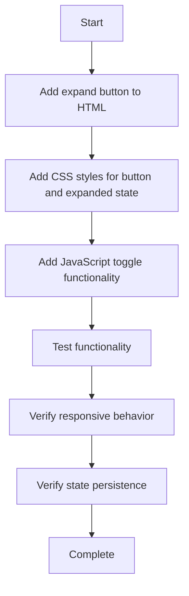

# Chat Expand Button Implementation Plan

## Overview

This document outlines the plan to add an expand button functionality to the MemberPress AI Assistant chat interface, allowing users to expand the chat to a larger size for better readability and interaction.

## Background

The expand button was a feature in the old system that allowed users to toggle between normal and expanded views of the chat interface. This functionality needs to be added back to the current implementation.

## Implementation Details

The implementation involves three main components:

1. HTML changes to add the expand button to the chat header
2. CSS changes to style the button and define the expanded state
3. JavaScript changes to implement the toggle functionality

### 1. HTML Changes (templates/chat-interface.php)

We need to add the expand button to the chat header, next to the close button. The improved implementation will:
- Use semantic HTML with proper accessibility attributes
- Position the button logically in the header's action area
- Use a clear, modern icon from the dashicons library

```php
<!-- Add this before the close button in the header -->
<button class="mpai-chat-expand" id="mpai-chat-expand" aria-label="<?php esc_attr_e('Expand chat', 'memberpress-ai-assistant'); ?>" title="<?php esc_attr_e('Expand chat', 'memberpress-ai-assistant'); ?>">
    <span class="dashicons dashicons-editor-expand"></span>
</button>
```

### 2. CSS Changes (assets/css/chat.css)

We need to add styles for:
- The expand button itself
- The expanded state of the chat container
- Responsive adjustments for the expanded state

```css
/* Expand Button */
.mpai-chat-expand {
    background: transparent;
    border: none;
    color: #fff;
    cursor: pointer;
    padding: 0;
    display: flex;
    align-items: center;
    justify-content: center;
    width: 24px;
    height: 24px;
    border-radius: 50%;
    transition: background-color 0.2s ease;
    margin-right: 8px; /* Space between expand and close buttons */
}

.mpai-chat-expand:hover {
    background-color: rgba(255, 255, 255, 0.2);
}

.mpai-chat-expand:focus {
    outline: 2px solid rgba(255, 255, 255, 0.5);
    outline-offset: 2px;
}

/* Expanded Chat Container */
.mpai-chat-container.mpai-chat-expanded {
    width: 600px;
    height: 650px;
    transition: width 0.3s ease, height 0.3s ease;
}

/* Responsive Adjustments for Expanded State */
@media (max-width: 768px) {
    .mpai-chat-container.mpai-chat-expanded {
        width: 90vw;
        height: 80vh;
    }
}

@media (max-width: 480px) {
    .mpai-chat-container.mpai-chat-expanded {
        width: 100%;
        height: 100%;
        max-height: 100vh;
        bottom: 0;
        right: 0;
    }
}
```

### 3. JavaScript Changes (assets/js/chat.js)

We need to add functionality to:
- Toggle the expanded state when the button is clicked
- Update the button icon and aria-label
- Save the state to localStorage
- Restore the state on page load

The implementation will be added to the existing `MPAIChat` class:

```javascript
// Add to the constructor's elements object
this.elements.expandButton = document.getElementById('mpai-chat-expand');

// Add to the state object
this.state.isExpanded = false;

// Add to the bindEvents method
if (this.elements.expandButton) {
    this.elements.expandButton.addEventListener('click', () => this.toggleExpand());
}

// Add new method for toggling expand state
toggleExpand() {
    this.state.isExpanded = !this.state.isExpanded;
    
    if (this.state.isExpanded) {
        this.elements.container.classList.add('mpai-chat-expanded');
        this.elements.expandButton.innerHTML = '<span class="dashicons dashicons-editor-contract"></span>';
        this.elements.expandButton.setAttribute('aria-label', 'Collapse chat');
        this.elements.expandButton.setAttribute('title', 'Collapse chat');
        
        // Save state to localStorage
        localStorage.setItem('mpai_chat_expanded', 'true');
    } else {
        this.elements.container.classList.remove('mpai-chat-expanded');
        this.elements.expandButton.innerHTML = '<span class="dashicons dashicons-editor-expand"></span>';
        this.elements.expandButton.setAttribute('aria-label', 'Expand chat');
        this.elements.expandButton.setAttribute('title', 'Expand chat');
        
        // Save state to localStorage
        localStorage.setItem('mpai_chat_expanded', 'false');
    }
    
    // Scroll to bottom after expansion change
    this.scrollToBottom();
    
    // Log the action if debug is enabled
    this.log('Chat expansion toggled:', this.state.isExpanded ? 'expanded' : 'collapsed');
}

// Modify the init method to restore expanded state
// Add this after the chat open state check
const chatWasExpanded = localStorage.getItem('mpai_chat_expanded') === 'true';
if (chatWasExpanded) {
    this.state.isExpanded = true;
    this.elements.container.classList.add('mpai-chat-expanded');
    if (this.elements.expandButton) {
        this.elements.expandButton.innerHTML = '<span class="dashicons dashicons-editor-contract"></span>';
        this.elements.expandButton.setAttribute('aria-label', 'Collapse chat');
        this.elements.expandButton.setAttribute('title', 'Collapse chat');
    }
}
```

## Improvements Over the Old Implementation

1. **Better Accessibility**:
   - Added proper aria-labels and title attributes
   - Improved focus states for keyboard navigation

2. **Responsive Design**:
   - Added media queries to handle the expanded state on different screen sizes
   - Ensures the expanded chat is usable on mobile devices

3. **Cleaner Code Structure**:
   - Integrated with the existing class-based architecture
   - Better separation of concerns between HTML, CSS, and JavaScript
   - More consistent with the current codebase style

4. **Enhanced User Experience**:
   - Smooth transitions between states
   - Consistent visual feedback
   - Maintains scroll position during expansion/collapse

## Implementation Flow



## Testing Plan

1. **Functionality Testing**:
   - Verify the expand button appears in the chat header
   - Verify clicking the button expands/collapses the chat
   - Verify the button icon changes appropriately
   - Verify the expanded state persists across page reloads

2. **Responsive Testing**:
   - Test on desktop, tablet, and mobile viewports
   - Verify the expanded state is usable on all devices

3. **Accessibility Testing**:
   - Verify keyboard navigation works correctly
   - Verify screen readers can access the button and understand its purpose