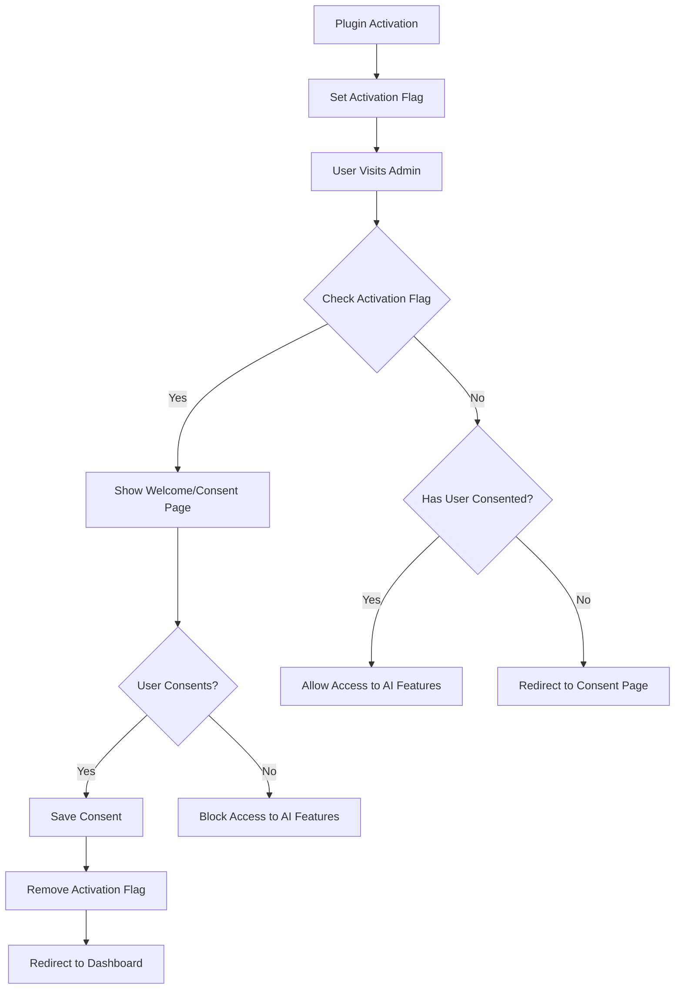
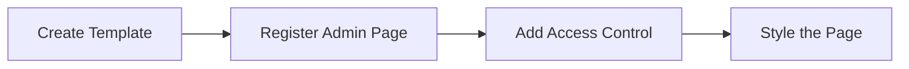
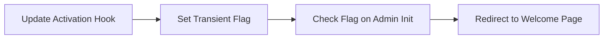
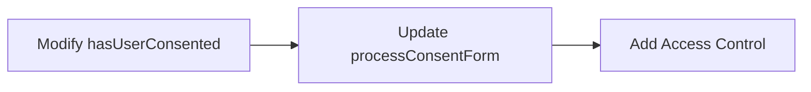
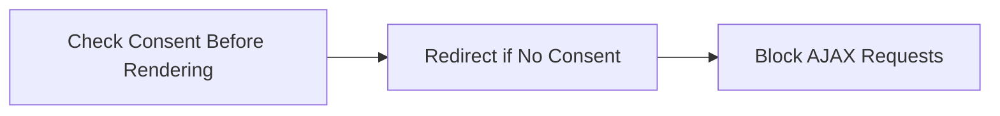

# Consent Form Implementation Plan

## Overview

This document outlines the plan for implementing a welcome/consent page that appears when the MemberPress AI Assistant plugin is activated. The page will require users to consent to the terms of use before they can access the AI Assistant features.



## Requirements

1. Create a dedicated welcome/consent page that appears only upon activation
2. The page should not be accessible from the menu
3. All consents should be reset when the plugin is deactivated
4. Users must consent again upon plugin reactivation
5. The form should prevent users from accessing the AI Assistant features until they've consented
6. The consent form should be shown to all users with appropriate permissions, not just administrators
7. The form should appear when accessing the AI assistant menu in the admin panel

## Implementation Details

### 1. Create a Welcome/Consent Page

We'll create a dedicated welcome/consent page that appears only upon activation and is not accessible from the menu.



#### 1.1 Create the Welcome Page Template

Create a new template file `templates/welcome-page.php` based on the design in the image:

- Welcome message: "Welcome to MemberPress AI Assistant"
- Description of the AI Assistant
- Terms of Use section with key points:
  - Data Access and Analysis
  - Privacy policies of AI providers
  - Potential for incomplete/inaccurate information
  - Limitation of liability
- Consent checkbox
- "Get Started" button (disabled until consent is given)
- "Review Full Terms" button/link

#### 1.2 Register the Welcome Page

Add a method to register the welcome page in the main plugin class:

```php
public function register_welcome_page() {
    add_submenu_page(
        null, // No parent menu - hidden page
        __('Welcome to MemberPress AI Assistant', 'memberpress-ai-assistant'),
        __('Welcome', 'memberpress-ai-assistant'),
        'manage_options',
        'mpai-welcome',
        array($this, 'render_welcome_page')
    );
}
```

#### 1.3 Render the Welcome Page

Add a method to render the welcome page:

```php
public function render_welcome_page() {
    // Get the consent manager
    $consent_manager = \MemberpressAiAssistant\Admin\MPAIConsentManager::getInstance();
    
    // Include the welcome page template
    include plugin_dir_path(__FILE__) . 'templates/welcome-page.php';
}
```

### 2. Modify the Activation Process



#### 2.1 Update the Activation Hook

Modify the `activate()` method in the main plugin file to set a transient flag:

```php
public function activate() {
    // Set default options
    $this->set_default_options();
    
    // Create tables if needed
    $this->create_database_tables();
    
    // Initialize agent system
    $this->initialize_agent_system();
    
    // Reset all user consents upon activation
    \MemberpressAiAssistant\Admin\MPAIConsentManager::resetAllConsents();
    
    // Clear rewrite rules
    flush_rewrite_rules();
    
    // Set a transient to redirect after activation
    set_transient('mpai_activation_redirect', true, 30);
}
```

#### 2.2 Update the Redirect Method

Modify the `maybe_redirect_after_activation()` method to redirect to the welcome page:

```php
public function maybe_redirect_after_activation() {
    // Check if we should redirect after activation
    if (get_transient('mpai_activation_redirect')) {
        // Delete the transient
        delete_transient('mpai_activation_redirect');
        
        // Make sure this is not an AJAX, cron, or other system request
        if (!wp_doing_ajax() && !wp_doing_cron() && !defined('DOING_AUTOSAVE') && !defined('WP_INSTALLING')) {
            // Redirect to the welcome page
            wp_safe_redirect(admin_url('admin.php?page=mpai-welcome'));
            exit;
        }
    }
}
```

### 3. Update the Consent Manager



#### 3.1 Update the Consent Manager

Ensure the `hasUserConsented()` method in `MPAIConsentManager.php` always checks user consent:

```php
public function hasUserConsented($user_id = null) {
    if (null === $user_id) {
        $user_id = \get_current_user_id();
    }
    
    if (empty($user_id)) {
        return false;
    }
    
    // Check user meta - consent is always required
    $has_consented = \get_user_meta($user_id, self::CONSENT_META_KEY, true);
    
    return (bool) $has_consented;
}
```

#### 3.2 Update the Process Consent Form Method

Modify the `processConsentForm()` method to handle the welcome page form submission:

```php
public function processConsentForm() {
    $this->log('Checking for consent form submission');
    
    // Check if the consent form was submitted
    if (isset($_POST['mpai_save_consent']) && isset($_POST['mpai_consent'])) {
        // Verify nonce
        if (!isset($_POST['mpai_consent_nonce']) || !\wp_verify_nonce($_POST['mpai_consent_nonce'], 'mpai_consent_nonce')) {
            $this->log('Consent form nonce verification failed', ['error' => true]);
            \add_settings_error('mpai_messages', 'mpai_consent_error', \__('Security check failed.', 'memberpress-ai-assistant'), 'error');
            return;
        }
        
        // Get current user ID
        $user_id = \get_current_user_id();
        
        if (empty($user_id)) {
            $this->log('Cannot save consent - no user ID available', ['error' => true]);
            \add_settings_error('mpai_messages', 'mpai_consent_error', \__('User not logged in.', 'memberpress-ai-assistant'), 'error');
            return;
        }
        
        // Save consent
        $this->saveUserConsent($user_id, true);
        
        $this->log('User consent saved successfully');
        
        // Add a transient message
        \add_settings_error(
            'mpai_messages',
            'mpai_consent_success',
            \__('Thank you for agreeing to the terms. You can now use the MemberPress AI Assistant.', 'memberpress-ai-assistant'),
            'updated'
        );
        
        // Redirect to the dashboard
        \wp_redirect(\admin_url('admin.php?page=memberpress-ai-assistant&consent=given'));
        exit;
    }
}
```

### 4. Add Access Control to AI Features



#### 4.1 Add Consent Check to Chat Interface

Modify the `render_chat_interface()` method to check for consent:

```php
public function render_chat_interface() {
    // Get the consent manager
    $consent_manager = \MemberpressAiAssistant\Admin\MPAIConsentManager::getInstance();
    
    // Check if user has consented
    if (!$consent_manager->hasUserConsented()) {
        // Redirect to the consent page
        wp_redirect(admin_url('admin.php?page=mpai-welcome'));
        exit;
    }
    
    // Continue with rendering the chat interface
    // ...
}
```

#### 4.2 Add Consent Check to AJAX Handlers

Modify the AJAX handlers to check for consent:

```php
public function process_chat_ajax() {
    // Check nonce for security
    check_ajax_referer('mpai_chat_nonce', 'nonce');
    
    // Get the consent manager
    $consent_manager = \MemberpressAiAssistant\Admin\MPAIConsentManager::getInstance();
    
    // Check if user has consented
    if (!$consent_manager->hasUserConsented()) {
        wp_send_json_error('User has not consented to use the AI Assistant');
        return;
    }
    
    // Continue with processing the chat request
    // ...
}
```

### 5. Style the Welcome/Consent Page

Create CSS styles for the welcome page to match the design in the image:

```css
.mpai-welcome-container {
    max-width: 800px;
    margin: 40px auto;
    background: #fff;
    padding: 30px;
    border-radius: 5px;
    box-shadow: 0 1px 3px rgba(0,0,0,0.1);
}

.mpai-welcome-header {
    margin-bottom: 20px;
}

.mpai-welcome-header h1 {
    font-size: 24px;
    margin-bottom: 10px;
}

.mpai-welcome-content p {
    font-size: 16px;
    line-height: 1.5;
    margin-bottom: 20px;
}

.mpai-terms-box {
    background: #f9f9f9;
    border: 1px solid #e5e5e5;
    border-radius: 4px;
    padding: 20px;
    margin: 20px 0;
    max-height: 300px;
    overflow-y: auto;
}

.mpai-terms-box h3 {
    margin-top: 0;
    margin-bottom: 10px;
}

.mpai-consent-checkbox {
    margin: 20px 0;
    padding: 15px;
    background: #f9f9f9;
    border: 1px solid #e5e5e5;
    border-radius: 4px;
}

.mpai-consent-checkbox label {
    display: flex;
    align-items: center;
    font-size: 15px;
    cursor: pointer;
}

.mpai-consent-checkbox input {
    margin-right: 10px;
}

.mpai-welcome-buttons {
    margin-top: 20px;
    display: flex;
    gap: 10px;
}

.mpai-welcome-buttons .button-primary:disabled {
    opacity: 0.7;
    cursor: not-allowed;
}
```

## Implementation Steps

1. **Create the Welcome Page Template**:
   - Create `templates/welcome-page.php` based on the design in the image
   - Include all necessary elements (welcome message, terms, checkbox, buttons)

2. **Register the Welcome Page**:
   - Add methods to register and render the welcome page in the main plugin class
   - Make it a hidden page (not accessible from the menu)

3. **Update the Activation Process**:
   - Modify the activation hook to reset all consents
   - Update the redirect method to go to the welcome page

4. **Update the Consent Manager**:
   - Ensure the `hasUserConsented()` method always checks user consent
   - Update the `processConsentForm()` method to handle the welcome page form

5. **Add Access Control**:
   - Add consent checks to the chat interface and AJAX handlers
   - Redirect users to the consent page if they haven't consented

6. **Style the Welcome Page**:
   - Add CSS to match the design in the image

## Testing Plan

1. Activate the plugin and verify the welcome page appears
2. Try to access AI features without consenting and verify access is blocked
3. Consent and verify access is granted
4. Deactivate and reactivate the plugin and verify consent is required again
5. Test with different user roles to ensure proper access control