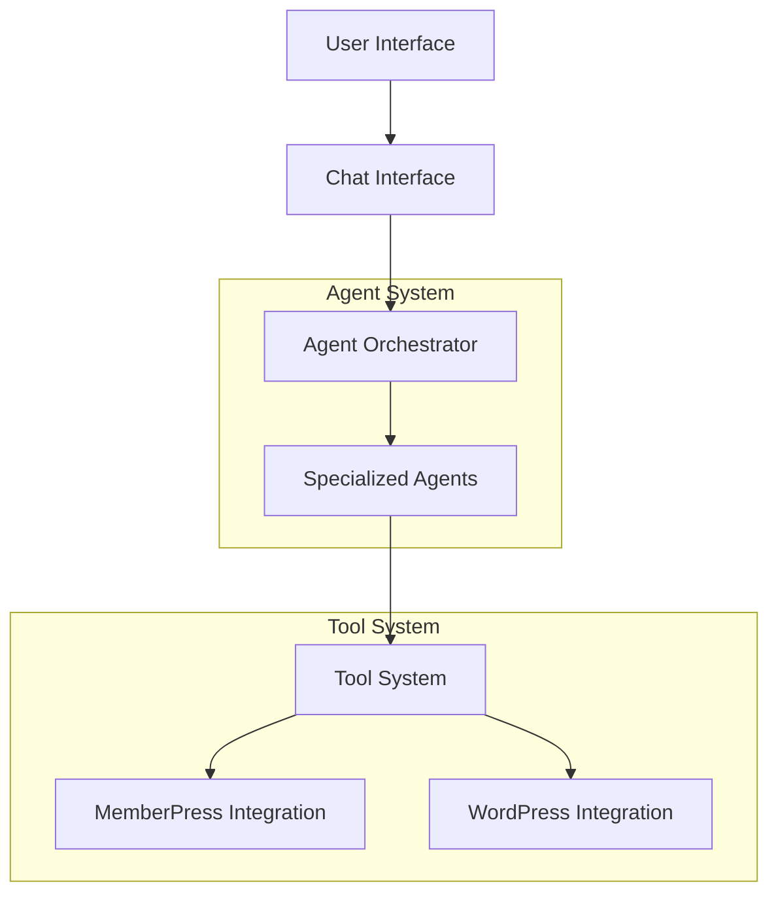
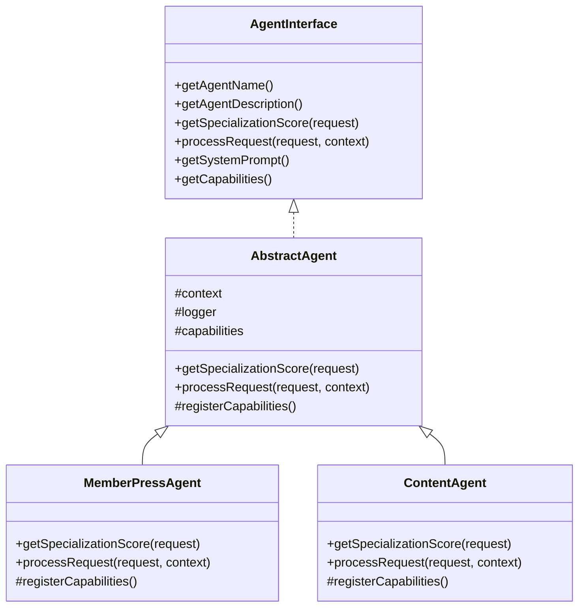
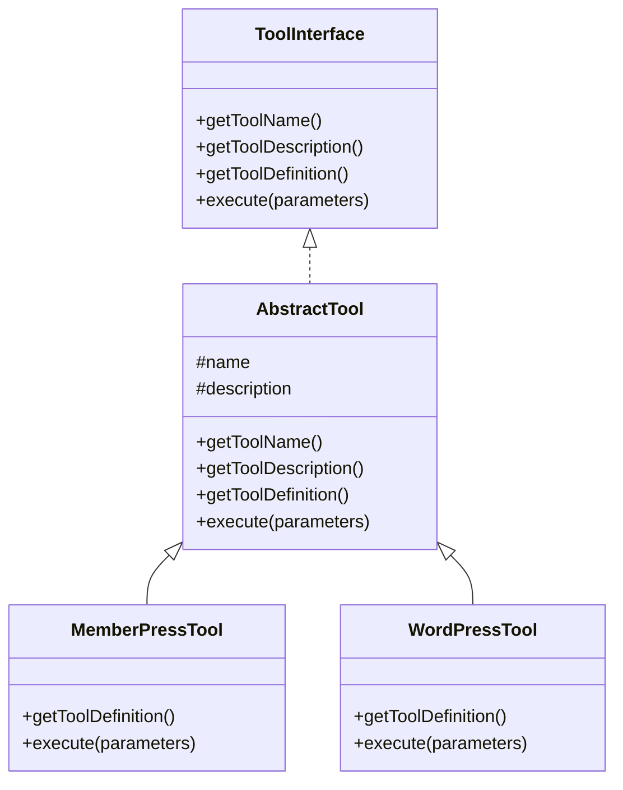
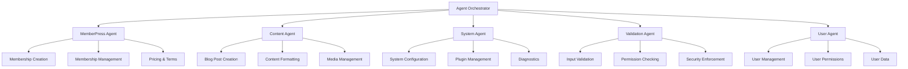
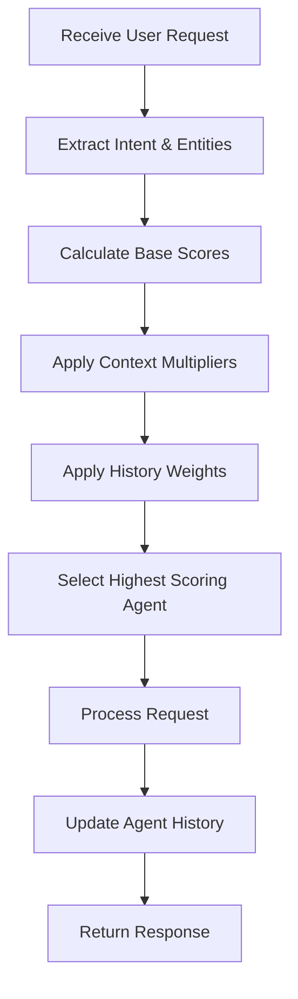
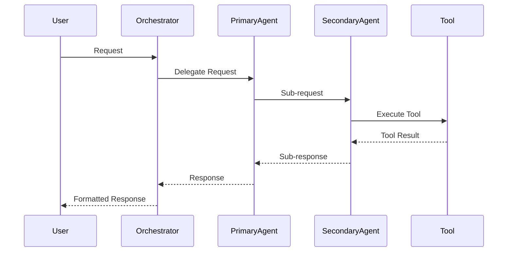
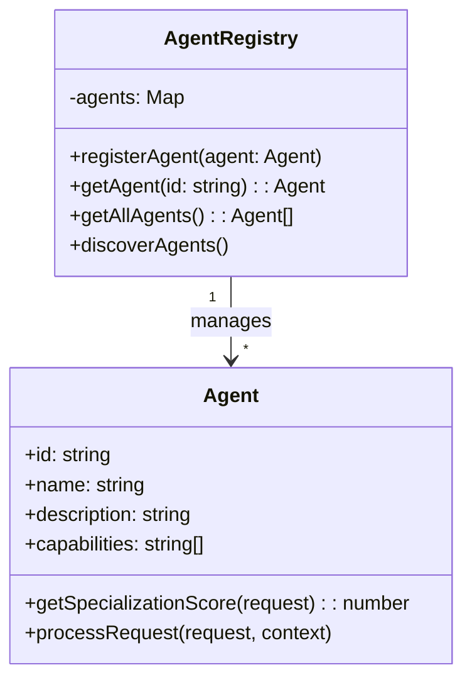
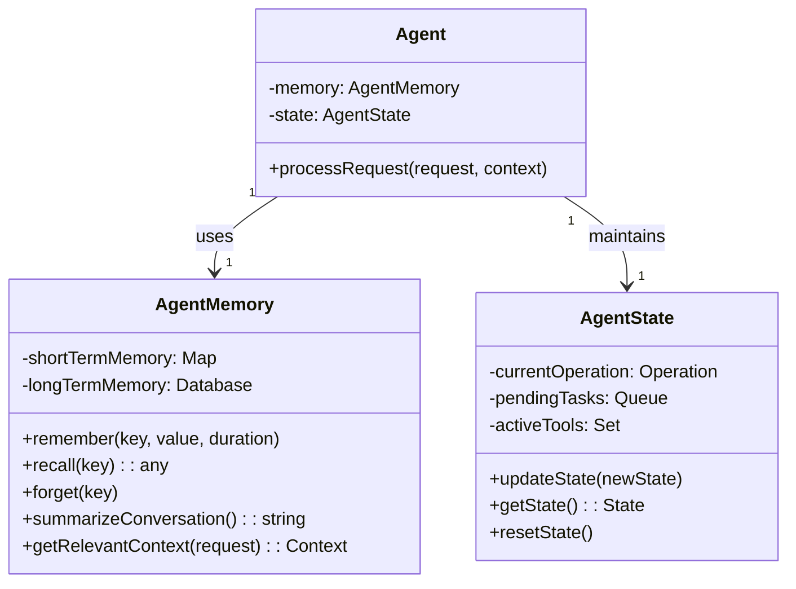
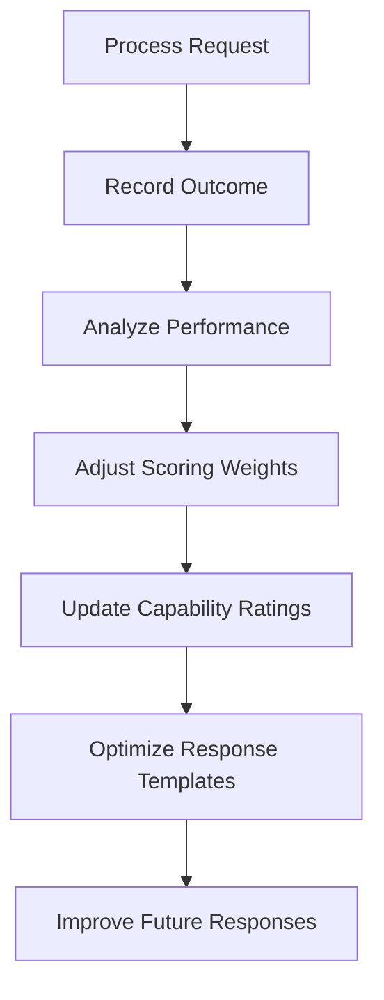

# MemberPress AI Assistant Complete Rebuild Plan

## Overview

This plan outlines a complete rebuild of the MemberPress AI Assistant system from scratch, focusing on DRY (Don't Repeat Yourself) and KISS (Keep It Simple, Stupid) principles. The new implementation will maintain all critical functionality while providing a clean, maintainable codebase.

## Current System Analysis

The current MemberPress AI Assistant has several issues:

1. Multiple competing systems processing the same XML content
2. Complex module loading with circular dependencies
3. Unnecessary compatibility layers
4. Poor error handling and debugging
5. Inconsistent UI rendering

## Rebuild Goals

1. Create a clean, maintainable codebase following DRY and KISS principles
2. Preserve the ability to create and manage MemberPress memberships via natural language
3. Maintain the agent system architecture with specialized agents
4. Keep the current technology stack with improved architecture
5. Ensure seamless integration with MemberPress core functionality

## System Architecture

Here's the proposed architecture for the rebuilt system:



## Implementation Plan

### Phase 1: Foundation Setup (2 days)

1. **Create Core Architecture**
   - Implement a clean plugin structure
   - Set up autoloading with Composer
   - Create base interfaces and abstract classes
   - Implement proper dependency injection

2. **Establish Testing Framework**
   - Set up PHPUnit for backend testing
   - Configure Jest for frontend testing
   - Create test fixtures and mocks

3. **Implement Logging and Error Handling**
   - Create a centralized logging system
   - Implement comprehensive error handling
   - Add debugging capabilities

### Phase 2: Agent System Implementation (3 days)

1. **Create Agent Framework**
   - Implement `AgentInterface` with clear contracts
   - Create `AbstractAgent` base class
   - Develop agent registration and discovery system

2. **Implement Agent Orchestrator**
   - Create efficient agent selection algorithm
   - Implement context management
   - Add agent communication protocol

3. **Develop Specialized Agents**
   - Implement `MemberPressAgent` for membership operations
   - Create `ContentAgent` for content management
   - Develop `SystemAgent` for system operations
   - Implement `ValidationAgent` for security



### Phase 3: Tool System Implementation (3 days)

1. **Create Tool Framework**
   - Implement `ToolInterface` with clear contracts
   - Create `AbstractTool` base class
   - Develop tool registration and discovery system

2. **Implement Core Tools**
   - Create `MemberPressTool` for membership operations
   - Implement `WordPressTool` for WordPress operations
   - Develop `ContentTool` for content management

3. **Create Tool Registry**
   - Implement efficient tool discovery
   - Create tool validation system
   - Add tool execution pipeline



### Phase 4: MemberPress Integration (2 days)

1. **Create MemberPress Service Layer**
   - Implement clean service interfaces
   - Create adapters for MemberPress core
   - Develop data transformation utilities

2. **Implement Membership Operations**
   - Create, read, update, delete memberships
   - Handle membership pricing and terms
   - Manage membership access and permissions

3. **Add User Integration**
   - Connect memberships to users
   - Handle user permissions
   - Implement user data management

### Phase 5: Chat Interface and UI (2 days)

1. **Implement Chat Interface**
   - Create clean, modular chat UI
   - Implement message handling
   - Add tool result formatting

2. **Develop UI Components**
   - Create button rendering system
   - Implement content preview components
   - Add form generation for tool parameters

3. **Add Response Formatting**
   - Implement XML content processing
   - Create structured data handling
   - Add rich text formatting

### Phase 6: Testing and Optimization (3 days)

1. **Implement Unit Tests**
   - Test agent system components
   - Test tool system functionality
   - Test MemberPress integration

2. **Create Integration Tests**
   - Test end-to-end workflows
   - Test agent-tool interactions
   - Test UI components

3. **Performance Optimization**
   - Implement caching where appropriate
   - Optimize agent selection algorithm
   - Improve tool execution performance

### Phase 7: Documentation and Deployment (2 days)

1. **Create Developer Documentation**
   - Document system architecture
   - Create API references
   - Add code examples

2. **Develop User Documentation**
   - Create user guides
   - Add usage examples
   - Develop troubleshooting guides

3. **Deployment Planning**
   - Create migration strategy
   - Develop rollback plan
   - Implement version compatibility

## Enhanced Agent Specialization System

### 1. Agent Types and Specializations



#### MemberPress Agent
- **Primary Focus**: All MemberPress-related operations
- **Key Capabilities**:
  - Membership creation and management
  - Pricing and terms configuration
  - Access rule management
  - Transaction processing
  - Subscription handling

#### Content Agent
- **Primary Focus**: Content creation and management
- **Key Capabilities**:
  - Blog post creation with XML formatting
  - Media attachment handling
  - Content organization (categories, tags)
  - Content revision management
  - SEO optimization suggestions

#### System Agent
- **Primary Focus**: System administration and configuration
- **Key Capabilities**:
  - Plugin settings management
  - System diagnostics
  - Performance monitoring
  - Error logging and reporting
  - Configuration validation

#### Validation Agent
- **Primary Focus**: Security and validation
- **Key Capabilities**:
  - Input sanitization
  - Permission verification
  - Command validation
  - Security policy enforcement
  - Threat detection

#### User Agent
- **Primary Focus**: User management and data
- **Key Capabilities**:
  - User profile management
  - User role and permission assignment
  - User activity tracking
  - User data analysis
  - User communication

### 2. Agent Selection Algorithm

The agent selection process will be significantly improved with a more efficient and accurate algorithm:



#### Scoring Components

1. **Base Score Calculation**:
   - Keyword matching (0-30 points)
   - Capability matching (0-30 points)
   - Domain relevance (0-20 points)
   - Tool requirements (0-20 points)

2. **Context Multipliers**:
   - Conversation continuity (1.0-1.5x)
   - Recent success with similar requests (1.0-1.3x)
   - User preference indicators (1.0-1.2x)

3. **History Weights**:
   - Recent agent usage patterns
   - Success rate with similar requests
   - Performance metrics for similar operations

#### Optimization Techniques

- **Fast-path Selection**: Common request patterns bypass full scoring
- **Cached Scoring**: Recent similar requests use cached scores
- **Progressive Scoring**: Stop calculation early when a clear winner emerges
- **Parallel Scoring**: Calculate scores concurrently for faster selection

### 3. Specialization Scoring Mechanism

Each agent will implement a sophisticated scoring mechanism:

```php
public function getSpecializationScore(Request $request): float {
    // Initialize base score
    $score = 0;
    
    // 1. Intent matching (0-30 points)
    $intentScore = $this->matchIntent($request->getIntent());
    $score += $intentScore;
    
    // 2. Entity relevance (0-30 points)
    $entityScore = $this->calculateEntityRelevance($request->getEntities());
    $score += $entityScore;
    
    // 3. Capability matching (0-20 points)
    $capabilityScore = $this->matchCapabilities($request);
    $score += $capabilityScore;
    
    // 4. Context continuity (0-20 points)
    $contextScore = $this->evaluateContextContinuity($request);
    $score += $contextScore;
    
    // 5. Apply multipliers
    $score = $this->applyMultipliers($score, $request);
    
    return min(100, $score);
}
```

#### Intent Matching
- Uses NLP techniques to extract and match user intent
- Maintains a dictionary of domain-specific intents
- Calculates similarity scores between request and known intents

#### Entity Relevance
- Identifies entities in the request (memberships, posts, users, etc.)
- Scores relevance based on agent's domain expertise
- Considers entity relationships and attributes

#### Capability Matching
- Evaluates if the agent has the necessary capabilities
- Checks for required tool access
- Assesses permission requirements

#### Context Continuity
- Analyzes conversation history
- Detects if this is a follow-up to previous interactions
- Considers state maintained by this agent

### 4. Agent Communication Protocol

Agents will communicate using a standardized message protocol:



#### Message Structure

```json
{
  "id": "msg_12345",
  "type": "request|response|notification",
  "sender": {
    "id": "agent_id",
    "type": "agent|orchestrator|tool"
  },
  "recipient": {
    "id": "agent_id",
    "type": "agent|orchestrator|tool"
  },
  "content": {
    "intent": "create_membership",
    "entities": [
      {
        "type": "membership",
        "attributes": {
          "name": "Gold Plan",
          "price": 99.99,
          "period": "monthly"
        }
      }
    ],
    "context": {
      "conversation_id": "conv_789",
      "user_id": 42,
      "timestamp": "2025-04-25T10:30:00Z"
    }
  },
  "metadata": {
    "priority": "high|medium|low",
    "requires_response": true,
    "timeout": 30000
  }
}
```

### 5. Agent Registration and Discovery

The system will use a flexible registration system:



#### Registration Methods

1. **Static Registration**:
   - Core agents registered during initialization
   - Configuration-based registration

2. **Dynamic Discovery**:
   - Plugin-based agent discovery
   - Directory scanning for agent implementations
   - Runtime registration API

3. **Capability Advertising**:
   - Agents advertise capabilities during registration
   - Capability-based lookup for specialized tasks
   - Dynamic capability negotiation

### 6. Agent Memory and State Management

Each agent will maintain its own memory and state:



#### Memory Types

1. **Short-term Memory**:
   - In-memory storage for current conversation
   - Recent user interactions
   - Temporary operation state

2. **Long-term Memory**:
   - Persistent storage for user preferences
   - Historical interaction patterns
   - Learning and adaptation data

3. **Shared Memory**:
   - Cross-agent knowledge sharing
   - Global context information
   - System-wide settings and state

### 7. Agent Learning and Adaptation

The agent system will include mechanisms for continuous improvement:



#### Learning Mechanisms

1. **Performance Tracking**:
   - Success/failure rates for different request types
   - Response time and efficiency metrics
   - User satisfaction indicators

2. **Weight Adjustment**:
   - Automatic adjustment of scoring weights
   - Reinforcement of successful patterns
   - Reduction of weights for unsuccessful approaches

3. **Capability Evolution**:
   - Dynamic capability rating based on performance
   - Capability expansion through usage patterns
   - Specialization refinement over time

## Key DRY and KISS Improvements

### DRY (Don't Repeat Yourself) Improvements

1. **Centralized Configuration**
   - Single source of truth for system configuration
   - Shared constants and settings

2. **Base Classes and Interfaces**
   - Common functionality in abstract base classes
   - Clear interfaces for all components

3. **Service Layer**
   - Centralized services for common operations
   - Shared utilities for repeated tasks

4. **Template System**
   - Reusable templates for UI components
   - Shared formatting utilities

### KISS (Keep It Simple, Stupid) Improvements

1. **Clear Component Boundaries**
   - Each component has a single responsibility
   - Minimal dependencies between components

2. **Simplified Module Loading**
   - Direct dependencies without circular references
   - Autoloading instead of manual includes

3. **Standardized Communication**
   - Consistent message format between components
   - Clear API contracts

4. **Reduced Complexity**
   - Fewer layers of abstraction
   - More direct implementation of features

## Timeline

- **Phase 1**: Days 1-2
- **Phase 2**: Days 3-5
- **Phase 3**: Days 6-8
- **Phase 4**: Days 9-10
- **Phase 5**: Days 11-12
- **Phase 6**: Days 13-15
- **Phase 7**: Days 16-17

Total: 17 days

## Success Criteria

1. All critical functionality is preserved
2. Code follows DRY and KISS principles
3. System is well-documented
4. Tests cover all major functionality
5. Performance is improved
6. Maintenance is simplified

## Risk Mitigation

1. **Integration Risks**
   - Create adapters for MemberPress integration
   - Implement feature flags for gradual rollout

2. **Performance Risks**
   - Benchmark critical operations
   - Implement performance monitoring

3. **Compatibility Risks**
   - Test with multiple WordPress versions
   - Ensure backward compatibility where needed

## Implementation Notes

This plan focuses on a complete rebuild from scratch without using any legacy code or fallback methods. The old system can be referenced at `app/public/wp-content/plugins/memberpress-ai-assistant` for understanding functionality, but no code will be carried over to the new implementation.