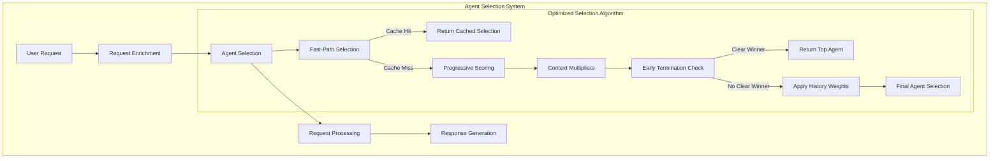
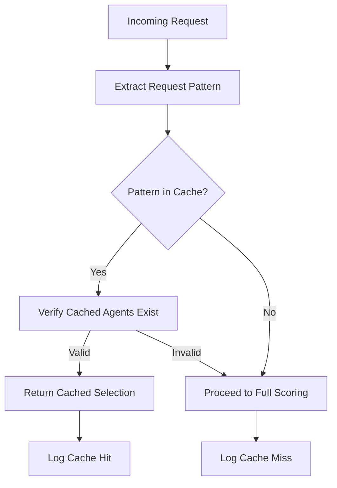
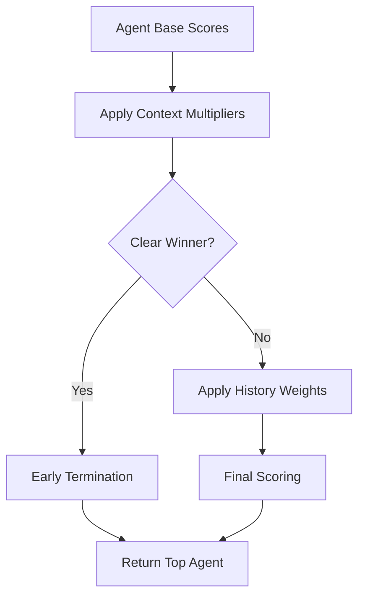
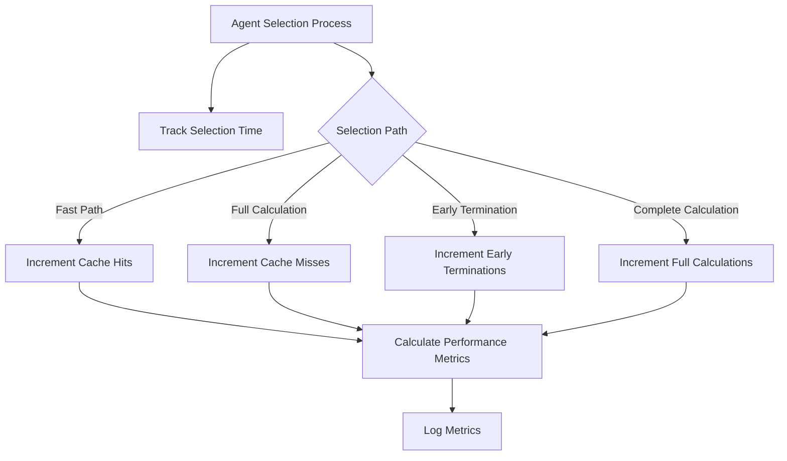

# MemberPress AI Assistant: Agent Selection Algorithm Documentation Plan

## 1. Executive Summary

This document provides comprehensive documentation for the optimized agent selection algorithm in the MemberPress AI Assistant. The agent selection algorithm has been enhanced with several optimizations to improve performance, efficiency, and accuracy:

- **Fast-path selection** for common request patterns
- **Progressive scoring with early termination**
- **Optimized calculation efficiency**
- **Performance metrics tracking**

These optimizations collectively improve response times, reduce computational overhead, and maintain or enhance selection accuracy. This documentation covers the technical implementation details, architectural design, performance benefits, and developer extension guidelines.

## 2. Architectural Overview

### 2.1 High-Level Architecture

The agent selection system is a core component of the MemberPress AI Assistant, responsible for routing user requests to the most appropriate agent for processing. The system follows a pipeline architecture:



### 2.2 Key Components

1. **AgentOrchestrator**: Central coordinator that manages the agent selection process
2. **AgentRegistry**: Repository of available agents with their capabilities
3. **ContextManager**: Manages conversation context and history
4. **Pattern Cache**: Stores previous agent selections for common request patterns
5. **Performance Metrics Tracker**: Collects and reports on selection performance

### 2.3 Selection Process Flow

The agent selection process follows these steps:

1. **Request Enrichment**: Add context, history, and entity information
2. **Pattern Extraction**: Extract a pattern signature from the request
3. **Fast-Path Selection**: Check if a similar pattern has been processed before
4. **Progressive Scoring**:
   - Apply context multipliers to base scores
   - Check for a clear winner (early termination)
   - Apply history weights if needed
5. **Agent Selection**: Choose the highest-scoring agent(s)
6. **Pattern Caching**: Store the selection for future similar requests

## 3. Optimization Mechanisms

### 3.1 Fast-Path Selection

The fast-path selection mechanism provides a shortcut for handling common request patterns, bypassing the full scoring process when a similar request has been processed before.



#### Key Features:

- **Pattern Extraction**: Converts requests into consistent pattern signatures
- **Pattern Verification**: Ensures cached agents still exist in the system
- **Cache Management**: Limits cache size to prevent memory issues
- **Performance Tracking**: Monitors cache hit/miss rates

### 3.2 Progressive Scoring with Early Termination

The progressive scoring mechanism applies scoring factors in stages, with checks for early termination to avoid unnecessary calculations.



#### Key Features:

- **Staged Scoring**: Applies scoring factors in order of computational cost
- **Early Termination**: Stops the scoring process when a clear winner emerges
- **Confidence Threshold**: Configurable threshold for determining clear winners
- **Performance Tracking**: Monitors early termination rates

### 3.3 Scoring Calculation Efficiency

The scoring calculation has been optimized for efficiency by:

1. **Combined Calculation and Application**: Merging separate calculation and application steps
2. **Optimized Entity Type Checking**: Using associative arrays for faster lookups
3. **Pre-calculation of Frequencies**: Computing agent frequencies once instead of repeatedly
4. **Reduced Function Call Overhead**: Inlining previously separate functions

### 3.4 Performance Metrics Tracking

The algorithm tracks various performance metrics to enable monitoring and optimization:



#### Tracked Metrics:

- **Pattern Cache Hits/Misses**: Effectiveness of the pattern cache
- **Early Terminations**: Frequency of early termination
- **Selection Times**: Average, minimum, and maximum selection times
- **Cache Hit Rate**: Percentage of requests served from cache
- **Early Termination Rate**: Percentage of full calculations avoided

## 4. Technical Implementation Details

### 4.1 Code Structure and Organization

The agent selection algorithm is primarily implemented in the `AgentOrchestrator` class, with the following key methods:

- **selectAgentsForRequest**: Main entry point for agent selection
- **tryFastPathSelection**: Implements the fast-path selection mechanism
- **extractRequestPattern**: Extracts pattern signatures from requests
- **applyProgressiveScoring**: Implements the progressive scoring mechanism
- **checkForClearWinner**: Determines if early termination is possible
- **applyContextMultipliers**: Applies context-based score adjustments
- **applyHistoryWeights**: Applies history-based score adjustments
- **getPerformanceMetrics**: Calculates and returns performance metrics

### 4.2 Key Method Details

#### 4.2.1 selectAgentsForRequest

```php
protected function selectAgentsForRequest(array $request): array {
    // Start timing the selection process
    $startTime = microtime(true);
    
    // Try fast-path selection first
    $fastPathResult = $this->tryFastPathSelection($request);
    if ($fastPathResult !== null) {
        // Record performance metrics
        $this->performanceMetrics['pattern_cache_hits']++;
        $this->performanceMetrics['selection_times'][] = microtime(true) - $startTime;
        
        // Log fast-path selection
        if ($this->logger) {
            $this->logger->info('Fast-path agent selection', [
                'pattern' => $this->extractRequestPattern($request),
                'agent' => reset($fastPathResult)['agent']->getAgentName(),
                'conversation_id' => $this->conversationId,
            ]);
        }
        
        return $fastPathResult;
    }
    
    // Record cache miss
    $this->performanceMetrics['pattern_cache_misses']++;
    
    // Get all agents with their specialization scores
    $agentsWithScores = $this->agentRegistry->findAgentsBySpecialization($request, 0);
    
    // Apply progressive scoring with early termination
    $agentsWithScores = $this->applyProgressiveScoring($agentsWithScores, $request);
    
    // Sort by final score (descending)
    uasort($agentsWithScores, function($a, $b) {
        return $b['score'] <=> $a['score'];
    });
    
    // Update agent selection history
    if (!empty($agentsWithScores)) {
        $topAgent = reset($agentsWithScores);
        $this->agentSelectionHistory[] = [
            'agent' => $topAgent['agent']->getAgentName(),
            'score' => $topAgent['score'],
            'timestamp' => time(),
        ];
        
        // Cache this pattern for future fast-path selection
        $this->cachePatternSelection($request, $agentsWithScores);
    }
    
    // Record full calculation
    $this->performanceMetrics['full_calculations']++;
    $this->performanceMetrics['selection_times'][] = microtime(true) - $startTime;
    
    return $agentsWithScores;
}
```

#### 4.2.2 tryFastPathSelection

```php
protected function tryFastPathSelection(array $request): ?array {
    // Extract pattern from request
    $pattern = $this->extractRequestPattern($request);
    
    // Check if we have a cached selection for this pattern
    if (isset($this->patternCache[$pattern])) {
        // Clone the cached result to avoid reference issues
        $cachedResult = $this->patternCache[$pattern];
        
        // Verify the cached agents still exist
        foreach ($cachedResult as $agentId => $data) {
            if (!$this->agentRegistry->hasAgent($agentId)) {
                // If any agent is missing, invalidate the cache entry
                unset($this->patternCache[$pattern]);
                return null;
            }
        }
        
        return $cachedResult;
    }
    
    return null;
}
```

#### 4.2.3 applyProgressiveScoring

```php
protected function applyProgressiveScoring(array $agentsWithScores, array $request): array {
    // Skip optimization if we have too few agents
    if (count($agentsWithScores) <= 2) {
        // Apply regular scoring
        $agentsWithScores = $this->applyContextMultipliers($agentsWithScores, $request);
        $agentsWithScores = $this->applyHistoryWeights($agentsWithScores, $request);
        return $agentsWithScores;
    }
    
    // Step 1: Apply context multipliers with progressive evaluation
    $agentsWithScores = $this->applyContextMultipliers($agentsWithScores, $request);
    
    // Check if we have a clear winner after context multipliers
    $earlyResult = $this->checkForClearWinner($agentsWithScores);
    if ($earlyResult !== null) {
        $this->performanceMetrics['early_terminations']++;
        return $earlyResult;
    }
    
    // Step 2: Apply history weights only if needed
    $agentsWithScores = $this->applyHistoryWeights($agentsWithScores, $request);
    
    return $agentsWithScores;
}
```

### 4.3 Configuration Options

The agent selection algorithm provides several configuration options:

1. **Confidence Threshold**: Controls the threshold for early termination
   ```php
   $orchestrator->setConfidenceThreshold(1.5); // Default is 1.5
   ```

2. **Cache TTL**: Controls the time-to-live for cached responses
   ```php
   $orchestrator->setDefaultCacheTtl(600); // Default is 600 seconds (10 minutes)
   ```

3. **Maximum Delegation Depth**: Controls the maximum depth of agent delegations
   ```php
   // Set in the constructor or via a setter method
   protected $maxDelegationDepth = 5; // Default is 5
   ```

## 5. Performance Analysis

### 5.1 Interpreting Performance Metrics

The `getPerformanceMetrics()` method returns a comprehensive set of metrics that can be used to analyze the performance of the agent selection algorithm:

```php
public function getPerformanceMetrics(): array {
    $metrics = $this->performanceMetrics;
    
    // Calculate average selection time
    if (!empty($metrics['selection_times'])) {
        $metrics['avg_selection_time'] = array_sum($metrics['selection_times']) / count($metrics['selection_times']);
        $metrics['max_selection_time'] = max($metrics['selection_times']);
        $metrics['min_selection_time'] = min($metrics['selection_times']);
    }
    
    // Calculate cache hit rate
    $totalCacheAttempts = $metrics['pattern_cache_hits'] + $metrics['pattern_cache_misses'];
    $metrics['pattern_cache_hit_rate'] = $totalCacheAttempts > 0
        ? $metrics['pattern_cache_hits'] / $totalCacheAttempts
        : 0;
        
    // Calculate early termination rate
    $totalCalculations = $metrics['early_terminations'] + $metrics['full_calculations'];
    $metrics['early_termination_rate'] = $totalCalculations > 0
        ? $metrics['early_terminations'] / $totalCalculations
        : 0;
    
    return $metrics;
}
```

#### Key Metrics to Monitor:

1. **Pattern Cache Hit Rate**: Higher is better, indicates effective pattern extraction
   - Target: > 50%
   - Action if low: Review pattern extraction logic, consider more generalized patterns

2. **Early Termination Rate**: Higher is better, indicates effective progressive scoring
   - Target: > 30%
   - Action if low: Adjust confidence threshold, review agent specialization scores

3. **Average Selection Time**: Lower is better, indicates overall efficiency
   - Target: < 5ms
   - Action if high: Review scoring calculations, optimize pattern extraction

### 5.2 Analyzing Logs

The agent selection algorithm logs key events that can be used for performance analysis:

1. **Fast-Path Selection**: Logged when a request is served from the pattern cache
   ```
   [info] Fast-path agent selection {pattern: "1a2b3c4d", agent: "ContentAgent", conversation_id: "conv_123"}
   ```

2. **Agent Selection Results**: Logged after agent selection is complete
   ```
   [info] Agent selection results {agents: [{name: "ContentAgent", score: 85}, ...], conversation_id: "conv_123", metrics: {...}}
   ```

3. **Cache Operations**: Logged when responses are cached or retrieved
   ```
   [info] Cached agent response {cache_key: "agent_response_abc123", agent: "ContentAgent", conversation_id: "conv_123"}
   [info] Cache hit for agent response {cache_key: "agent_response_abc123", conversation_id: "conv_123"}
   ```

### 5.3 Potential Future Optimizations

Based on the current implementation, several potential optimizations could be considered:

1. **Distributed Pattern Cache**: Implement a distributed cache for pattern-based selection in multi-server environments

2. **Machine Learning Integration**: Use machine learning to improve pattern recognition and agent selection

3. **Adaptive Confidence Threshold**: Dynamically adjust the confidence threshold based on historical performance

4. **Request Categorization**: Pre-categorize requests to further optimize the selection process

5. **Parallel Scoring**: Implement parallel scoring for high-volume environments

## 6. Developer Guide (Enhanced)

### 6.1 Extending the Agent Selection Algorithm

#### 6.1.1 Custom Pattern Extraction

The pattern extraction mechanism can be extended to better handle domain-specific requests:

1. **Creating specialized pattern extractors for domain-specific requests**
   - Implement custom logic for identifying patterns in specific domains
   - Extract domain-specific intents and entities
   - Create more precise pattern signatures

2. **Implementing advanced NLP techniques**
   - Integrate with NLP services for better intent recognition
   - Use entity extraction libraries for improved entity recognition
   - Implement semantic analysis for better pattern matching

3. **Maintaining pattern consistency and uniqueness**
   - Ensure patterns are deterministic for similar requests
   - Balance specificity with generalization
   - Implement pattern normalization techniques

#### 6.1.2 Custom Scoring Mechanisms

The scoring system can be extended with additional factors:

1. **Creating new scoring factors**
   - Implement domain-specific scoring factors
   - Create time-based or location-based scoring
   - Add user preference-based scoring

2. **Implementing domain-specific multipliers**
   - Create multipliers based on business rules
   - Implement industry-specific scoring adjustments
   - Develop user segment-specific multipliers

3. **Integrating external data sources**
   - Connect to CRM systems for customer-specific scoring
   - Use analytics data to inform agent selection
   - Integrate with business intelligence systems

#### 6.1.3 Confidence Threshold Customization

The confidence threshold mechanism can be customized:

1. **Strategies for tuning the confidence threshold**
   - Analyze historical data to determine optimal thresholds
   - Balance accuracy with performance
   - Consider the cost of incorrect agent selection

2. **Implementing adaptive thresholds**
   - Adjust thresholds based on request complexity
   - Implement different thresholds for different request types
   - Create time-based threshold adjustments

3. **Balancing early termination with selection accuracy**
   - Monitor selection quality metrics
   - Implement feedback loops for threshold adjustment
   - Create A/B testing for threshold optimization

#### 6.1.4 Pattern Cache Customization

The pattern cache can be customized for specific use cases:

1. **Implementing specialized cache strategies**
   - Create domain-specific cache segmentation
   - Implement priority-based caching
   - Develop user-specific cache partitions

2. **Custom eviction policies**
   - Implement frequency-based eviction
   - Create time-decay eviction policies
   - Develop importance-based retention

3. **Persistent caching**
   - Implement database-backed pattern caches
   - Create distributed caching mechanisms
   - Develop cache warming strategies

#### 6.1.5 Custom Performance Metrics

The performance metrics system can be extended:

1. **Adding domain-specific performance metrics**
   - Track business-specific performance indicators
   - Implement user satisfaction metrics
   - Create domain-specific efficiency metrics

2. **Creating specialized analytics**
   - Develop visualization tools for selection quality
   - Implement trend analysis for pattern recognition
   - Create comparative analytics for agent performance

3. **Implementing feedback loops**
   - Develop user feedback integration
   - Create automatic performance optimization
   - Implement A/B testing frameworks

### 6.2 Integration Patterns

#### 6.2.1 Adding New Agent Types

Guidelines for integrating new agent types:

1. **Agent specialization definition**
   - Define clear areas of expertise
   - Create specific intent mappings
   - Implement entity type affinities

2. **Implementing capability declarations**
   ```php
   public function getCapabilities(): array {
       return [
           'product_catalog' => 0.9,  // High affinity for product catalog queries
           'pricing' => 0.8,          // Strong capability for pricing questions
           'inventory' => 0.7,        // Good capability for inventory questions
           'shipping' => 0.5,         // Moderate capability for shipping questions
       ];
   }
   ```

3. **Ensuring compatibility with the selection algorithm**
   - Implement all required interfaces
   - Follow scoring factor conventions
   - Maintain consistent capability scoring

#### 6.2.2 Custom Delegation Strategies

Implementing specialized delegation logic:

1. **Implementing specialized delegation logic**
   ```php
   public function processRequest(array $request, array $context): array {
       // Check if this request requires specialized knowledge
       if ($this->requiresSpecialistKnowledge($request)) {
           return [
               'status' => 'delegating',
               'message' => 'Delegating to specialist',
               'agent' => $this->getAgentName(),
               'delegate_to' => 'SpecialistAgent',
               'delegation_reason' => 'Request requires specialized knowledge',
               'delegate_data' => $this->prepareDataForSpecialist($request),
           ];
       }
       
       // Process normally if no delegation needed
       return $this->processNormally($request, $context);
   }
   ```

2. **Creating multi-stage delegation pipelines**
   - Implement delegation chains
   - Create delegation with feedback loops
   - Develop collaborative delegation models

3. **Handling complex delegation scenarios**
   - Implement conditional delegation logic
   - Create context-aware delegation
   - Develop fallback mechanisms

#### 6.2.3 Context-Aware Selection Extensions

Extending the context-awareness of the selection algorithm:

1. **Implementing context providers**
   ```php
   class DomainContextProvider implements ContextProviderInterface {
       public function enrichContext(array $request, string $conversationId): array {
           // Add domain-specific context
           $domainContext = $this->getDomainContext($request);
           
           // Return the enriched request
           return array_merge($request, [
               'context' => array_merge(
                   $request['context'] ?? [],
                   ['domain_context' => $domainContext]
               ),
           ]);
       }
       
       protected function getDomainContext(array $request): array {
           // Implementation details...
       }
   }
   ```

2. **Creating context-aware multipliers**
   - Implement domain-specific context multipliers
   - Create user-specific context adjustments
   - Develop session-based context factors

3. **Developing entity recognition for domain-specific concepts**
   - Implement custom entity extractors
   - Create domain-specific entity types
   - Develop entity relationship mapping

### 6.3 Advanced Use Cases

#### 6.3.1 Multi-Tenant Implementations

Guidelines for implementing multi-tenant agent selection:

1. **Isolating selection patterns between tenants**
   - Implement tenant-specific pattern caches
   - Create tenant-specific pattern extractors
   - Develop tenant isolation mechanisms

2. **Implementing tenant-specific optimizations**
   - Create tenant-specific confidence thresholds
   - Implement tenant-specific scoring factors
   - Develop tenant-specific performance metrics

3. **Managing shared vs. tenant-specific caches**
   - Implement cache partitioning strategies
   - Create cache isolation mechanisms
   - Develop shared pattern recognition

#### 6.3.2 High-Volume Scenarios

Optimizing for high-volume environments:

1. **Scaling strategies for the selection algorithm**
   - Implement distributed pattern caching
   - Create load-balanced agent selection
   - Develop asynchronous scoring mechanisms

2. **Optimizing for high request rates**
   - Implement request batching
   - Create prioritization mechanisms
   - Develop performance-focused pattern extraction

3. **Balancing memory usage with performance**
   - Implement efficient cache eviction policies
   - Create memory-conscious data structures
   - Develop streaming processing techniques

#### 6.3.3 Learning Systems Integration

Integrating with machine learning systems:

1. **Implementing feedback loops**
   - Collect selection quality metrics
   - Create reinforcement learning integration
   - Develop continuous improvement mechanisms

2. **Integrating with machine learning systems**
   ```php
   class MLEnhancedOrchestrator extends AgentOrchestrator {
       protected $mlClient;
       
       public function __construct(
           AgentRegistry $agentRegistry,
           AgentFactory $agentFactory,
           ContextManager $contextManager,
           $logger = null,
           CacheService $cacheService = null,
           MLClient $mlClient = null
       ) {
           parent::__construct($agentRegistry, $agentFactory, $contextManager, $logger, $cacheService);
           $this->mlClient = $mlClient;
       }
       
       protected function selectAgentsForRequest(array $request): array {
           // First try the standard selection process
           $selectedAgents = parent::selectAgentsForRequest($request);
           
           // If we have an ML client, enhance the selection
           if ($this->mlClient !== null && !empty($selectedAgents)) {
               $selectedAgents = $this->enhanceSelectionWithML($selectedAgents, $request);
           }
           
           return $selectedAgents;
       }
       
       protected function enhanceSelectionWithML(array $selectedAgents, array $request): array {
           // Get ML-based adjustments
           $mlAdjustments = $this->mlClient->getPredictedAgentScores($request);
           
           // Apply ML adjustments to the selected agents
           foreach ($selectedAgents as $agentId => &$data) {
               if (isset($mlAdjustments[$agentId])) {
                   $data['score'] *= $mlAdjustments[$agentId];
                   $data['ml_factor'] = $mlAdjustments[$agentId];
               }
           }
           
           // Re-sort by the adjusted scores
           uasort($selectedAgents, function($a, $b) {
               return $b['score'] <=> $a['score'];
           });
           
           return $selectedAgents;
       }
   }
   ```

3. **Creating self-tuning selection mechanisms**
   - Implement automatic threshold adjustment
   - Create pattern optimization mechanisms
   - Develop adaptive scoring systems

### 6.4 Code Examples

#### 6.4.1 Custom Pattern Extractor Implementation

```php
/**
 * Example of a custom pattern extractor for e-commerce requests
 */
class EcommercePatternExtractor extends BasePatternExtractor {
    public function extractPattern(array $request): string {
        // Custom implementation for e-commerce specific patterns
        $message = $request['message'] ?? '';
        
        // Extract product-related intents
        $productIntent = $this->extractProductIntent($message);
        
        // Extract category information
        $categoryInfo = $this->extractCategoryInfo($message);
        
        // Create a pattern signature specific to e-commerce
        $patternParts = [
            'product_intent' => $productIntent,
            'category_info' => $categoryInfo,
            'message_fp' => substr(md5($message), 0, 8),
        ];
        
        return md5(json_encode($patternParts));
    }
    
    protected function extractProductIntent(string $message): string {
        // Implementation details for extracting product intents
        if (stripos($message, 'buy') !== false || stripos($message, 'purchase') !== false) {
            return 'purchase_intent';
        } elseif (stripos($message, 'price') !== false || stripos($message, 'cost') !== false) {
            return 'price_inquiry';
        } elseif (stripos($message, 'compare') !== false) {
            return 'product_comparison';
        } else {
            return 'general_product_inquiry';
        }
    }
    
    protected function extractCategoryInfo(string $message): string {
        // Implementation details for extracting category information
        $categories = ['electronics', 'clothing', 'books', 'home', 'beauty'];
        $foundCategories = [];
        
        foreach ($categories as $category) {
            if (stripos($message, $category) !== false) {
                $foundCategories[] = $category;
            }
        }
        
        return !empty($foundCategories) ? implode(',', $foundCategories) : 'unknown';
    }
}
```

#### 6.4.2 Custom Scoring Factor Implementation

```php
/**
 * Example of a custom scoring factor for time-sensitive requests
 */
class TimeAwareScoring {
    /**
     * Apply time-based scoring adjustments
     *
     * @param array $agentsWithScores Agents with their current scores
     * @param array $request The request data
     * @return array Updated agents with adjusted scores
     */
    public function applyTimeFactors(array $agentsWithScores, array $request): array {
        // Get current time factors
        $hourOfDay = (int)date('G');
        $dayOfWeek = (int)date('w');
        
        // Apply time-based adjustments to each agent
        foreach ($agentsWithScores as $agentId => &$data) {
            $agent = $data['agent'];
            $timePreferences = $agent->getTimePreferences();
            
            // Check if agent has time-based specialization
            if (isset($timePreferences['peak_hours']) && 
                in_array($hourOfDay, $timePreferences['peak_hours'])) {
                // Boost score during agent's peak hours
                $data['score'] *= 1.15;
                $data['time_factor'] = 1.15;
            } else {
                $data['time_factor'] = 1.0;
            }
        }
        
        return $agentsWithScores;
    }
}
```

#### 6.4.3 Integration with External Systems

```php
/**
 * Example of integrating the selection algorithm with external ML system
 */
class MLEnhancedOrchestrator extends AgentOrchestrator {
    protected $mlClient;
    
    public function __construct(
        AgentRegistry $agentRegistry,
        AgentFactory $agentFactory,
        ContextManager $contextManager,
        $logger = null,
        CacheService $cacheService = null,
        MLClient $mlClient = null
    ) {
        parent::__construct($agentRegistry, $agentFactory, $contextManager, $logger, $cacheService);
        $this->mlClient = $mlClient;
    }
    
    protected function selectAgentsForRequest(array $request): array {
        // First try the standard selection process
        $selectedAgents = parent::selectAgentsForRequest($request);
        
        // If we have an ML client, enhance the selection
        if ($this->mlClient !== null && !empty($selectedAgents)) {
            $selectedAgents = $this->enhanceSelectionWithML($selectedAgents, $request);
        }
        
        return $selectedAgents;
    }
    
    protected function enhanceSelectionWithML(array $selectedAgents, array $request): array {
        // Get ML-based adjustments
        $mlAdjustments = $this->mlClient->getPredictedAgentScores($request);
        
        // Apply ML adjustments to the selected agents
        foreach ($selectedAgents as $agentId => &$data) {
            if (isset($mlAdjustments[$agentId])) {
                $data['score'] *= $mlAdjustments[$agentId];
                $data['ml_factor'] = $mlAdjustments[$agentId];
            }
        }
        
        // Re-sort by the adjusted scores
        uasort($selectedAgents, function($a, $b) {
            return $b['score'] <=> $a['score'];
        });
        
        return $selectedAgents;
    }
}
```

### 6.5 Troubleshooting and Best Practices

#### 6.5.1 Common Extension Issues

1. **Handling pattern collisions**
   - Ensure pattern extraction is sufficiently unique
   - Implement collision detection mechanisms
   - Create fallback strategies for collision resolution

2. **Debugging scoring anomalies**
   - Implement detailed score logging
   - Create score breakdown analysis
   - Develop scoring visualization tools

3. **Resolving cache inconsistencies**
   - Implement cache validation mechanisms
   - Create cache monitoring tools
   - Develop cache consistency checks

#### 6.5.2 Performance Optimization Guidelines

1. **Balancing memory usage with cache size**
   - Monitor memory consumption
   - Implement adaptive cache sizing
   - Create efficient data structures

2. **Optimizing pattern extraction for speed**
   - Minimize regex usage
   - Implement efficient string operations
   - Create optimized pattern signatures

3. **Efficient scoring calculation techniques**
   - Pre-compute common values
   - Implement early termination checks
   - Optimize data structures for scoring

#### 6.5.3 Testing Strategies

1. **Creating test fixtures for selection scenarios**
   - Develop representative request samples
   - Create agent capability profiles
   - Implement context simulation

2. **Benchmarking selection performance**
   - Measure selection times
   - Track cache hit rates
   - Monitor early termination rates

3. **Validating selection quality**
   - Implement selection accuracy metrics
   - Create A/B testing frameworks
   - Develop user satisfaction tracking