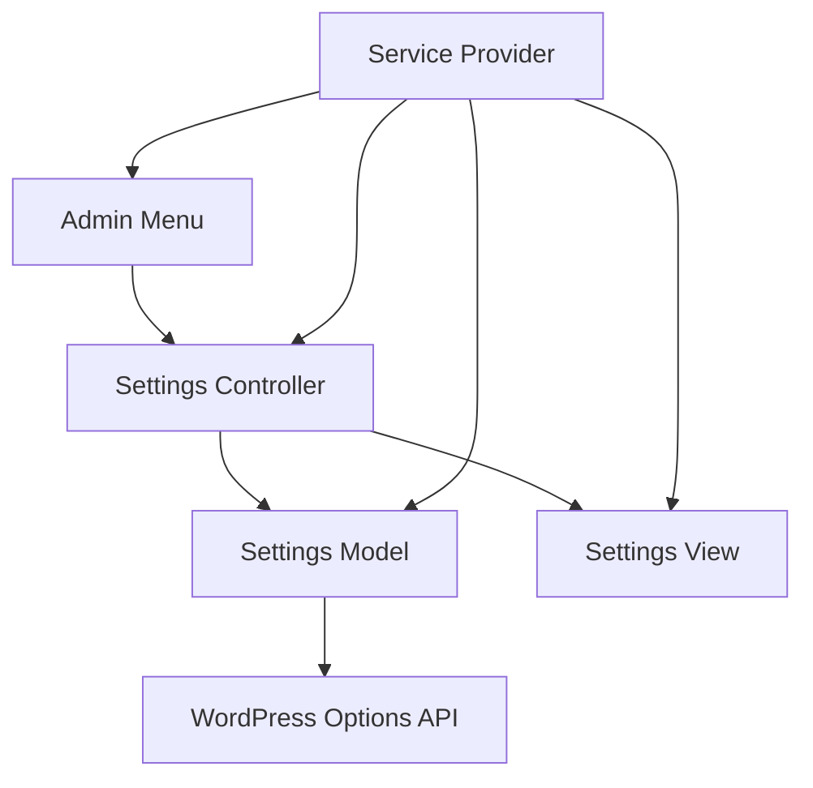

# MemberPress AI Assistant Settings Implementation Plan

## 1. Architecture Overview



## 2. Component Responsibilities

### Settings Model
- Manages data persistence through WordPress Options API
- Handles validation of settings values
- Provides methods for getting/setting values
- No dependencies on other settings components

### Settings View
- Renders UI components
- Receives data through method parameters
- No data fetching or business logic
- No dependencies on other settings components

### Settings Controller
- Coordinates between Model and View
- Handles WordPress hooks and user interactions
- Contains business logic
- Depends on Model and View

### Admin Menu
- Registers admin menu items
- Delegates settings page rendering to Controller
- Depends only on Controller

## 3. Implementation Steps

### Phase 1: Create New Components

1. **Create Settings Model**
   - Combine functionality from current Storage and Validator
   - Implement clean API for getting/setting values
   - Add comprehensive validation

2. **Create Settings View**
   - Extract rendering logic from current Renderer
   - Implement methods for rendering different UI components
   - Ensure all data comes from method parameters

3. **Create Settings Controller**
   - Simplify current Controller
   - Add dependencies on Model and View
   - Implement methods for coordinating between components

### Phase 2: Update Service Provider

1. **Simplify Initialization Process**
   - Remove special handling for settings components
   - Use constructor injection for dependencies
   - Ensure predictable initialization order

2. **Update Service Registration**
   - Register new components with container
   - Remove registration of old components

### Phase 3: Update Admin Menu

1. **Simplify Admin Menu**
   - Update to use new Controller
   - Remove dependency on Coordinator

### Phase 4: Update Templates

1. **Improve Template Handling**
   - Update templates to work with new View
   - Improve variable passing
   - Add better documentation

### Phase 5: Cleanup

1. **Remove Old Components**
   - Delete or archive old components to reduce confusion
   - No migration path needed as there are no existing users

## 4. Detailed Component Specifications

### Settings Model (`MPAISettingsModel.php`)

```php
class MPAISettingsModel {
    // Properties
    private $option_name = 'mpai_settings';
    private $defaults = [
        // General settings
        'chat_enabled' => true,
        // Chat settings
        'chat_location' => 'admin_only',
        'chat_position' => 'bottom_right',
        // Access settings
        'user_roles' => ['administrator'],
        // API settings
        'openai_api_key' => '',
        'openai_model' => 'gpt-4o',
        'openai_temperature' => 0.7,
        'openai_max_tokens' => 1000,
        'anthropic_api_key' => '',
        'anthropic_model' => 'claude-3-opus-20240229',
        'anthropic_temperature' => 0.7,
        'anthropic_max_tokens' => 1000,
        'primary_api' => 'openai',
        // Consent settings
        'consent_required' => true,
    ];
    private $settings = [];
    private $logger;
    
    // Constructor
    public function __construct($logger = null) {
        $this->logger = $logger;
        $this->load_settings();
    }
    
    // Core methods
    public function get($key, $default = null) {
        if (isset($this->settings[$key])) {
            return $this->settings[$key];
        }
        
        if (isset($this->defaults[$key])) {
            return $this->defaults[$key];
        }
        
        return $default;
    }
    
    public function set($key, $value, $save = true) {
        $this->settings[$key] = $value;
        
        if ($save) {
            return $this->save();
        }
        
        return true;
    }
    
    public function save() {
        return update_option($this->option_name, $this->settings);
    }
    
    public function get_all() {
        return $this->settings;
    }
    
    public function update($settings, $save = true) {
        $validated = $this->validate($settings);
        
        foreach ($validated as $key => $value) {
            $this->settings[$key] = $value;
        }
        
        if ($save) {
            return $this->save();
        }
        
        return true;
    }
    
    public function reset($save = true) {
        $this->settings = $this->defaults;
        
        if ($save) {
            return $this->save();
        }
        
        return true;
    }
    
    // Validation methods
    public function validate($settings) {
        $validated = [];
        
        // Validate each setting
        foreach ($settings as $key => $value) {
            switch ($key) {
                case 'chat_enabled':
                case 'consent_required':
                    $validated[$key] = $this->validate_boolean($value);
                    break;
                    
                case 'chat_location':
                    $validated[$key] = $this->validate_chat_location($value);
                    break;
                    
                case 'chat_position':
                    $validated[$key] = $this->validate_chat_position($value);
                    break;
                    
                case 'user_roles':
                    $validated[$key] = $this->validate_user_roles($value);
                    break;
                    
                // Add other validations for remaining settings
                
                default:
                    // For unknown settings, just pass through
                    $validated[$key] = $value;
                    break;
            }
        }
        
        return $validated;
    }
    
    // Helper methods
    private function load_settings() {
        $saved_settings = get_option($this->option_name, []);
        $this->settings = wp_parse_args($saved_settings, $this->defaults);
    }
    
    private function validate_boolean($value) {
        if (is_string($value)) {
            $value = strtolower($value);
            return in_array($value, ['true', 'yes', '1', 'on'], true);
        }
        
        return (bool) $value;
    }
    
    private function validate_chat_location($value) {
        $valid_locations = ['admin_only', 'frontend', 'both'];
        
        if (in_array($value, $valid_locations, true)) {
            return $value;
        }
        
        return 'admin_only';
    }
    
    private function validate_chat_position($value) {
        $valid_positions = ['bottom_right', 'bottom_left', 'top_right', 'top_left'];
        
        if (in_array($value, $valid_positions, true)) {
            return $value;
        }
        
        return 'bottom_right';
    }
    
    private function validate_user_roles($value) {
        if (!is_array($value)) {
            return ['administrator'];
        }
        
        $wp_roles = wp_roles();
        $valid_roles = array_keys($wp_roles->get_names());
        
        $validated = array_filter($value, function($role) use ($valid_roles) {
            return in_array($role, $valid_roles, true);
        });
        
        if (empty($validated)) {
            return ['administrator'];
        }
        
        return array_values($validated);
    }
    
    // Convenience methods for specific settings
    public function is_chat_enabled() {
        return (bool) $this->get('chat_enabled', true);
    }
    
    public function get_chat_location() {
        return $this->get('chat_location', 'admin_only');
    }
    
    // Add other convenience methods as needed
}
```

### Settings View (`MPAISettingsView.php`)

```php
class MPAISettingsView {
    private $logger;
    
    public function __construct($logger = null) {
        $this->logger = $logger;
    }
    
    // Main rendering methods
    public function render_page($current_tab, $tabs, $page_slug, $model) {
        // Check for required variables
        if (empty($tabs)) {
            $this->render_error(__('Error: Required template variables are missing.', 'memberpress-ai-assistant'));
            return;
        }
        
        // Ensure the tab is valid
        if (!isset($tabs[$current_tab])) {
            $current_tab = 'general';
        }
        
        // Start output
        echo '<div class="wrap">';
        echo '<h1>' . esc_html__('MemberPress AI Assistant Settings', 'memberpress-ai-assistant') . '</h1>';
        
        // Display settings updated message if needed
        if (isset($_GET['settings-updated']) && $_GET['settings-updated'] === 'true') {
            echo '<div class="notice notice-success is-dismissible"><p>' .
                esc_html__('Settings saved successfully.', 'memberpress-ai-assistant') .
                '</p></div>';
        }
        
        // Render tabs
        $this->render_tabs($current_tab, $tabs);
        
        // Render form
        $this->render_form($current_tab, $page_slug, $model);
        
        echo '</div>';
    }
    
    public function render_tabs($current_tab, $tabs) {
        echo '<h2 class="nav-tab-wrapper">';
        
        foreach ($tabs as $tab_id => $tab_name) {
            $active = ($current_tab === $tab_id) ? 'nav-tab-active' : '';
            $url = add_query_arg([
                'page' => 'mpai-settings',
                'tab' => $tab_id,
            ], admin_url('admin.php'));
            
            echo '<a href="' . esc_url($url) . '" class="nav-tab ' . esc_attr($active) . '">' .
                esc_html($tab_name) . '</a>';
        }
        
        echo '</h2>';
    }
    
    public function render_form($current_tab, $page_slug, $model) {
        echo '<form method="post" action="' . esc_url(admin_url('admin-post.php')) . '">';
        
        // Add hidden fields
        echo '<input type="hidden" name="action" value="mpai_update_settings" />';
        echo '<input type="hidden" name="tab" value="' . esc_attr($current_tab) . '" />';
        
        // Add WordPress nonce field
        wp_nonce_field($page_slug . '-options');
        
        // Render settings fields for the current tab
        $this->render_fields($current_tab, $page_slug, $model);
        
        // Render submit button
        $this->render_submit_button();
        
        echo '</form>';
    }
    
    public function render_fields($current_tab, $page_slug, $model) {
        echo '<table class="form-table" role="presentation">';
        
        // Output section and fields based on current tab
        switch ($current_tab) {
            case 'general':
                do_settings_sections($page_slug);
                break;
                
            case 'api':
                $this->render_section('mpai_api_section', $page_slug);
                break;
                
            case 'chat':
                $this->render_section('mpai_chat_section', $page_slug);
                break;
                
            case 'access':
                $this->render_section('mpai_access_section', $page_slug);
                break;
                
            case 'consent':
                $this->render_section('mpai_consent_section', $page_slug);
                break;
                
            default:
                do_settings_sections($page_slug);
                break;
        }
        
        echo '</table>';
    }
    
    // Helper rendering methods
    public function render_section($section_id, $page_slug) {
        global $wp_settings_sections, $wp_settings_fields;
        
        if (!isset($wp_settings_sections[$page_slug][$section_id])) {
            return;
        }
        
        $section = $wp_settings_sections[$page_slug][$section_id];
        
        // Output section header
        if ($section['title']) {
            echo '<h2>' . esc_html($section['title']) . '</h2>';
        }
        
        // Output section description
        if ($section['callback']) {
            call_user_func($section['callback']);
        }
        
        // Output section fields
        if (isset($wp_settings_fields[$page_slug][$section_id])) {
            do_settings_fields($page_slug, $section_id);
        }
    }
    
    public function render_submit_button() {
        echo '<p class="submit">';
        echo '<input type="submit" name="submit" id="submit" class="button button-primary" value="' . 
            esc_attr__('Save Changes', 'memberpress-ai-assistant') . '" />';
        echo '</p>';
    }
    
    public function render_error($message) {
        echo '<div class="wrap">';
        echo '<h1>' . esc_html__('MemberPress AI Assistant Settings', 'memberpress-ai-assistant') . '</h1>';
        echo '<div class="notice notice-error"><p>' . esc_html($message) . '</p></div>';
        echo '</div>';
    }
    
    // Field rendering methods
    public function render_chat_enabled_field($value) {
        ?>
        <label for="mpai_chat_enabled">
            <input type="checkbox" id="mpai_chat_enabled" name="mpai_settings[chat_enabled]" value="1" <?php checked($value, true); ?> />
            <?php esc_html_e('Enable the AI Assistant chat interface', 'memberpress-ai-assistant'); ?>
        </label>
        <p class="description">
            <?php esc_html_e('When enabled, the chat interface will be available based on the location settings below.', 'memberpress-ai-assistant'); ?>
        </p>
        <?php
    }
    
    // Add other field rendering methods as needed
}
```

### Settings Controller (`MPAISettingsController.php`)

```php
class MPAISettingsController {
    private $model;
    private $view;
    private $page_slug = 'mpai-settings';
    private $tabs = [];
    private $logger;
    
    public function __construct($model, $view, $logger = null) {
        $this->model = $model;
        $this->view = $view;
        $this->logger = $logger;
        
        // Define tabs
        $this->tabs = [
            'general' => __('General', 'memberpress-ai-assistant'),
            'api' => __('API Settings', 'memberpress-ai-assistant'),
            'chat' => __('Chat Settings', 'memberpress-ai-assistant'),
            'access' => __('Access Control', 'memberpress-ai-assistant'),
            'consent' => __('Consent', 'memberpress-ai-assistant'),
        ];
    }
    
    public function init() {
        // Register settings
        add_action('admin_init', [$this, 'register_settings']);
        
        // Handle form submissions
        add_action('admin_post_mpai_update_settings', [$this, 'handle_form_submission']);
        
        // Handle reset all consents action
        add_action('admin_init', [$this, 'handle_reset_all_consents']);
        
        // Register consent preview page
        add_action('admin_menu', [$this, 'register_consent_preview_page'], 30);
    }
    
    public function render_page() {
        try {
            // Get current tab
            $current_tab = isset($_GET['tab']) ? sanitize_text_field($_GET['tab']) : 'general';
            
            // Render the page
            $this->view->render_page($current_tab, $this->tabs, $this->page_slug, $this->model);
        } catch (Exception $e) {
            $this->log_error('Error rendering settings page: ' . $e->getMessage());
            $this->view->render_error(__('An error occurred while rendering the settings page. Please try again later or contact support.', 'memberpress-ai-assistant'));
        }
    }
    
    public function register_settings() {
        // Register setting
        register_setting(
            $this->page_slug,
            'mpai_settings',
            [
                'sanitize_callback' => [$this, 'sanitize_settings'],
                'default' => $this->model->get_all(),
            ]
        );
        
        // Register sections and fields
        $this->register_general_section();
        $this->register_api_section();
        $this->register_chat_section();
        $this->register_access_section();
        $this->register_consent_section();
    }
    
    public function handle_form_submission() {
        // Check nonce
        if (!isset($_POST['_wpnonce']) || !wp_verify_nonce($_POST['_wpnonce'], $this->page_slug . '-options')) {
            wp_die(__('Security check failed. Please try again.', 'memberpress-ai-assistant'));
        }
        
        // Check permissions
        if (!current_user_can('manage_options')) {
            wp_die(__('You do not have sufficient permissions to access this page.', 'memberpress-ai-assistant'));
        }
        
        // Get settings from POST
        $settings = isset($_POST['mpai_settings']) ? $_POST['mpai_settings'] : [];
        
        // Update settings
        $this->model->update($settings);
        
        // Trigger action for other components to react to settings update
        do_action('memberpress_ai_assistant_update_settings', $settings);
        
        // Redirect back to settings page with success message
        wp_redirect(add_query_arg(['page' => 'mpai-settings', 'settings-updated' => 'true'], admin_url('admin.php')));
        exit;
    }
    
    // Add other methods for registering sections, handling reset consents, etc.
    
    // Getter methods
    public function get_page_slug() {
        return $this->page_slug;
    }
    
    public function get_tabs() {
        return $this->tabs;
    }
    
    // Helper methods
    private function log_error($message) {
        if ($this->logger) {
            $this->logger->error($message);
        }
    }
}
```

### Service Provider Updates

```php
// In the discoverServices method
protected function discoverServices(Container $container): void {
    $logger = $container->make('logger');
    
    // Phase 1: Instantiate all services first
    $this->instantiateServicesInDirectory($container, 'Services', $logger);
    $this->instantiateServicesInDirectory($container, 'Admin', $logger);
    
    // Phase 2: Set dependencies for services that require them
    $this->resolveAndSetDependencies($container, $logger);
}

// In the resolveAndSetDependencies method
protected function resolveAndSetDependencies(Container $container, $logger): void {
    // Create and register settings components
    $settings_model = new MPAISettingsModel($logger);
    $settings_view = new MPAISettingsView($logger);
    $settings_controller = new MPAISettingsController($settings_model, $settings_view, $logger);
    
    $container->singleton('settings_model', function() use ($settings_model) {
        return $settings_model;
    });
    
    $container->singleton('settings_view', function() use ($settings_view) {
        return $settings_view;
    });
    
    $container->singleton('settings_controller', function() use ($settings_controller) {
        return $settings_controller;
    });
    
    // Initialize the controller
    $settings_controller->init();
    
    // Update admin menu to use the new controller
    $admin_menu = null;
    foreach ($this->services as $serviceName => $service) {
        if ($service instanceof MPAIAdminMenu) {
            $admin_menu = $service;
            break;
        }
    }
    
    if ($admin_menu) {
        $admin_menu->set_settings_controller($settings_controller);
    }
    
    // Handle other services normally
    foreach ($this->services as $serviceName => $service) {
        // Skip the admin menu as we've already handled it
        if ($service instanceof MPAIAdminMenu) {
            continue;
        }
        
        if (method_exists($service, 'set_dependencies')) {
            // Resolve dependencies as before
        }
    }
}
```

### Admin Menu Updates

```php
class MPAIAdminMenu extends AbstractService {
    // Properties
    protected $menu_slug = 'mpai-settings';
    protected $parent_menu_slug = 'memberpress';
    protected $settings_controller;
    
    // Constructor
    public function __construct(string $name = 'admin_menu', $logger = null) {
        parent::__construct($name, $logger);
    }
    
    // Set the settings controller
    public function set_settings_controller($settings_controller): void {
        $this->settings_controller = $settings_controller;
    }
    
    // Register admin menu
    public function register_admin_menu(): void {
        if (mpai_is_memberpress_active()) {
            $this->register_memberpress_submenu();
        } else {
            $this->register_top_level_menu();
        }
    }
    
    // Render settings page
    public function render_settings_page(): void {
        try {
            if (!$this->settings_controller) {
                $this->log_error('Settings controller not available in admin menu');
                $this->render_fallback_settings_page();
                return;
            }
            
            $this->settings_controller->render_page();
        } catch (Exception $e) {
            $this->log_error('Error rendering settings page: ' . $e->getMessage());
            $this->render_fallback_settings_page();
        }
    }
    
    // Other methods remain largely unchanged
}
```

## 5. Cleanup Strategy

Since there are no existing users, we can simply delete or archive the old components without needing a migration path. The files to be removed include:

- `src/Admin/MPAISettingsStorage.php`
- `src/Admin/MPAISettingsValidator.php`
- `src/Admin/MPAISettingsRenderer.php`
- `src/Admin/MPAISettingsCoordinator.php`
- `src/Interfaces/SettingsCoordinatorInterface.php`
- `src/Interfaces/SettingsProviderInterface.php`
- `src/Interfaces/SettingsRendererInterface.php`

## 6. Testing Plan

1. **Unit Testing**
   - Test each component in isolation
   - Verify validation logic in Model
   - Test rendering methods in View
   - Test coordination in Controller

2. **Integration Testing**
   - Test components working together
   - Verify settings are saved and retrieved correctly
   - Test form submissions and error handling

3. **UI Testing**
   - Verify all UI elements render correctly
   - Test tab navigation
   - Test form submissions from UI

## 7. Timeline

1. **Phase 1: Create New Components** - 2-3 days
2. **Phase 2: Update Service Provider** - 1 day
3. **Phase 3: Update Admin Menu** - 1 day
4. **Phase 4: Update Templates** - 1-2 days
5. **Phase 5: Cleanup** - 1 day

**Total Estimated Time**: 6-8 days

## 8. Benefits of This Solution

1. **Eliminates Circular Dependencies**
   - Clear one-way dependencies
   - Model and View have no dependencies on each other

2. **Simplifies Initialization**
   - Predictable initialization sequence
   - No special handling for settings components

3. **Improves Template Variable Handling**
   - Explicit variable passing
   - Clear origin of all template variables

4. **Enhances Maintainability**
   - Single Responsibility Principle for each component
   - Clear separation of concerns
   - Easier to test individual components

5. **Provides Better Error Handling**
   - Consistent error logging
   - User-friendly error messages
   - Graceful fallbacks