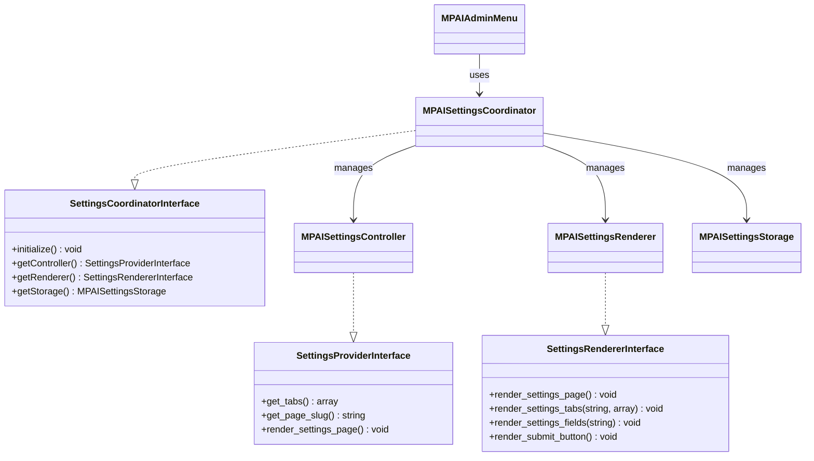
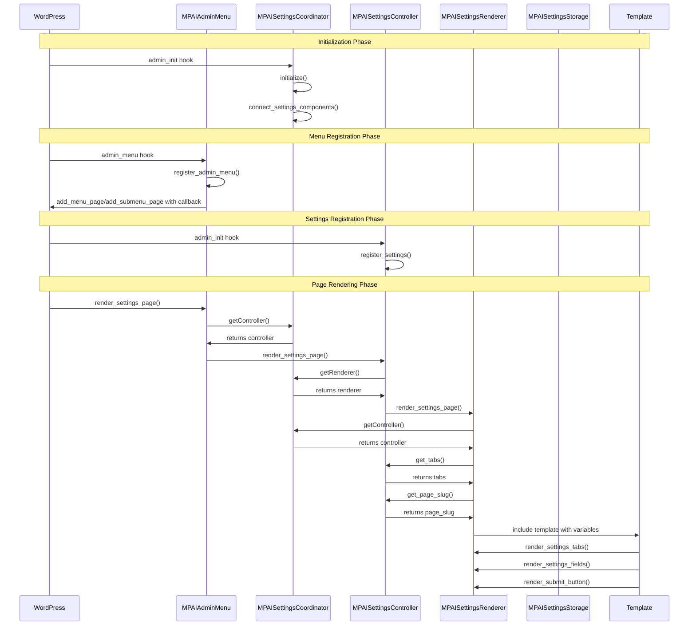

# MemberPress AI Assistant Settings Page - Solution Plan

## Overview

This document outlines a comprehensive solution for fixing the identified issues in the MemberPress AI Assistant settings page implementation. The solution maintains and improves the existing Coordinator pattern while addressing circular dependencies, hook-based issues, template variable passing, and service container initialization problems.

## Current Issues

1. **Circular Dependencies**
   - The `MPAISettingsController` and `MPAISettingsRenderer` have a circular dependency where each needs the other to function properly.
   - The renderer needs the controller to get tabs, and the controller needs the renderer to render settings fields.

2. **Hook-Based Approach Issues**
   - The controller attempts to override the admin menu's render method using `remove_action`, but this approach is flawed.
   - Both the controller and renderer hook into the `mpai_render_settings_page` filter, potentially causing conflicts.

3. **Template Variable Passing**
   - The renderer's `render_settings_page` method sets up template variables and extracts them, but there are issues with ensuring these variables are properly passed to the template.
   - Debug code in the renderer logs whether variables are set, indicating previous problems.

4. **Service Container Initialization**
   - The ServiceProvider has special handling for the circular dependency, but it's not robust.
   - The initialization order is critical but fragile.

## Solution Architecture

We'll maintain the existing component structure but improve how they interact:



### Key Improvements

1. **Strengthen the Coordinator Pattern**
   - Make the Coordinator the single source of truth for accessing components
   - Ensure components only interact through the Coordinator
   - Remove direct dependencies between Controller and Renderer

2. **Fix Hook-Based Approach**
   - Simplify the hook usage
   - Use proper delegation for rendering
   - Remove problematic hook overrides

3. **Improve Template Variable Passing**
   - Use a consistent approach for passing variables to templates as arrays (without extract())
   - Ensure all required variables are available
   - Add proper error handling for missing variables

4. **Enhance Service Container Initialization**
   - Improve the initialization order in ServiceProvider
   - Add better error handling and logging
   - Ensure all dependencies are properly set

5. **Comprehensive Error Handling**
   - Add user-friendly error messages
   - Implement detailed logging for debugging
   - Include fallback mechanisms when components are missing

## Detailed Component Changes

### 1. MPAISettingsCoordinator

The Coordinator will be strengthened as the central component that manages all interactions:

```php
class MPAISettingsCoordinator implements SettingsCoordinatorInterface {
    // Existing properties
    protected $settings_storage;
    protected $settings_controller;
    protected $settings_renderer;
    
    // Improved initialization method
    public function initialize(): void {
        // Ensure all components are available
        if (!$this->settings_storage) {
            $this->log('Error: Cannot initialize settings components - storage missing', 'error');
            return;
        }
        
        if (!$this->settings_controller) {
            $this->log('Error: Cannot initialize settings components - controller missing', 'error');
            return;
        }
        
        if (!$this->settings_renderer) {
            $this->log('Error: Cannot initialize settings components - renderer missing', 'error');
            return;
        }
        
        // Connect components
        $this->connect_settings_components();
        
        $this->log('Settings coordinator initialized successfully');
    }
    
    // Improved connection method
    protected function connect_settings_components(): void {
        try {
            // No need to set cross-dependencies anymore
            // The coordinator will mediate all interactions
            $this->log('Settings components connected successfully');
        } catch (\Exception $e) {
            $this->log('Error connecting settings components: ' . $e->getMessage(), 'error');
        }
    }
    
    // Enhanced getter methods with error handling
    public function getController(): ?SettingsProviderInterface {
        if (!$this->settings_controller) {
            $this->log('Warning: Attempted to access null controller', 'warning');
        }
        return $this->settings_controller;
    }
    
    public function getRenderer(): ?SettingsRendererInterface {
        if (!$this->settings_renderer) {
            $this->log('Warning: Attempted to access null renderer', 'warning');
        }
        return $this->settings_renderer;
    }
    
    public function getStorage(): ?MPAISettingsStorage {
        if (!$this->settings_storage) {
            $this->log('Warning: Attempted to access null storage', 'warning');
        }
        return $this->settings_storage;
    }
    
    // Enhanced logging method
    protected function log($message, $level = 'info'): void {
        if ($this->logger) {
            if ($level === 'error') {
                $this->logger->error($message);
            } else if ($level === 'warning') {
                $this->logger->warning($message);
            } else {
                $this->logger->info($message);
            }
        }
    }
}
```

### 2. MPAISettingsController

The Controller will be updated to work through the Coordinator:

```php
class MPAISettingsController implements SettingsProviderInterface {
    // Existing properties
    protected $settings_storage;
    protected $settings_coordinator;
    
    // Remove direct reference to renderer
    // protected $settings_renderer;
    
    // Set coordinator method
    public function set_settings_coordinator(SettingsCoordinatorInterface $settings_coordinator): void {
        $this->settings_coordinator = $settings_coordinator;
        $this->log('Settings coordinator set in controller');
    }
    
    // Update render_settings_page to use coordinator
    public function render_settings_page(): void {
        // Check if coordinator is available
        if (!$this->settings_coordinator) {
            $this->log('Error: Settings coordinator not available in controller', 'error');
            echo '<div class="notice notice-error"><p>';
            echo esc_html__('Error: Settings coordinator not available. Please try again later or contact support.', 'memberpress-ai-assistant');
            echo '</p></div>';
            return;
        }
        
        // Get renderer from coordinator
        $renderer = $this->settings_coordinator->getRenderer();
        
        // Delegate to the renderer
        if ($renderer) {
            try {
                $renderer->render_settings_page();
            } catch (\Exception $e) {
                $this->log('Error during settings page rendering: ' . $e->getMessage(), 'error');
                echo '<div class="notice notice-error"><p>';
                echo esc_html__('An error occurred while rendering the settings page. Please try again later or contact support.', 'memberpress-ai-assistant');
                echo '</p></div>';
            }
        } else {
            // Fallback if renderer not available
            $this->log('Renderer not available, using fallback', 'warning');
            $this->render_fallback_settings_page();
        }
    }
    
    // Enhanced fallback method
    protected function render_fallback_settings_page(): void {
        echo '<div class="wrap">';
        echo '<h1>' . esc_html__('MemberPress AI Assistant Settings', 'memberpress-ai-assistant') . '</h1>';
        echo '<div class="notice notice-warning"><p>';
        echo esc_html__('The settings renderer is not available. Basic functionality is provided.', 'memberpress-ai-assistant');
        echo '</p></div>';
        
        // Display basic settings form if storage is available
        if ($this->settings_storage) {
            // Basic settings form implementation
            echo '<form method="post" action="' . esc_url(admin_url('admin-post.php')) . '">';
            echo '<input type="hidden" name="action" value="mpai_update_settings" />';
            wp_nonce_field($this->get_page_slug() . '-options');
            
            // Display some basic settings
            echo '<table class="form-table" role="presentation">';
            // ... basic settings fields ...
            echo '</table>';
            
            echo '<p class="submit">';
            echo '<input type="submit" name="submit" id="submit" class="button button-primary" value="' . 
                esc_attr__('Save Changes', 'memberpress-ai-assistant') . '" />';
            echo '</p>';
            echo '</form>';
        } else {
            echo '<p>' . esc_html__('Settings storage is not available. Please try again later or contact support.', 'memberpress-ai-assistant') . '</p>';
        }
        
        echo '</div>';
    }
    
    // Enhanced logging method
    protected function log($message, $level = 'info'): void {
        if ($this->logger) {
            if ($level === 'error') {
                $this->logger->error($message);
            } else if ($level === 'warning') {
                $this->logger->warning($message);
            } else {
                $this->logger->info($message);
            }
        }
    }
    
    // Other methods remain largely the same
}
```

### 3. MPAISettingsRenderer

The Renderer will be updated to work through the Coordinator:

```php
class MPAISettingsRenderer implements SettingsRendererInterface {
    // Existing properties
    protected $settings_storage;
    protected $settings_coordinator;
    
    // Remove direct reference to controller
    // protected $settings_controller;
    
    // Set coordinator method
    public function set_dependencies(SettingsCoordinatorInterface $settings_coordinator): void {
        $this->settings_coordinator = $settings_coordinator;
        // Get the storage from the coordinator
        $this->settings_storage = $settings_coordinator->getStorage();
        $this->log('Settings coordinator set in renderer');
    }
    
    // Update render_settings_page to use coordinator
    public function render_settings_page(): void {
        // Check if coordinator is available
        if (!$this->settings_coordinator) {
            $this->log('Error: Settings coordinator not available in renderer', 'error');
            echo '<div class="notice notice-error"><p>';
            echo esc_html__('Error: Settings coordinator not available. Please try again later or contact support.', 'memberpress-ai-assistant');
            echo '</p></div>';
            return;
        }
        
        // Get provider from coordinator
        $provider = $this->settings_coordinator->getController();
        
        if (!$provider) {
            $this->log('Error: Settings provider not available from coordinator', 'error');
            echo '<div class="notice notice-error"><p>';
            echo esc_html__('Error: Settings provider not available. Please try again later or contact support.', 'memberpress-ai-assistant');
            echo '</p></div>';
            return;
        }
        
        try {
            // Get current tab from the provider
            $tabs = $provider->get_tabs();
            $current_tab = isset($_GET['tab']) ? sanitize_text_field($_GET['tab']) : 'general';
            
            // Ensure the tab is valid
            if (!isset($tabs[$current_tab])) {
                $current_tab = 'general';
            }
            
            // Set up template variables with explicit context
            $renderer = $this;
            
            // Create template variables array with explicit context
            $template_vars = [
                'renderer' => $renderer,
                'provider' => $provider,
                'current_tab' => $current_tab,
                'tabs' => $tabs
            ];
            
            // Log template variables
            $this->log('Rendering settings page with variables: ' .
                json_encode(array_keys($template_vars)));
            
            // Pass variables directly to the template without extract()
            $this->render_template($template_vars);
        } catch (\Exception $e) {
            $this->log('Error preparing template variables: ' . $e->getMessage(), 'error');
            echo '<div class="notice notice-error"><p>';
            echo esc_html__('An error occurred while preparing the settings page. Please try again later or contact support.', 'memberpress-ai-assistant');
            echo '</p></div>';
        }
    }
    
    // Improved template rendering with error handling
    protected function render_template(array $vars): void {
        $template_path = MPAI_PLUGIN_DIR . 'templates/settings-page.php';
        
        if (!file_exists($template_path)) {
            $this->log('Error: Template file not found: ' . $template_path, 'error');
            echo '<div class="notice notice-error"><p>';
            echo esc_html__('Error: Settings template file not found. Please reinstall the plugin or contact support.', 'memberpress-ai-assistant');
            echo '</p></div>';
            return;
        }
        
        try {
            // Include the template with variables in scope
            include($template_path);
        } catch (\Exception $e) {
            $this->log('Error rendering template: ' . $e->getMessage(), 'error');
            echo '<div class="notice notice-error"><p>';
            echo esc_html__('An error occurred while rendering the settings page. Please try again later or contact support.', 'memberpress-ai-assistant');
            echo '</p></div>';
        }
    }
    
    // Enhanced logging method
    protected function log($message, $level = 'info'): void {
        if ($this->logger) {
            if ($level === 'error') {
                $this->logger->error($message);
            } else if ($level === 'warning') {
                $this->logger->warning($message);
            } else {
                $this->logger->info($message);
            }
        }
    }
    
    // Other methods remain largely the same
}
```

### 4. MPAIAdminMenu

The Admin Menu will be updated to work through the Coordinator:

```php
class MPAIAdminMenu {
    // Existing properties
    protected $settings_coordinator;
    
    // Set coordinator method
    public function set_settings_coordinator(SettingsCoordinatorInterface $settings_coordinator): void {
        $this->settings_coordinator = $settings_coordinator;
        $this->log('Settings coordinator set in admin menu');
    }
    
    // Update render_settings_page to use coordinator
    public function render_settings_page(): void {
        try {
            // Check if settings coordinator is available
            if ($this->settings_coordinator) {
                // Get the controller from the coordinator
                $controller = $this->settings_coordinator->getController();
                
                // Delegate rendering to the controller
                if ($controller) {
                    $controller->render_settings_page();
                    return;
                } else {
                    $this->log('Controller not available from coordinator', 'warning');
                }
            } else {
                $this->log('Settings coordinator not available in admin menu', 'warning');
            }
            
            // Fallback if coordinator or controller not available
            $this->render_fallback_settings_page();
        } catch (\Exception $e) {
            $this->log('Error in render_settings_page: ' . $e->getMessage(), 'error');
            $this->render_fallback_settings_page();
        }
    }
    
    // Enhanced fallback method
    protected function render_fallback_settings_page(): void {
        echo '<div class="wrap">';
        echo '<h1>' . esc_html__('MemberPress AI Assistant Settings', 'memberpress-ai-assistant') . '</h1>';
        
        echo '<div class="notice notice-error">';
        echo '<p>' . esc_html__('The settings system is not available. This could indicate an issue with the plugin initialization.', 'memberpress-ai-assistant') . '</p>';
        echo '<p>' . esc_html__('Please try refreshing the page. If the problem persists, contact support.', 'memberpress-ai-assistant') . '</p>';
        echo '</div>';
        
        echo '</div>';
    }
    
    // Enhanced logging method
    protected function log($message, $level = 'info'): void {
        if ($this->logger) {
            if ($level === 'error') {
                $this->logger->error($message);
            } else if ($level === 'warning') {
                $this->logger->warning($message);
            } else {
                $this->logger->info($message);
            }
        }
    }
}
```

### 5. ServiceProvider

The ServiceProvider will be updated to properly initialize components:

```php
class ServiceProvider {
    // Existing methods
    
    // Update resolveAndSetDependencies method
    protected function resolveAndSetDependencies(Container $container, $logger): void {
        // First, handle the settings components in the correct order
        $settingsStorage = null;
        $settingsController = null;
        $settingsRenderer = null;
        $settingsCoordinator = null;
        
        // Find the instances
        foreach ($this->services as $serviceName => $service) {
            if ($service instanceof \MemberpressAiAssistant\Admin\MPAISettingsStorage) {
                $settingsStorage = $service;
            } elseif ($service instanceof \MemberpressAiAssistant\Admin\MPAISettingsController) {
                $settingsController = $service;
            } elseif ($service instanceof \MemberpressAiAssistant\Admin\MPAISettingsRenderer) {
                $settingsRenderer = $service;
            } elseif ($service instanceof \MemberpressAiAssistant\Admin\MPAISettingsCoordinator) {
                $settingsCoordinator = $service;
            }
        }
        
        // Log the component status
        $logger->info('Settings components status before initialization', [
            'storage' => isset($settingsStorage) ? 'available' : 'missing',
            'controller' => isset($settingsController) ? 'available' : 'missing',
            'renderer' => isset($settingsRenderer) ? 'available' : 'missing',
            'coordinator' => isset($settingsCoordinator) ? 'available' : 'missing'
        ]);
        
        // Set up dependencies in the correct order using the coordinator pattern
        if ($settingsStorage && $settingsController && $settingsRenderer && $settingsCoordinator) {
            try {
                // First, set dependencies for the coordinator
                if (method_exists($settingsCoordinator, 'set_dependencies')) {
                    $settingsCoordinator->set_dependencies($settingsStorage, $settingsController, $settingsRenderer);
                    $logger->info('Set dependencies for MPAISettingsCoordinator');
                } else {
                    $logger->error('MPAISettingsCoordinator does not have set_dependencies method');
                }
                
                // Now set the coordinator in the controller
                if (method_exists($settingsController, 'set_settings_coordinator')) {
                    $settingsController->set_settings_coordinator($settingsCoordinator);
                    $logger->info('Set coordinator for MPAISettingsController');
                } else {
                    $logger->error('MPAISettingsController does not have set_settings_coordinator method');
                }
                
                // Set the coordinator in the renderer
                if (method_exists($settingsRenderer, 'set_dependencies')) {
                    $settingsRenderer->set_dependencies($settingsCoordinator);
                    $logger->info('Set coordinator for MPAISettingsRenderer');
                } else {
                    $logger->error('MPAISettingsRenderer does not have set_dependencies method');
                }
                
                // Set the coordinator in the admin menu
                $adminMenu = null;
                foreach ($this->services as $serviceName => $service) {
                    if ($service instanceof \MemberpressAiAssistant\Admin\MPAIAdminMenu) {
                        $adminMenu = $service;
                        break;
                    }
                }
                
                if ($adminMenu) {
                    if (method_exists($adminMenu, 'set_settings_coordinator')) {
                        $adminMenu->set_settings_coordinator($settingsCoordinator);
                        $logger->info('Set coordinator for MPAIAdminMenu');
                    } else {
                        $logger->error('MPAIAdminMenu does not have set_settings_coordinator method');
                    }
                } else {
                    $logger->warning('MPAIAdminMenu not found in services');
                }
                
                // Initialize the coordinator
                if (method_exists($settingsCoordinator, 'initialize')) {
                    $settingsCoordinator->initialize();
                    $logger->info('Initialized MPAISettingsCoordinator');
                } else {
                    $logger->error('MPAISettingsCoordinator does not have initialize method');
                }
            } catch (\Exception $e) {
                $logger->error('Error during settings components initialization', [
                    'error' => $e->getMessage(),
                    'trace' => $e->getTraceAsString()
                ]);
            }
        } else {
            $logger->error('Could not set up settings components - one or more components missing', [
                'storage' => isset($settingsStorage) ? 'yes' : 'no',
                'controller' => isset($settingsController) ? 'yes' : 'no',
                'renderer' => isset($settingsRenderer) ? 'yes' : 'no',
                'coordinator' => isset($settingsCoordinator) ? 'yes' : 'no'
            ]);
        }
        
        // Handle other services as before
    }
}
```

### 6. Template (settings-page.php)

The template will be updated to handle variables consistently:

```php
<?php
/**
 * Settings Page Template
 *
 * Renders the MemberPress AI Assistant settings page.
 * This template works with the MPAISettingsRenderer class to display
 * the settings form, tabs, and fields.
 *
 * @package MemberpressAiAssistant
 */

// Exit if accessed directly
if (!defined('ABSPATH')) {
    exit;
}

/**
 * Template variables:
 *
 * @var array $vars The template variables array containing:
 * @var \MemberpressAiAssistant\Admin\MPAISettingsRenderer $vars['renderer'] The settings renderer instance
 * @var \MemberpressAiAssistant\Interfaces\SettingsProviderInterface $vars['provider'] The settings provider instance
 * @var string $vars['current_tab'] The current active tab
 * @var array $vars['tabs'] Available tabs
 */

// Access variables from the $vars array
$renderer = $vars['renderer'] ?? null;
$provider = $vars['provider'] ?? null;
$current_tab = $vars['current_tab'] ?? (isset($_GET['tab']) ? sanitize_text_field($_GET['tab']) : 'general');
$tabs = $vars['tabs'] ?? [];

// Ensure the tab is valid
if (!isset($tabs[$current_tab])) {
    $current_tab = 'general';
}

// Check for required variables
if (!$renderer || !$provider) {
    ?>
    <div class="wrap">
        <h1><?php esc_html_e('MemberPress AI Assistant Settings', 'memberpress-ai-assistant'); ?></h1>
        <div class="notice notice-error">
            <p><?php esc_html_e('Error: Required template variables are missing. Please try again later or contact support.', 'memberpress-ai-assistant'); ?></p>
        </div>
    </div>
    <?php
    return;
}
?>

<div class="wrap">
    <h1><?php esc_html_e('MemberPress AI Assistant Settings', 'memberpress-ai-assistant'); ?></h1>
    
    <?php
    // Display settings updated message if needed
    if (isset($_GET['settings-updated']) && $_GET['settings-updated'] === 'true') {
        echo '<div class="notice notice-success is-dismissible"><p>' .
            esc_html__('Settings saved successfully.', 'memberpress-ai-assistant') .
            '</p></div>';
    }
    
    // Render tabs
    $renderer->render_settings_tabs($current_tab, $tabs);
    ?>
    
    <form method="post" action="<?php echo esc_url(admin_url('admin-post.php')); ?>">
        <?php
        // Add hidden fields
        echo '<input type="hidden" name="action" value="mpai_update_settings" />';
        echo '<input type="hidden" name="tab" value="' . esc_attr($current_tab) . '" />';
        
        // Add WordPress nonce field
        $page_slug = $provider->get_page_slug();
        wp_nonce_field($page_slug . '-options');
        
        // Render settings fields for the current tab
        $renderer->render_settings_fields($current_tab);
        
        // Render submit button
        $renderer->render_submit_button();
        ?>
    </form>
</div>
```

## Implementation Flow

The following sequence diagram illustrates how the components will interact after the changes:



## Implementation Plan

Here's the step-by-step implementation plan:

1. **Update MPAISettingsCoordinator**
   - Strengthen the initialization method
   - Improve error handling
   - Ensure proper component connections

2. **Update MPAISettingsController**
   - Remove direct dependency on MPAISettingsRenderer
   - Update to work through the Coordinator
   - Fix hook-based issues

3. **Update MPAISettingsRenderer**
   - Remove direct dependency on MPAISettingsController
   - Update to work through the Coordinator
   - Improve template variable handling

4. **Update MPAIAdminMenu**
   - Update to work through the Coordinator
   - Improve error handling

5. **Update ServiceProvider**
   - Improve initialization order
   - Enhance error handling
   - Ensure proper dependency injection

6. **Update Template**
   - Improve variable handling
   - Add error checking
   - Ensure consistent variable naming

## Testing Strategy

After implementation, we should test:

1. **Component Initialization**
   - Verify all components are properly initialized
   - Test error handling when components are missing

2. **Settings Page Rendering**
   - Verify the settings page loads correctly
   - Test error handling when rendering fails

3. **Tab Navigation**
   - Test that all tabs can be navigated
   - Verify correct tab content is displayed

4. **Settings Saving**
   - Confirm settings can be saved
   - Verify settings are retrieved correctly
   - Test validation and sanitization

5. **Error Handling**
   - Test behavior when components are missing
   - Test behavior when template variables are missing
   - Test behavior when template file is missing

6. **Edge Cases**
   - Test with invalid tab parameters
   - Test with missing nonce
   - Test with insufficient permissions

## Benefits of This Solution

1. **Maintains Existing Architecture**
   - Preserves the Coordinator pattern while fixing its issues
   - Minimal changes to the overall structure

2. **Breaks Circular Dependencies**
   - Components interact through the Coordinator, not directly
   - Clearer flow of control and data

3. **Improves Error Handling**
   - Comprehensive error handling with user-friendly messages
   - Detailed logging for debugging
   - Fallback mechanisms when components are missing

4. **Enhances Maintainability**
   - Clearer component responsibilities and interactions
   - Better encapsulation of functionality
   - More robust initialization

5. **Follows WordPress Best Practices**
   - Proper use of hooks and filters
   - Secure template handling
   - Consistent error messaging

## Conclusion

This solution addresses all the identified issues with the current implementation while maintaining the core architecture. By strengthening the Coordinator pattern and improving error handling, we create a more robust and maintainable settings page implementation.

The changes are focused on fixing the issues rather than completely redesigning the system, which minimizes the risk of introducing new problems. The improved error handling and logging will make it easier to diagnose and fix any issues that do arise.