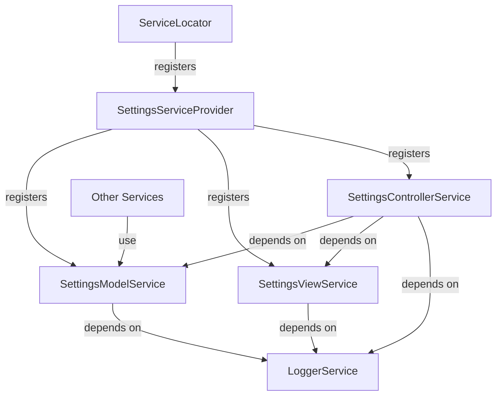
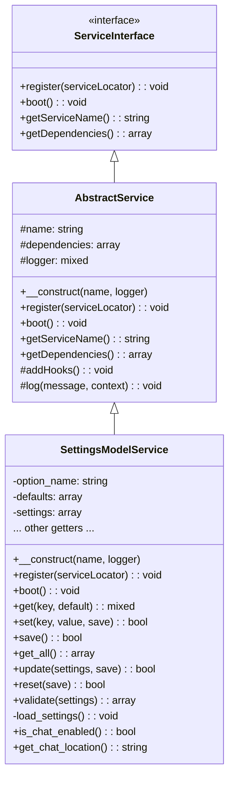
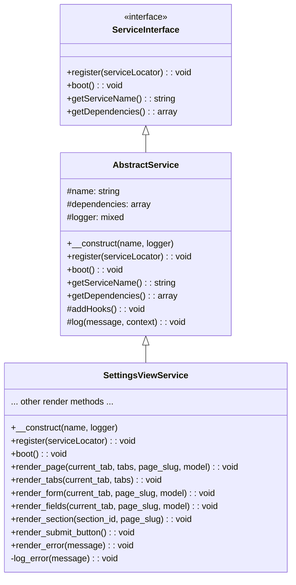
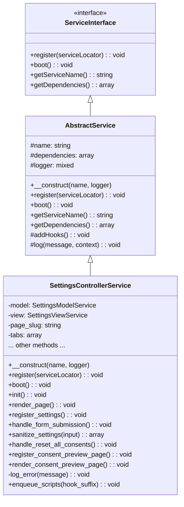
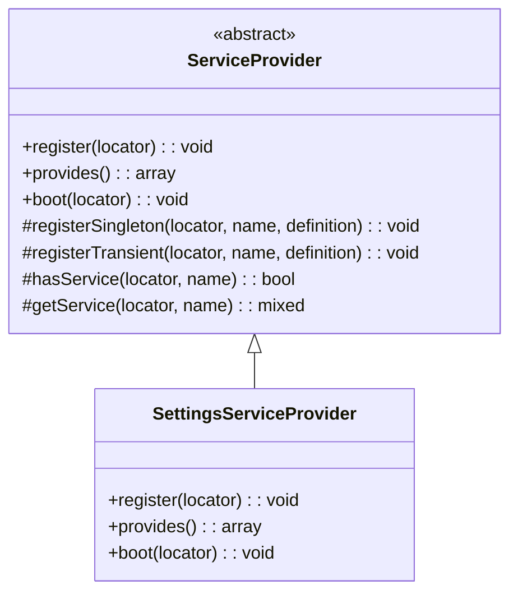
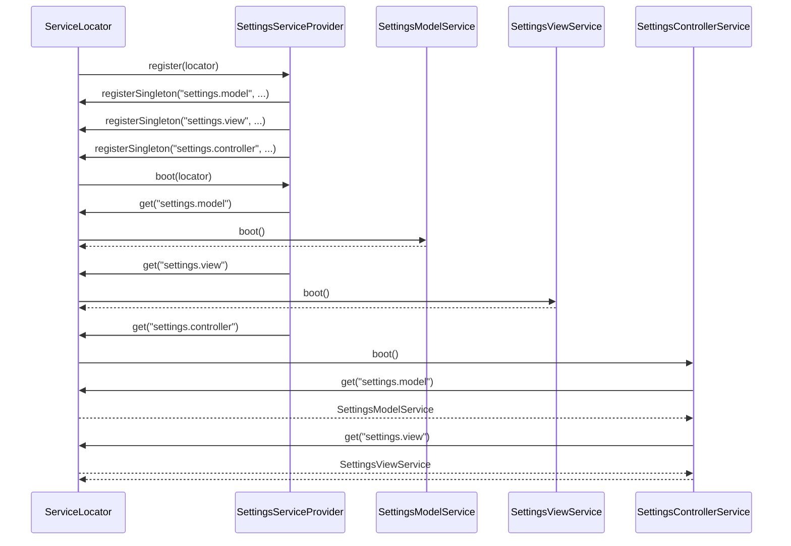
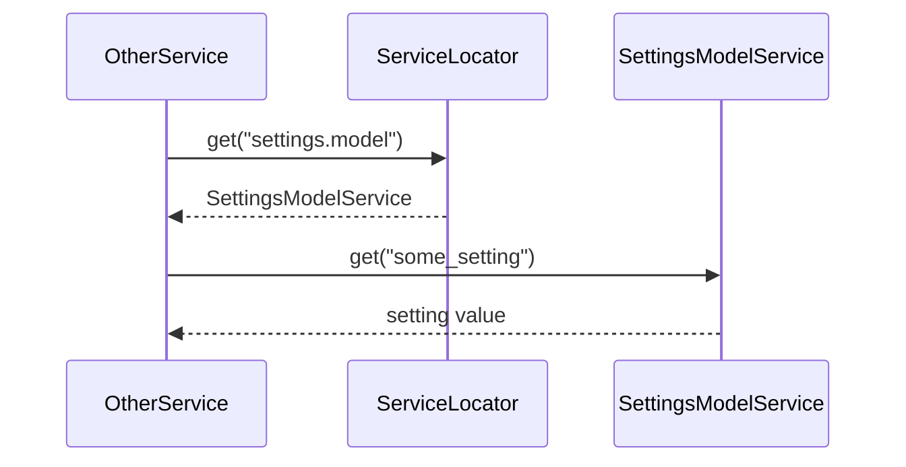

# Settings System DI Integration Plan

## Overview

This document outlines the plan for integrating the current MemberPress AI Assistant settings system with the dependency injection (DI) architecture as part of Phase 3 of the DI rewrite plan.

## Current Implementation

The current settings implementation uses an MVC pattern with:
- `MPAISettingsModel.php`: Handles data storage, validation, and retrieval
- `MPAISettingsView.php`: Handles UI rendering
- `MPAISettingsController.php`: Coordinates between model and view, handles WordPress hooks

## DI Architecture

The DI architecture uses:
- A ServiceLocator as the central registry for all services
- ServiceProviders for registering groups of related services
- ServiceInterface as the contract all services must implement
- AbstractService as a base implementation with common functionality

## Integration Approach

We will maintain the MVC structure while adapting each component to work as services in the DI system. This approach:
1. Preserves the separation of concerns already established in the MVC pattern
2. Minimizes refactoring while still integrating with the DI system
3. Makes the SettingsModel accessible to other services that need configuration values
4. Follows DI best practices by injecting dependencies

## Component Relationships



## Component Adaptations

### SettingsModelService



#### Key Changes:
- Extend `AbstractService` and implement `ServiceInterface`
- Add `register()` method to register itself with the ServiceLocator
- Add `boot()` method to initialize settings and add hooks
- Add `getServiceName()` and `getDependencies()` methods
- Modify constructor to accept service name and logger from DI

### SettingsViewService



#### Key Changes:
- Extend `AbstractService` and implement `ServiceInterface`
- Add `register()` method to register itself with the ServiceLocator
- Add `boot()` method (minimal implementation as view is mostly passive)
- Add `getServiceName()` and `getDependencies()` methods
- Modify constructor to accept service name and logger from DI

### SettingsControllerService



#### Key Changes:
- Extend `AbstractService` and implement `ServiceInterface`
- Add `register()` method to register itself with the ServiceLocator
- Modify `boot()` method to get dependencies from ServiceLocator
- Add `getServiceName()` and `getDependencies()` methods
- Modify constructor to accept service name and logger from DI
- Update methods to use injected dependencies

### SettingsServiceProvider



## Initialization Sequence



## Usage by Other Services



## Implementation Steps

### 1. Create SettingsModelService

1. Create a new class `SettingsModelService` that extends `AbstractService`
2. Copy functionality from `MPAISettingsModel`
3. Implement required methods from `ServiceInterface`:
   - `register()`
   - `boot()`
   - `getServiceName()`
   - `getDependencies()`
4. Modify constructor to accept service name and logger
5. Add method to initialize settings in `boot()`

```php
// Key methods
public function register($serviceLocator): void {
    $serviceLocator->singleton('settings.model', $this);
}

public function boot(): void {
    parent::boot();
    $this->load_settings();
    $this->addHooks();
}

public function getDependencies(): array {
    return ['logger'];
}
```

### 2. Create SettingsViewService

1. Create a new class `SettingsViewService` that extends `AbstractService`
2. Copy functionality from `MPAISettingsView`
3. Implement required methods from `ServiceInterface`
4. Modify constructor to accept service name and logger

```php
// Key methods
public function register($serviceLocator): void {
    $serviceLocator->singleton('settings.view', $this);
}

public function boot(): void {
    parent::boot();
    // Minimal implementation as view is mostly passive
}

public function getDependencies(): array {
    return ['logger'];
}
```

### 3. Create SettingsControllerService

1. Create a new class `SettingsControllerService` that extends `AbstractService`
2. Copy functionality from `MPAISettingsController`
3. Implement required methods from `ServiceInterface`
4. Modify constructor to accept service name and logger
5. Update `boot()` to get dependencies from ServiceLocator
6. Update methods to use injected dependencies

```php
// Key methods
public function register($serviceLocator): void {
    $serviceLocator->singleton('settings.controller', $this);
}

public function boot(): void {
    parent::boot();
    
    // Get dependencies from service locator
    $this->model = $this->serviceLocator->get('settings.model');
    $this->view = $this->serviceLocator->get('settings.view');
    
    // Initialize
    $this->init();
}

public function getDependencies(): array {
    return ['logger', 'settings.model', 'settings.view'];
}
```

### 4. Create SettingsServiceProvider

1. Create a new class `SettingsServiceProvider` that extends `ServiceProvider`
2. Implement `register()` method to register all settings services
3. Implement `provides()` method to list all provided services
4. Implement `boot()` method to initialize services in the correct order

```php
// Key methods
public function register(ServiceLocator $locator): void {
    // Register logger if not already registered
    if (!$locator->has('logger')) {
        $this->registerSingleton($locator, 'logger', function() {
            return new \stdClass(); // Simple logger implementation
        });
    }
    
    // Register settings model
    $this->registerSingleton($locator, 'settings.model', function() use ($locator) {
        $logger = $locator->get('logger');
        return new SettingsModelService('settings.model', $logger);
    });
    
    // Register settings view
    $this->registerSingleton($locator, 'settings.view', function() use ($locator) {
        $logger = $locator->get('logger');
        return new SettingsViewService('settings.view', $logger);
    });
    
    // Register settings controller
    $this->registerSingleton($locator, 'settings.controller', function() use ($locator) {
        $logger = $locator->get('logger');
        $controller = new SettingsControllerService('settings.controller', $logger);
        $controller->setServiceLocator($locator);
        return $controller;
    });
}

public function provides(): array {
    return [
        'settings.model',
        'settings.view',
        'settings.controller'
    ];
}

public function boot(ServiceLocator $locator): void {
    // Boot services in the correct order
    $locator->get('settings.model')->boot();
    $locator->get('settings.view')->boot();
    $locator->get('settings.controller')->boot();
}
```

## Code Structure

```
src/
├── DI/
│   ├── Providers/
│   │   └── SettingsServiceProvider.php
├── Services/
│   ├── Settings/
│   │   ├── SettingsModelService.php
│   │   ├── SettingsViewService.php
│   │   └── SettingsControllerService.php
```

## Integration with Existing Services

Other services that need access to settings will:
1. Declare a dependency on `settings.model`
2. Get the settings model from the ServiceLocator
3. Use the model's methods to retrieve settings

Example:
```php
class SomeOtherService extends AbstractService {
    private $settingsModel;
    
    public function boot(): void {
        parent::boot();
        $this->settingsModel = $this->serviceLocator->get('settings.model');
    }
    
    public function getDependencies(): array {
        return ['logger', 'settings.model'];
    }
    
    public function someMethod(): void {
        $chatEnabled = $this->settingsModel->is_chat_enabled();
        // Use the setting...
    }
}
```

## Conclusion

This plan provides a comprehensive approach to integrating the settings system with the DI architecture while maintaining the existing MVC structure. By adapting each component to implement ServiceInterface and creating a dedicated SettingsServiceProvider, we ensure that the settings system is properly integrated with the DI system and can be used by other services.