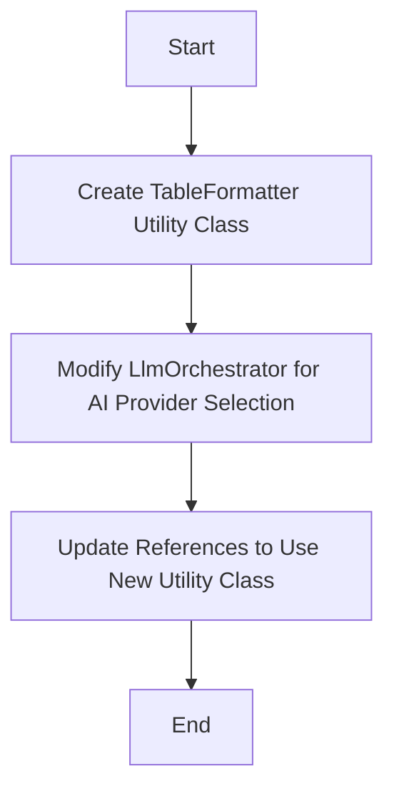
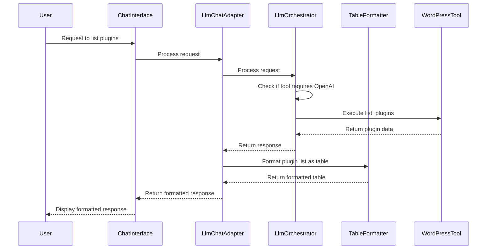

# Table Formatter Implementation Plan

This document outlines the plan for implementing a flexible table formatting utility and improving AI provider selection for tool calls in the MemberPress AI Assistant plugin.

## Problem Statement

1. **Formatting Issue**: The results from the "List Plugins" tool calls are displayed as raw JSON output instead of a formatted table.
   - The `formatPluginListAsTable` method in `ChatInterface.php` exists but isn't being properly applied to the tool call results.

2. **AI Provider Selection Issue**: When Claude is selected as the primary AI provider, it outputs a generic response without actually executing the tool call.
   - Claude doesn't handle the tool call format correctly, but the system should default to OpenAI for tool calls regardless of the primary AI provider setting.

## Solution Overview



## Implementation Details

### 1. Create a Flexible TableFormatter Utility Class

Create a new utility class called `TableFormatter` in `src/Utilities/TableFormatter.php` that will contain the table formatting functionality:

```php
<?php
namespace MemberpressAiAssistant\Utilities;

class TableFormatter {
    // Output format constants
    const FORMAT_MARKDOWN = 'markdown';
    const FORMAT_HTML = 'html';
    const FORMAT_PLAIN = 'plain';
    
    /**
     * Format data as a table
     *
     * @param array $data Array of items to format
     * @param array $options Formatting options
     *        - format: Output format (markdown, html, plain)
     *        - headers: Custom headers to use (optional)
     *        - summary: Summary information (optional)
     *        - title: Table title (optional)
     * @return string Formatted table
     */
    public static function formatTable(array $data, array $options = []): string {
        // Default options
        $options = array_merge([
            'format' => self::FORMAT_MARKDOWN,
            'headers' => [],
            'summary' => [],
            'title' => '',
        ], $options);
        
        // Call the appropriate formatter based on format
        switch ($options['format']) {
            case self::FORMAT_HTML:
                return self::formatAsHtml($data, $options);
            case self::FORMAT_PLAIN:
                return self::formatAsPlain($data, $options);
            case self::FORMAT_MARKDOWN:
            default:
                return self::formatAsMarkdown($data, $options);
        }
    }
    
    /**
     * Format plugin list as a table
     *
     * @param array $plugins List of plugins
     * @param array $options Formatting options
     * @return string Formatted table
     */
    public static function formatPluginList(array $plugins, array $options = []): string {
        // Set default title and summary if not provided
        if (empty($options['title'])) {
            $options['title'] = 'Installed WordPress Plugins';
        }
        
        // Calculate summary if not provided
        if (empty($options['summary'])) {
            $active = 0;
            $inactive = 0;
            $update_available = 0;
            
            foreach ($plugins as $plugin) {
                if ($plugin['active']) {
                    $active++;
                } else {
                    $inactive++;
                }
                
                if (!empty($plugin['update_available']) && $plugin['update_available']) {
                    $update_available++;
                }
            }
            
            $options['summary'] = [
                'total' => count($plugins),
                'active' => $active,
                'inactive' => $inactive,
                'update_available' => $update_available,
            ];
        }
        
        return self::formatTable($plugins, $options);
    }
    
    /**
     * Format data as a markdown table
     *
     * @param array $data Array of items to format
     * @param array $options Formatting options
     * @return string Formatted markdown table
     */
    protected static function formatAsMarkdown(array $data, array $options): string {
        // Extract options
        $title = $options['title'] ?? '';
        $summary = $options['summary'] ?? [];
        $headers = $options['headers'] ?? [];
        
        // Start with a header
        $output = empty($title) ? '' : "# {$title}\n\n";
        
        // Add summary information if provided
        if (!empty($summary)) {
            foreach ($summary as $key => $value) {
                $formatted_key = ucwords(str_replace('_', ' ', $key));
                $output .= "**{$formatted_key}:** {$value}  \n";
            }
            $output .= "\n";
        }
        
        // If no data, return early
        if (empty($data)) {
            return $output . "No data available.\n";
        }
        
        // Determine headers if not provided
        if (empty($headers) && !empty($data)) {
            // Use keys from first item
            $first_item = reset($data);
            if (is_array($first_item)) {
                $headers = array_keys($first_item);
            }
        }
        
        // Create table header
        if (!empty($headers)) {
            $output .= "| " . implode(" | ", array_map('ucfirst', $headers)) . " |\n";
            $output .= "|" . str_repeat("------|", count($headers)) . "\n";
            
            // Add each item to the table
            foreach ($data as $item) {
                $row = [];
                foreach ($headers as $header) {
                    $value = isset($item[$header]) ? $item[$header] : '';
                    // Format boolean values
                    if (is_bool($value)) {
                        $value = $value ? 'Yes' : 'No';
                    }
                    $row[] = $value;
                }
                $output .= "| " . implode(" | ", $row) . " |\n";
            }
        } else {
            // Simple list for non-tabular data
            foreach ($data as $item) {
                $output .= "- " . (is_scalar($item) ? $item : json_encode($item)) . "\n";
            }
        }
        
        return $output;
    }
    
    /**
     * Format data as an HTML table
     *
     * @param array $data Array of items to format
     * @param array $options Formatting options
     * @return string Formatted HTML table
     */
    protected static function formatAsHtml(array $data, array $options): string {
        // Extract options
        $title = $options['title'] ?? '';
        $summary = $options['summary'] ?? [];
        $headers = $options['headers'] ?? [];
        
        // Start with container
        $output = '<div class="mpai-table-container">';
        
        // Add title if provided
        if (!empty($title)) {
            $output .= '<h2>' . esc_html($title) . '</h2>';
        }
        
        // Add summary information if provided
        if (!empty($summary)) {
            $output .= '<div class="mpai-table-summary">';
            foreach ($summary as $key => $value) {
                $formatted_key = ucwords(str_replace('_', ' ', $key));
                $output .= '<div><strong>' . esc_html($formatted_key) . ':</strong> ' . esc_html($value) . '</div>';
            }
            $output .= '</div>';
        }
        
        // If no data, return early
        if (empty($data)) {
            return $output . '<p>No data available.</p></div>';
        }
        
        // Determine headers if not provided
        if (empty($headers) && !empty($data)) {
            // Use keys from first item
            $first_item = reset($data);
            if (is_array($first_item)) {
                $headers = array_keys($first_item);
            }
        }
        
        // Create table
        $output .= '<table class="mpai-table">';
        
        // Add table header
        if (!empty($headers)) {
            $output .= '<thead><tr>';
            foreach ($headers as $header) {
                $output .= '<th>' . esc_html(ucfirst($header)) . '</th>';
            }
            $output .= '</tr></thead>';
            
            // Add table body
            $output .= '<tbody>';
            foreach ($data as $item) {
                $output .= '<tr>';
                foreach ($headers as $header) {
                    $value = isset($item[$header]) ? $item[$header] : '';
                    // Format boolean values
                    if (is_bool($value)) {
                        $value = $value ? 'Yes' : 'No';
                    }
                    $output .= '<td>' . esc_html($value) . '</td>';
                }
                $output .= '</tr>';
            }
            $output .= '</tbody>';
        } else {
            // Simple list for non-tabular data
            $output .= '<ul>';
            foreach ($data as $item) {
                $output .= '<li>' . esc_html(is_scalar($item) ? $item : json_encode($item)) . '</li>';
            }
            $output .= '</ul>';
        }
        
        $output .= '</table></div>';
        
        return $output;
    }
    
    /**
     * Format data as a plain text table
     *
     * @param array $data Array of items to format
     * @param array $options Formatting options
     * @return string Formatted plain text table
     */
    protected static function formatAsPlain(array $data, array $options): string {
        // Extract options
        $title = $options['title'] ?? '';
        $summary = $options['summary'] ?? [];
        $headers = $options['headers'] ?? [];
        
        // Start with a header
        $output = empty($title) ? '' : "{$title}\n" . str_repeat('=', strlen($title)) . "\n\n";
        
        // Add summary information if provided
        if (!empty($summary)) {
            foreach ($summary as $key => $value) {
                $formatted_key = ucwords(str_replace('_', ' ', $key));
                $output .= "{$formatted_key}: {$value}\n";
            }
            $output .= "\n";
        }
        
        // If no data, return early
        if (empty($data)) {
            return $output . "No data available.\n";
        }
        
        // Determine headers if not provided
        if (empty($headers) && !empty($data)) {
            // Use keys from first item
            $first_item = reset($data);
            if (is_array($first_item)) {
                $headers = array_keys($first_item);
            }
        }
        
        // Calculate column widths
        $widths = [];
        foreach ($headers as $header) {
            $widths[$header] = strlen(ucfirst($header));
            foreach ($data as $item) {
                $value = isset($item[$header]) ? $item[$header] : '';
                if (is_bool($value)) {
                    $value = $value ? 'Yes' : 'No';
                }
                $widths[$header] = max($widths[$header], strlen($value));
            }
        }
        
        // Create table header
        if (!empty($headers)) {
            // Header row
            foreach ($headers as $header) {
                $output .= str_pad(ucfirst($header), $widths[$header] + 2);
            }
            $output .= "\n";
            
            // Separator row
            foreach ($headers as $header) {
                $output .= str_repeat('-', $widths[$header] + 1) . ' ';
            }
            $output .= "\n";
            
            // Data rows
            foreach ($data as $item) {
                foreach ($headers as $header) {
                    $value = isset($item[$header]) ? $item[$header] : '';
                    if (is_bool($value)) {
                        $value = $value ? 'Yes' : 'No';
                    }
                    $output .= str_pad($value, $widths[$header] + 2);
                }
                $output .= "\n";
            }
        } else {
            // Simple list for non-tabular data
            foreach ($data as $item) {
                $output .= "- " . (is_scalar($item) ? $item : json_encode($item)) . "\n";
            }
        }
        
        return $output;
    }
}
```

### 2. Modify LlmOrchestrator for AI Provider Selection

Add a configuration array to `LlmOrchestrator.php` that specifies which tool operations should always use OpenAI:

```php
/**
 * Tool operations that should always use OpenAI
 *
 * @var array
 */
private $openaiToolOperations = [
    'list_plugins',
    'list_posts',
    'list_users',
    'list_terms',
    // Add other structured data operations here
];
```

Then modify the `processRequest` method to check if the request contains tools and if any of those tools are in the `$openaiToolOperations` array:

```php
public function processRequest(LlmRequest $request): LlmResponse {
    // Check if this is a tool call that should use OpenAI
    $providerName = $request->getOption('provider', $this->primaryProvider);
    
    // If request contains tools, check if any are in the OpenAI-only list
    if ($request->getTools() && $this->shouldUseOpenAiForTools($request->getTools())) {
        $providerName = 'openai';
    }
    
    // Rest of the method remains the same...
}

/**
 * Check if the request should use OpenAI for tools
 *
 * @param array $tools The tools in the request
 * @return bool Whether to use OpenAI
 */
private function shouldUseOpenAiForTools(array $tools): bool {
    foreach ($tools as $tool) {
        $toolName = $tool['name'] ?? '';
        // Check if the tool name contains any of the OpenAI-only operations
        foreach ($this->openaiToolOperations as $operation) {
            if (strpos($toolName, $operation) !== false) {
                return true;
            }
        }
    }
    return false;
}
```

### 3. Update References to Use the New Utility Class

#### Update ChatInterface.php

Replace the existing `formatPluginListAsTable` method with:

```php
private function formatPluginListAsTable(array $plugins, array $summary): string {
    return \MemberpressAiAssistant\Utilities\TableFormatter::formatPluginList($plugins, [
        'format' => \MemberpressAiAssistant\Utilities\TableFormatter::FORMAT_MARKDOWN,
        'summary' => $summary
    ]);
}
```

#### Update LlmChatAdapter.php

Modify the `processToolCalls` method to use the new utility class:

```php
// In the processToolCalls method, when handling wordpress_list_plugins:
if ($toolName === 'wordpress_list_plugins' && isset($result['result']['data']['plugins'])) {
    $plugins = $result['result']['data']['plugins'];
    $summary = [
        'total' => $result['result']['data']['total'] ?? count($plugins),
        'active' => array_sum(array_column($plugins, 'active')),
        'inactive' => count($plugins) - array_sum(array_column($plugins, 'active')),
        'update_available' => array_sum(array_column($plugins, 'update_available') ?? [])
    ];
    
    $resultMessage .= \MemberpressAiAssistant\Utilities\TableFormatter::formatPluginList($plugins, [
        'format' => \MemberpressAiAssistant\Utilities\TableFormatter::FORMAT_MARKDOWN,
        'summary' => $summary
    ]);
} else {
    $resultMessage .= json_encode($result['result'], JSON_PRETTY_PRINT) . "\n\n";
}
```

## Implementation Flow



## Benefits

1. **Improved User Experience**: Plugin lists and other structured data will be displayed in a more readable and user-friendly format.
2. **Consistent Behavior**: Tool calls will always work correctly, regardless of the primary AI provider setting.
3. **Flexibility**: The TableFormatter utility can be used in various contexts with different output formats.
4. **Reusability**: The code is more maintainable and can be extended to support other types of data formatting.